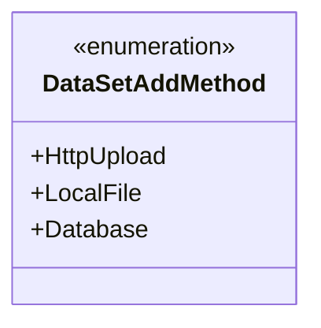
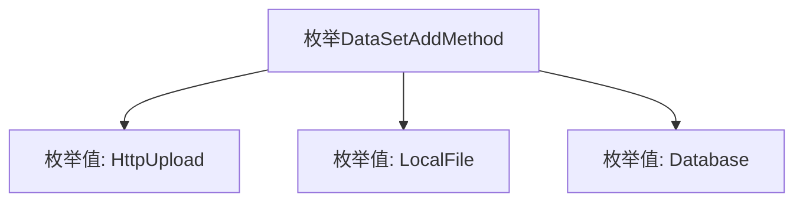

# 基础信息

|      |      |
|------|------|
| 名称 | DataSetAddMethod |
| 编码语言 | .java |
| 代码路径 | WeFe/board/board-service/src/main/java/com/welab/wefe/board/service/constant/DataSetAddMethod.java |
| 包名 | com.welab.wefe.board.service.constant |
| 依赖项 | [] |
| 概述说明 | 枚举DataSetAddMethod定义了三种数据集添加方法：HttpUpload、LocalFile和Database。 |

# 说明

这是一个名为DataSetAddMethod的枚举类型，定义了三种数据集添加方法：HttpUpload表示通过HTTP上传方式添加数据，LocalFile表示通过本地文件方式添加数据，Database表示通过数据库方式添加数据。每种方法对应不同的数据来源途径。

# 类列表 Class Summary

| 名称   | 类型  | 说明 |
|-------|------|-------------|
| DataSetAddMethod | enum | 枚举DataSetAddMethod定义三种数据集添加方法：HttpUpload、LocalFile、Database。 |

## 类 DataSetAddMethod

|      |      |
|------|------|
| 访问范围 | public |
| 类型 | enum |
| 名称 | DataSetAddMethod |
| 说明 | 枚举DataSetAddMethod定义三种数据集添加方法：HttpUpload、LocalFile、Database。 |

### UML类图

这段代码定义了一个名为DataSetAddMethod的枚举类型，包含三个枚举常量：HttpUpload、LocalFile和Database。该枚举用于表示数据集添加的不同方法，分别对应HTTP上传、本地文件和数据库三种数据来源方式。枚举类型在类图中用<<enumeration>>标记，其常量作为公有静态成员列出。这种设计常用于限定参数选项或配置类型，确保类型安全并提高代码可读性。

### 内部方法调用关系图

这段流程图描述了一个名为DataSetAddMethod的枚举类型，该枚举包含三个预定义的常量值：HttpUpload、LocalFile和Database。每个枚举值代表不同的数据集添加方法，分别对应HTTP上传、本地文件和数据库三种数据来源方式。枚举类型在Java中用于定义固定数量的常量集合，这里清晰地展示了该枚举的结构和可选值。

### 字段列表 Field List

| 名称  | 类型  | 说明 |
|-------|-------|------|

### 方法列表

| 名称  | 类型  | 说明 |
|-------|-------|------|

