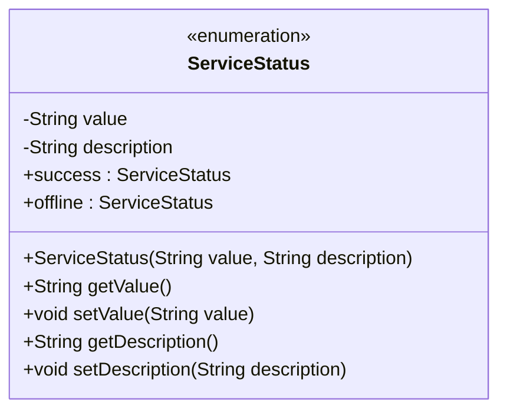
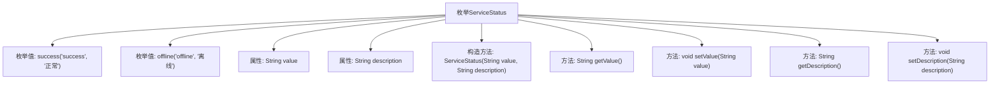

# 基础信息

|      |      |
|------|------|
| 名称 | ServiceStatus |
| 编码语言 | .java |
| 代码路径 | WeFe/board/board-service/src/main/java/com/welab/wefe/board/service/constant/ServiceStatus.java |
| 包名 | com.welab.wefe.board.service.constant |
| 依赖项 | [] |
| 概述说明 | 定义ServiceStatus枚举，包含success和offline两种状态，分别对应值和描述。提供getter和setter方法访问属性。 |

# 说明

这是一个名为ServiceStatus的Java枚举类，用于表示服务状态。它包含两个枚举值：success（正常）和offline（离线）。每个枚举值都有对应的value和description属性，分别表示状态值和描述信息。类中提供了构造方法初始化这两个属性，并为每个属性提供了getter和setter方法，以便获取和修改属性值。

# 类列表 Class Summary

| 名称   | 类型  | 说明 |
|-------|------|-------------|
| ServiceStatus | enum | 枚举ServiceStatus定义两种状态：success（正常）和offline（离线），包含value和description属性及对应getter/setter方法。 |

## 类 ServiceStatus

|      |      |
|------|------|
| 访问范围 | public |
| 类型 | enum |
| 名称 | ServiceStatus |
| 说明 | 枚举ServiceStatus定义两种状态：success（正常）和offline（离线），包含value和description属性及对应getter/setter方法。 |

### UML类图

这段代码定义了一个名为ServiceStatus的枚举类，包含两个枚举常量：success（正常）和offline（离线）。每个枚举常量都有value和description两个私有属性，分别表示状态值和描述信息。类中提供了构造方法初始化这两个属性，并提供了对应的getter和setter方法。该枚举类主要用于表示服务的状态，可以方便地获取和修改状态值及其描述信息。

### 内部方法调用关系图

该流程图展示了ServiceStatus枚举的结构，包含两个枚举值(success和offline)、两个私有属性(value和description)、一个构造方法和四个访问方法。枚举通过构造方法初始化状态值和描述，并提供getter/setter方法进行属性访问。这种设计常用于定义有限的、预定义的状态集合，每个状态携带特定值和描述信息。

### 字段列表 Field List

| 名称  | 类型  | 说明 |
|-------|-------|------|

### 方法列表

| 名称  | 类型  | 说明 |
|-------|-------|------|

