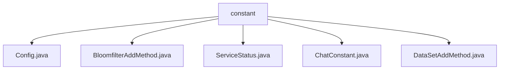

# 基础信息

|      |      |
|------|------|
| 名称 | constant |
| 编码语言 | .java |
| 代码路径 | WeFe/board/board-service/src/main/java/com/welab/wefe/board/service/constant |
| 包名 | docs.board.board-service.src.main.java.com.welab.wefe.board.service.constant |
| 概述说明 | Config类继承CommonConfig，加载动态路径配置文件，支持多环境。BloomfilterAddMethod枚举定义HTTP上传、本地文件、数据库三种数据添加方式。ServiceStatus枚举包含正常和离线状态及描述。ChatConstant类提供聊天消息方向、状态及键值常量。DataSetAddMethod枚举定义三种数据集添加方式。 |

# 说明

## 概述  
该模块核心职责是提供配置管理和枚举常量定义，支持多环境配置加载与标准化业务状态描述。接口规范包括Spring的`@PropertySource`动态加载配置、`@ConfigurationProperties`绑定属性，以及枚举类定义标准化方法（例如`BloomfilterAddMethod`的HTTP上传/本地文件/数据库三种数据添加途径）。关键数据结构涵盖配置类`Config`、枚举类`ServiceStatus`（成功/离线状态）和`ChatConstant`（消息方向/状态常量）。外部依赖仅Spring框架。例如`Config`支持UTF-8编码配置文件的忽略缺失加载。

## 主要业务场景  
模块服务于配置驱动和状态管理的通用场景，类似配置中心的简化实现。业务流程包括动态加载多环境配置（如`Config`）、标准化枚举值传递（如`DataSetAddMethod`定义数据来源途径）。交互模式通过常量类（如`ChatConstant`）统一字段命名，例如消息方向区分接收/发送。典型应用涵盖聊天系统状态管理、布隆过滤器数据源选择等。API类型以配置类和枚举为主，例如`ServiceStatus`枚举支持服务健康状态检查。

### 包内部结构视图

该流程图展示了WeFe项目中board-service模块下constant目录的层级结构。constant作为父节点，包含5个Java常量类文件：Config.java、BloomfilterAddMethod.java、ServiceStatus.java、ChatConstant.java和DataSetAddMethod.java。这些文件均为同一层级，直接隶属于constant目录，用于存储服务配置、枚举类型和业务常量等静态定义。

# 文件列表

| 名称   | 类型  | 说明 |
|-------|------|-------------|
| [Config.java](Config.md) | file | 该代码定义了一个配置类Config，继承CommonConfig，通过@PropertySource加载外部配置文件，支持UTF-8编码，忽略缺失文件。 |
| [BloomfilterAddMethod.java](BloomfilterAddMethod.md) | file | BloomfilterAddMethod枚举定义了三种添加方法：HttpUpload、LocalFile和Database。 |
| [ServiceStatus.java](ServiceStatus.md) | file | 定义ServiceStatus枚举，包含success和offline两种状态，分别对应值和描述。提供getter和setter方法访问属性。 |
| [ChatConstant.java](ChatConstant.md) | file | ChatConstant类定义了消息方向、状态常量及键名，用于消息收发处理和数据结构标识。 |
| [DataSetAddMethod.java](DataSetAddMethod.md) | file | 枚举DataSetAddMethod定义了三种数据集添加方法：HttpUpload、LocalFile和Database。 |

