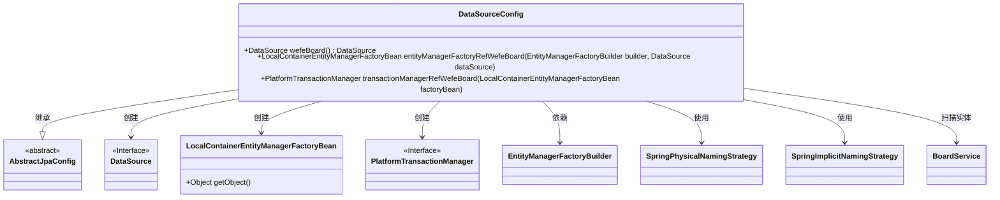
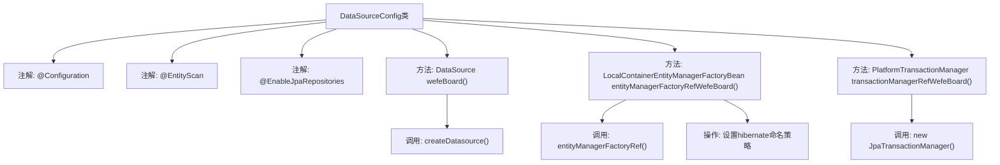

# 基础信息

|      |      |
|------|------|
| 名称 | DataSourceConfig |
| 编码语言 | .java |
| 代码路径 | WeFe/board/board-service/src/main/java/com/welab/wefe/board/service/database/DataSourceConfig.java |
| 包名 | com.welab.wefe.board.service.database |
| 依赖项 | ['com.welab.wefe.board.service.BoardService', 'com.welab.wefe.board.service.database.repository.base.BaseRepositoryFactoryBean', 'com.welab.wefe.common.data.mysql.config.AbstractJpaConfig', 'org.springframework.beans.factory.annotation.Qualifier', 'org.springframework.boot.autoconfigure.domain.EntityScan', 'org.springframework.boot.context.properties.ConfigurationProperties', 'org.springframework.boot.orm.jpa.EntityManagerFactoryBuilder', 'org.springframework.boot.orm.jpa.hibernate.SpringImplicitNamingStrategy', 'org.springframework.boot.orm.jpa.hibernate.SpringPhysicalNamingStrategy', 'org.springframework.context.annotation.Bean', 'org.springframework.context.annotation.Configuration', 'org.springframework.context.annotation.Primary', 'org.springframework.data.jpa.repository.config.EnableJpaRepositories', 'org.springframework.orm.jpa.JpaTransactionManager', 'org.springframework.orm.jpa.LocalContainerEntityManagerFactoryBean', 'org.springframework.transaction.PlatformTransactionManager', 'javax.sql.DataSource', 'java.util.Map'] |
| 概述说明 | 配置类DataSourceConfig继承AbstractJpaConfig，定义主数据源board及JPA相关Bean，包括实体管理工厂和事务管理器，设置命名策略。 |

# 说明

该配置类定义了JPA数据源相关配置，包含主数据源创建、实体管理工厂和事务管理器设置。使用@EntityScan指定实体扫描包路径，通过@EnableJpaRepositories配置JPA仓库参数。主数据源"board"通过前缀"db.mysql"注入属性，实体工厂设置了Hibernate命名策略，事务管理器绑定到指定实体工厂。所有Bean均标记为@Primary确保优先使用。

# 类列表 Class Summary

| 名称   | 类型  | 说明 |
|-------|------|-------------|
| DataSourceConfig | class | 配置类DataSourceConfig继承AbstractJpaConfig，定义主数据源board，设置JPA实体扫描路径、仓库工厂及事务管理器，并配置Hibernate命名策略。 |

## 类 DataSourceConfig

|      |      |
|------|------|
| 访问范围 | @Configuration;@EntityScan("com.welab.wefe.board.service");@EnableJpaRepositories(basePackageClasses = BoardService.class,;        repositoryFactoryBeanClass = BaseRepositoryFactoryBean.class,;        entityManagerFactoryRef = "entityManagerFactoryRefBoard",;        transactionManagerRef = "transactionManagerRefWefeBoard");public |
| 类型 | class |
| 名称 | DataSourceConfig |
| 说明 | 配置类DataSourceConfig继承AbstractJpaConfig，定义主数据源board，设置JPA实体扫描路径、仓库工厂及事务管理器，并配置Hibernate命名策略。 |

### UML类图

该图展示了Spring Boot中一个多数据源配置类DataSourceConfig的结构，它继承自AbstractJpaConfig抽象类，主要负责创建和管理三个核心Bean：主数据源、实体管理器工厂和事务管理器。通过注解配置实现了JPA与特定数据源的集成，包含物理命名策略和隐式命名策略的设置，同时指定了实体扫描的基础包。类图中清晰地呈现了配置类与各种Spring/JPA组件之间的依赖和创建关系。

### 内部方法调用关系图

这段代码是一个Spring Boot的JPA数据源配置类，主要完成三个核心功能：1) 创建主数据源；2) 配置实体管理器工厂；3) 配置事务管理器。通过@Primary注解标记主Bean，使用自定义的hibernate命名策略，并继承AbstractJpaConfig实现基础配置复用。整个流程从数据源创建开始，到事务管理器初始化结束，形成完整的JPA持久化配置链。

### 字段列表 Field List

| 名称  | 类型  | 说明 |
|-------|-------|------|

### 方法列表

| 名称  | 类型  | 说明 |
|-------|-------|------|
| entityManagerFactoryRefWefeBoard | LocalContainerEntityManagerFactoryBean | 定义主实体管理器工厂Bean，配置命名策略，使用指定数据源和属性，返回自定义工厂实例。 |
| wefeBoard | DataSource | 这是一个Spring配置类中的方法，使用@Bean注解创建名为"board"的数据源，配置前缀为"db.mysql"，并标记为@Primary主数据源。 |
| transactionManagerRefWefeBoard | PlatformTransactionManager | 定义主事务管理器，使用指定实体工厂创建JPA事务管理器。 |

