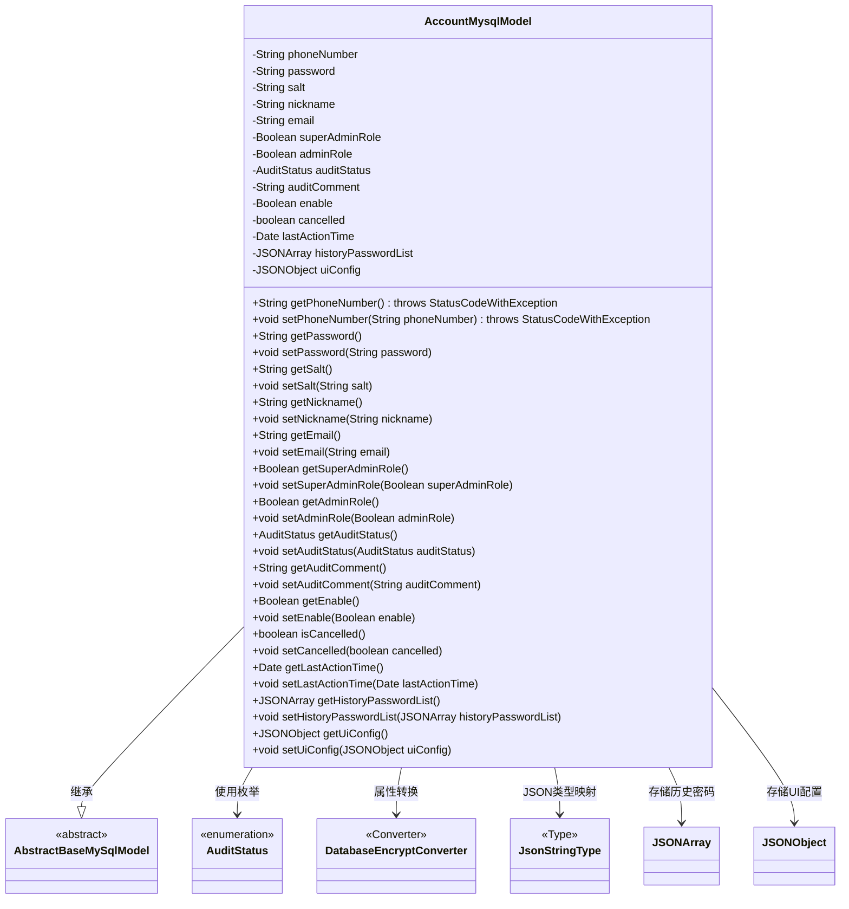

# 基础信息

|      |      |
|------|------|
| 名称 | AccountMysqlModel |
| 编码语言 | .java |
| 代码路径 | WeFe/board/board-service/src/main/java/com/welab/wefe/board/service/database/entity/AccountMysqlModel.java |
| 包名 | com.welab.wefe.board.service.database.entity |
| 依赖项 | ['com.alibaba.fastjson.JSONArray', 'com.alibaba.fastjson.JSONObject', 'com.vladmihalcea.hibernate.type.json.JsonStringType', 'com.welab.wefe.board.service.database.entity.base.AbstractBaseMySqlModel', 'com.welab.wefe.common.exception.StatusCodeWithException', 'com.welab.wefe.common.web.util.DatabaseEncryptConverter', 'com.welab.wefe.common.wefe.enums.AuditStatus', 'org.hibernate.annotations.Type', 'org.hibernate.annotations.TypeDef', 'javax.persistence', 'java.util.Date'] |
| 概述说明 | 账户实体类，包含手机号、密码、角色、审核状态、活动时间等字段，支持JSON存储和加密转换。 |

# 说明

这是一个名为AccountMysqlModel的实体类，用于表示账户信息。该类继承自AbstractBaseMySqlModel，并使用@Entity注解标记为数据库实体。类中定义了多个属性，包括手机号（加密存储）、密码、盐值、昵称、邮箱、超级管理员标识、管理员标识、审核状态、审核意见、可用状态、注销状态、最后活动时间、历史密码列表和UI配置信息。其中手机号使用了加密转换器，历史密码列表和UI配置信息以JSON格式存储。类中还包含了所有属性的getter和setter方法，用于访问和修改这些属性值。

# 类列表 Class Summary

| 名称   | 类型  | 说明 |
|-------|------|-------------|
| AccountMysqlModel | class | 账户实体类，包含手机号、密码、昵称、邮箱等基本信息，加密存储手机号，支持管理员角色、审核状态及UI配置，记录历史密码和最后活动时间。 |

## 类 AccountMysqlModel

|      |      |
|------|------|
| 访问范围 | @Entity(name = "account");@TypeDef(name = "json", typeClass = JsonStringType.class);public |
| 类型 | class |
| 名称 | AccountMysqlModel |
| 说明 | 账户实体类，包含手机号、密码、昵称、邮箱等基本信息，加密存储手机号，支持管理员角色、审核状态及UI配置，记录历史密码和最后活动时间。 |

### UML类图

这段代码展示了一个基于MySQL的账户实体类`AccountMysqlModel`，继承自抽象基类`AbstractBaseMySqlModel`。该类包含用户账户的核心属性如手机号（加密存储）、密码、角色标识、审核状态等，并使用JSON类型存储历史密码和UI配置。通过JPA注解实现了数据库字段映射，包括枚举类型处理、JSON字段转换和敏感数据加密转换。类中提供了完整的getter/setter方法，其中手机号操作可能抛出业务异常，体现了对敏感数据的特殊处理逻辑。

### 内部方法调用关系图

这段代码定义了一个名为AccountMysqlModel的JPA实体类，继承自AbstractBaseMySqlModel，用于表示账户信息。类中包含多个属性如手机号、密码、昵称等，其中部分属性使用了特殊注解如@Convert进行加密转换，@Type和@Column处理JSON类型字段。每个属性都有对应的getter和setter方法，其中phoneNumber的getter和setter方法可能抛出StatusCodeWithException异常。该类通过@Entity注解映射到数据库表"account"，并使用@TypeDef定义了名为"json"的自定义类型处理器。

### 字段列表 Field List

| 名称  | 类型  | 说明 |
|-------|-------|------|
| uiConfig | JSONObject | 实体类字段uiConfig使用JSON类型，数据库列定义为json格式。 |
| superAdminRole | Boolean | 私有布尔变量，标识是否为超级管理员角色。 |
| cancelled | boolean | 布尔变量cancelled，表示是否已取消。 |
| email | String | 私有字符串类型变量email |
| auditStatus | AuditStatus | 实体类中定义枚举类型字段auditStatus，使用@Enumerated注解指定按字符串值映射到数据库。 |
| enable | Boolean | 私有布尔类型变量enable，用于控制功能开关。 |
| adminRole | Boolean | 私有布尔类型变量，标识管理员角色。 |
| nickname | String | 声明一个私有字符串变量nickname。 |
| salt | String | 私有字符串变量salt，用于存储加密盐值。 |
| phoneNumber | String | 字段phoneNumber使用DatabaseEncryptConverter类进行加密转换。 |
| lastActionTime | Date | 私有变量，记录最后一次操作的时间。 |
| password | String | 私有字符串类型变量password |
| auditComment | String | 私有字符串类型变量auditComment，用于存储审核评论。 |
| historyPasswordList | JSONArray | 字段historyPasswordList使用JSON类型存储历史密码列表，数据库列定义为json格式。 |

### 方法列表

| 名称  | 类型  | 说明 |
|-------|-------|------|
| getSalt | String | 获取salt值的公共方法，返回字符串类型。 |
| getPassword | String | 这是一个Java方法，返回字符串类型的password变量值。 |
| setEnable | void | 设置布尔型启用状态的方法。 |
| setEmail | void | 这是一个Java方法，用于设置对象的email属性。方法接收一个String参数email，并将其赋值给当前对象的email字段。 |
| getNickname | String | 获取昵称的方法，返回字符串类型的nickname变量值。 |
| setSalt | void | 设置字符串类型的盐值。 |
| getEnable | Boolean | 这是一个Java方法，返回布尔类型的enable变量值。 |
| getSuperAdminRole | Boolean | 获取超级管理员角色状态的方法，返回布尔值表示是否为超级管理员。 |
| isCancelled | boolean | 检查任务是否已取消，返回布尔值cancelled的状态。 |
| getPhoneNumber | String | 获取电话号码方法，返回字符串类型，可能抛出StatusCodeWithException异常。 |
| setNickname | void | 设置用户昵称的方法，将输入参数赋值给成员变量nickname。 |
| setAuditStatus | void | 设置审计状态的方法，将传入的auditStatus赋值给当前对象的auditStatus属性。 |
| setPassword | void | 设置密码方法，将输入字符串赋值给类成员变量password。 |
| getAdminRole | Boolean | 获取管理员角色状态的方法，返回布尔值表示是否为管理员。 |
| setAdminRole | void | 设置管理员角色的方法，接受布尔参数并赋值给成员变量adminRole。 |
| setSuperAdminRole | void | 设置超级管理员角色状态的方法。 |
| setCancelled | void | 设置取消状态的方法，参数为布尔值cancelled，用于更新内部状态。 |
| getLastActionTime | Date | 获取最后操作时间的方法，返回lastActionTime变量。 |
| setLastActionTime | void | 设置最后操作时间的方法，将参数lastActionTime赋值给类的同名成员变量。 |
| getHistoryPasswordList | JSONArray | 获取历史密码列表的方法，返回JSONArray类型数据。 |
| setHistoryPasswordList | void | 设置历史密码列表的方法，接收JSONArray参数并赋值给成员变量。 |
| getUiConfig | JSONObject | 获取UI配置的JSON对象方法。 |
| setUiConfig | void | 方法setUiConfig接收JSONObject参数uiConfig，并将其赋值给当前对象的uiConfig属性。 |
| setAuditComment | void | 这是一个Java方法，用于设置auditComment属性的值。方法接受一个字符串参数auditComment，并将其赋值给当前对象的同名属性。 |
| setPhoneNumber | void | Java方法：设置电话号码，参数为字符串，可能抛出StatusCodeWithException异常。 |
| getAuditComment | String | 获取审计评语的方法，返回auditComment字符串。 |
| getAuditStatus | AuditStatus | 获取当前审核状态的方法，返回auditStatus属性值。 |
| getEmail | String | 获取email值的公共方法。 |

