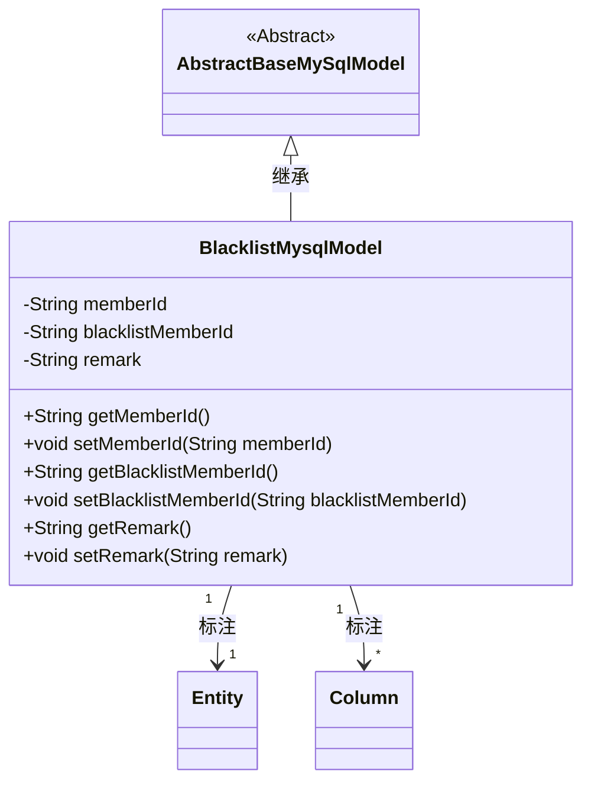
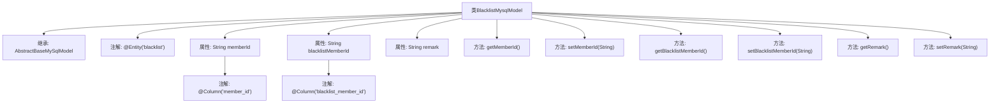

# 基础信息

|      |      |
|------|------|
| 名称 | BlacklistMysqlModel |
| 编码语言 | .java |
| 代码路径 | WeFe/board/board-service/src/main/java/com/welab/wefe/board/service/database/entity/BlacklistMysqlModel.java |
| 包名 | com.welab.wefe.board.service.database.entity |
| 依赖项 | ['com.welab.wefe.board.service.database.entity.base.AbstractBaseMySqlModel', 'javax.persistence.Column', 'javax.persistence.Entity'] |
| 概述说明 | 黑名单实体类，包含成员ID、黑名单成员ID和备注字段，提供getter和setter方法。 |

# 说明

这是一个名为BlacklistMysqlModel的JPA实体类，映射到数据库表blacklist。它继承自AbstractBaseMySqlModel基类，包含三个主要字段：memberId表示当前成员ID，blacklistMemberId表示被加入黑名单的成员ID，remark用于存储备注信息。每个字段都有对应的getter和setter方法，且memberId和blacklistMemberId通过@Column注解指定了数据库列名。

# 类列表 Class Summary

| 名称   | 类型  | 说明 |
|-------|------|-------------|
| BlacklistMysqlModel | class | 黑名单实体类，包含成员ID、黑名单成员ID和备注字段，提供getter和setter方法。 |

## 类 BlacklistMysqlModel

|      |      |
|------|------|
| 访问范围 | @Entity(name = "blacklist");public |
| 类型 | class |
| 名称 | BlacklistMysqlModel |
| 说明 | 黑名单实体类，包含成员ID、黑名单成员ID和备注字段，提供getter和setter方法。 |

### UML类图

这段代码定义了一个名为BlacklistMysqlModel的实体类，用于表示黑名单信息，继承自AbstractBaseMySqlModel抽象基类。该类包含三个私有字段：memberId表示当前成员ID，blacklistMemberId表示被加入黑名单的成员ID，remark用于存储备注信息。通过@Entity注解标记为JPA实体，并使用@Column注解映射数据库字段。类中提供了各字段的getter和setter方法，实现了对黑名单数据的封装和操作。

### 内部方法调用关系图

这段代码定义了一个名为BlacklistMysqlModel的实体类，继承自AbstractBaseMySqlModel，用于表示黑名单数据。类中包含三个主要属性：memberId（当前成员ID）、blacklistMemberId（被加入黑名单的成员ID）和remark（备注），每个属性都有对应的getter和setter方法。类上使用了@Entity注解标记为JPA实体，属性上使用@Column注解指定数据库列名。该模型主要用于ORM框架与数据库表"blacklist"的映射操作。

### 字段列表 Field List

| 名称  | 类型  | 说明 |
|-------|-------|------|
| remark | String | 私有字符串类型备注字段。 |
| blacklistMemberId | String | 数据库字段映射：blacklistMemberId对应表列blacklist_member_id。 |
| memberId | String | 数据库字段member_id映射为成员ID字符串。 |

### 方法列表

| 名称  | 类型  | 说明 |
|-------|-------|------|
| getRemark | String | 获取备注信息的公共方法，返回字符串类型变量remark。 |
| setBlacklistMemberId | void | 设置黑名单成员ID的方法，将参数赋值给类的成员变量blacklistMemberId。 |
| getMemberId | String | 获取成员ID的方法，返回成员ID字符串。 |
| getBlacklistMemberId | String | 获取黑名单成员ID的方法，返回字符串类型的blacklistMemberId。 |
| setMemberId | void | 设置成员ID的方法，将传入的字符串参数赋值给类的成员变量memberId。 |
| setRemark | void | 这是一个Java方法，用于设置对象的remark属性值。方法接收一个字符串参数，并将其赋值给对象的remark字段。 |

