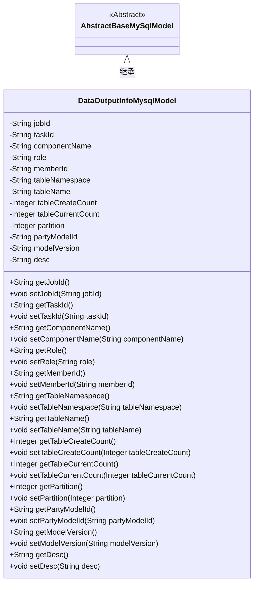

# 基础信息

|      |      |
|------|------|
| 名称 | DataOutputInfoMysqlModel |
| 编码语言 | .java |
| 代码路径 | WeFe/board/board-service/src/main/java/com/welab/wefe/board/service/database/entity/DataOutputInfoMysqlModel.java |
| 包名 | com.welab.wefe.board.service.database.entity |
| 依赖项 | ['com.welab.wefe.board.service.database.entity.base.AbstractBaseMySqlModel', 'javax.persistence.Entity'] |
| 概述说明 | DataOutputInfoMysqlModel类存储任务输出信息，包含任务ID、组件、角色、表信息、模型版本等字段。 |

# 说明

该内容定义了一个名为DataOutputInfoMysqlModel的Java类，继承自AbstractBaseMySqlModel，并使用@Entity注解标记为数据库实体。类中包含多个字段，分别表示任务Id、子任务Id、组件名称、角色、成员id、表空间、表名、创建时数量、当前数量、分区数、模型id、模型版本和描述。每个字段都有对应的getter和setter方法，用于访问和修改字段值。该类主要用于存储和管理与数据输出相关的信息。

# 类列表 Class Summary

| 名称   | 类型  | 说明 |
|-------|------|-------------|
| DataOutputInfoMysqlModel | class | DataOutputInfoMysqlModel类包含任务、子任务、组件、角色、成员、表信息、分区、模型及版本等字段，用于存储数据输出相关信息。 |

## 类 DataOutputInfoMysqlModel

|      |      |
|------|------|
| 访问范围 | @Entity(name = "data_output_info");public |
| 类型 | class |
| 名称 | DataOutputInfoMysqlModel |
| 说明 | DataOutputInfoMysqlModel类包含任务、子任务、组件、角色、成员、表信息、分区、模型及版本等字段，用于存储数据输出相关信息。 |

### UML类图

类图描述：DataOutputInfoMysqlModel类继承自抽象基类AbstractBaseMySqlModel，是一个用于存储数据输出信息的实体类，包含任务ID、组件名称、角色、表信息、模型版本等私有字段，并为每个字段提供了对应的getter和setter方法。该类通过@Entity注解标记为JPA实体，映射到数据库中的data_output_info表。

### 内部方法调用关系图

```mermaid
graph TD
    A["类DataOutputInfoMysqlModel"]
    B["继承: AbstractBaseMySqlModel"]
    C["注解: @Entity('data_output_info')"]
    D["属性: String jobId"]
    E["属性: String taskId"]
    F["属性: String componentName"]
    G["属性: String role"]
    H["属性: String memberId"]
    I["属性: String tableNamespace"]
    J["属性: String tableName"]
    K["属性: Integer tableCreateCount"]
    L["属性: Integer tableCurrentCount"]
    M["属性: Integer partition"]
    N["属性: String partyModelId"]
    O["属性: String modelVersion"]
    P["属性: String desc"]
    Q["方法: getJobId/setJobId"]
    R["方法: getTaskId/setTaskId"]
    S["方法: getComponentName/setComponentName"]
    T["方法: getRole/setRole"]
    U["方法: getMemberId/setMemberId"]
    V["方法: getTableNamespace/setTableNamespace"]
    W["方法: getTableName/setTableName"]
    X["方法: getTableCreateCount/setTableCreateCount"]
    Y["方法: getTableCurrentCount/setTableCurrentCount"]
    Z["方法: getPartition/setPartition"]
    AA["方法: getPartyModelId/setPartyModelId"]
    AB["方法: getModelVersion/setModelVersion"]
    AC["方法: getDesc/setDesc"]

    A --> B
    A --> C
    A --> D
    A --> E
    A --> F
    A --> G
    A --> H
    A --> I
    A --> J
    A --> K
    A --> L
    A --> M
    A --> N
    A --> O
    A --> P
    A --> Q
    A --> R
    A --> S
    A --> T
    A --> U
    A --> V
    A --> W
    A --> X
    A --> Y
    A --> Z
    A --> AA
    A --> AB
    A --> AC
```

该流程图展示了DataOutputInfoMysqlModel类的完整结构，包括其继承关系、实体注解、12个私有属性字段以及对应的getter/setter方法。这个JPA实体类用于存储数据输出相关的元信息，包含任务标识、组件信息、表结构、模型版本等关键字段，通过标准的JavaBean规范提供属性访问接口，适用于数据库持久化操作。

### 字段列表 Field List

| 名称  | 类型  | 说明 |
|-------|-------|------|
| memberId | String | 声明一个私有字符串类型变量memberId。 |
| tableNamespace | String | 私有字符串变量，用于存储表的命名空间。 |
| taskId | String | 私有字符串类型变量taskId，用于存储任务标识。 |
| role | String | 私有字符串变量role，用于存储角色信息。 |
| tableName | String | 私有字符串变量，存储表名。 |
| tableCurrentCount | Integer | 私有整型变量，记录当前表格数量。 |
| partyModelId | String | 私有字符串类型变量partyModelId。 |
| desc | String | 私有字符串类型变量desc |
| tableCreateCount | Integer | 私有整型变量，记录表创建次数。 |
| componentName | String | 私有字符串变量componentName，用于存储组件名称。 |
| modelVersion | String | 私有字符串变量modelVersion，用于存储模型版本信息。 |
| jobId | String | 私有字符串类型变量jobId，用于存储任务ID。 |
| partition | Integer | 私有整型分区变量。 |

### 方法列表

| 名称  | 类型  | 说明 |
|-------|-------|------|
| setMemberId | void | 设置成员ID的方法，将输入字符串赋值给成员变量memberId。 |
| getMemberId | String | 获取成员ID的方法，返回成员ID字符串。 |
| setPartyModelId | void | 设置成员模型ID的方法，将输入参数赋值给类的成员变量partyModelId。 |
| setPartition | void | 设置分区数值的方法，将输入参数赋给类的分区变量。 |
| setTaskId | void | 这是一个Java方法，用于设置类中的taskId属性值。方法接收一个字符串参数taskId，并将其赋值给类的成员变量taskId。 |
| getTableCurrentCount | Integer | 获取当前表格计数值的方法，返回整数类型。 |
| getRole | String | 获取角色信息的方法，返回字符串类型的角色值。 |
| setJobId | void | 设置任务ID的方法，将输入参数jobId赋值给当前对象的jobId属性。 |
| getJobId | String | 方法getJobId返回jobId字符串。 |
| setTableCreateCount | void | 设置表创建次数的方法，用于更新实例变量tableCreateCount的值。 |
| getTableName | String | 方法返回表名字符串。 |
| getComponentName | String | 获取组件名称的方法，返回字符串类型的componentName。 |
| getTableCreateCount | Integer | 获取表创建次数的整数值。 |
| getPartyModelId | String | 获取partyModelId的字符串值。 |
| getTableNamespace | String | 获取表命名空间的方法，返回字符串类型的tableNamespace值。 |
| setComponentName | void | 设置组件名称的方法，将传入的字符串赋值给类的成员变量componentName。 |
| setTableNamespace | void | 这是一个Java方法，用于设置表的命名空间。方法接受一个字符串参数tableNamespace，并将其赋值给类的同名成员变量。 |
| setTableName | void | 这是一个Java方法，用于设置类的tableName属性值。方法接收一个字符串参数tableName，并将其赋值给类的同名成员变量。 |
| setRole | void | 这是一个Java方法，用于设置对象的角色属性。方法接受一个字符串参数role，并将其赋值给当前对象的role字段。 |
| getPartition | Integer | 获取分区编号的方法，返回整数类型的partition值。 |
| setTableCurrentCount | void | 设置表格当前计数值的方法。 |
| getTaskId | String | 获取任务ID的方法，返回字符串类型的taskId。 |
| getModelVersion | String | 获取模型版本号的方法，返回字符串类型的modelVersion值。 |
| setModelVersion | void | 设置模型版本的方法，参数为字符串类型。 |
| getDesc | String | 这是一个Java方法，返回字符串类型的desc属性值。 |
| setDesc | void | 这是一个Java方法，用于设置对象的描述属性。方法名为setDesc，接收一个String类型参数desc，并将其赋值给当前对象的desc成员变量。 |

