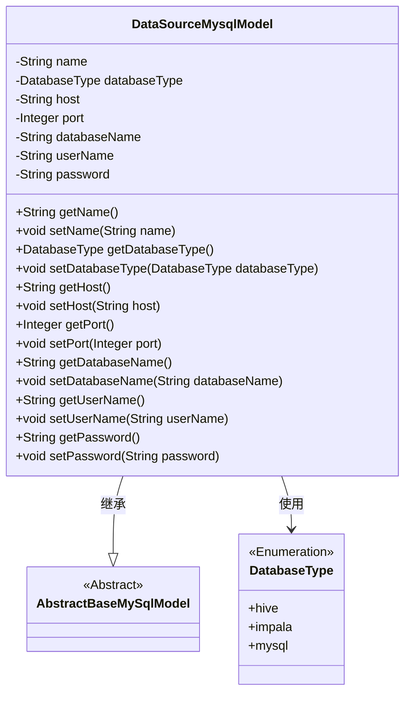

# 基础信息

|      |      |
|------|------|
| 名称 | DataSourceMysqlModel |
| 编码语言 | .java |
| 代码路径 | WeFe/board/board-service/src/main/java/com/welab/wefe/board/service/database/entity/DataSourceMysqlModel.java |
| 包名 | com.welab.wefe.board.service.database.entity |
| 依赖项 | ['com.welab.wefe.board.service.database.entity.base.AbstractBaseMySqlModel', 'com.welab.wefe.common.jdbc.base.DatabaseType', 'com.welab.wefe.common.web.util.DatabaseEncryptConverter', 'javax.persistence.Convert', 'javax.persistence.Entity', 'javax.persistence.EnumType', 'javax.persistence.Enumerated'] |
| 概述说明 | MySQL数据源实体类，包含名称、类型、主机、端口、数据库名、用户名和加密密码等字段及对应getter/setter方法。 |

# 说明

这是一个名为DataSourceMysqlModel的Java实体类，继承自AbstractBaseMySqlModel，对应数据库表data_source。该类定义了数据源的各项属性，包括名称、数据库类型（枚举值hive、impala、mysql）、主机地址、端口号、数据库名称、用户名和密码。其中密码字段使用了加密转换器DatabaseEncryptConverter进行加密处理。类中为每个属性提供了标准的getter和setter方法，用于访问和修改这些属性值。

# 类列表 Class Summary

| 名称   | 类型  | 说明 |
|-------|------|-------------|
| DataSourceMysqlModel | class | DataSourceMysqlModel类表示数据源实体，包含名称、数据库类型（hive、impala、mysql）、主机地址、端口、数据库名、用户名和加密密码等属性及其getter/setter方法。 |

## 类 DataSourceMysqlModel

|      |      |
|------|------|
| 访问范围 | @Entity(name = "data_source");public |
| 类型 | class |
| 名称 | DataSourceMysqlModel |
| 说明 | DataSourceMysqlModel类表示数据源实体，包含名称、数据库类型（hive、impala、mysql）、主机地址、端口、数据库名、用户名和加密密码等属性及其getter/setter方法。 |

### UML类图

这段代码定义了一个名为DataSourceMysqlModel的实体类，继承自AbstractBaseMySqlModel抽象类，用于表示MySQL数据源的配置信息。该类包含数据源名称、数据库类型枚举、主机地址、端口号、数据库名称、用户名和密码等私有字段，并为每个字段提供了公有的getter和setter方法。其中password字段使用了加密转换器，databaseType字段使用了枚举类型DatabaseType。类图清晰地展示了继承关系和枚举类型的使用。

### 内部方法调用关系图

```mermaid
graph TD
    A["类DataSourceMysqlModel"]
    B["继承: AbstractBaseMySqlModel"]
    C["注解: @Entity('data_source')"]
    D["属性: String name"]
    E["属性: DatabaseType databaseType"]
    F["注解: @Enumerated(EnumType.STRING)"]
    G["属性: String host"]
    H["属性: Integer port"]
    I["属性: String databaseName"]
    J["属性: String userName"]
    K["属性: String password"]
    L["注解: @Convert(converter=DatabaseEncryptConverter.class)"]
    M["方法: getName/setName"]
    N["方法: getDatabaseType/setDatabaseType"]
    O["方法: getHost/setHost"]
    P["方法: getPort/setPort"]
    Q["方法: getDatabaseName/setDatabaseName"]
    R["方法: getUserName/setUserName"]
    S["方法: getPassword/setPassword"]

    A --> B
    A --> C
    A --> D
    A --> E
    E --> F
    A --> G
    A --> H
    A --> I
    A --> J
    A --> K
    K --> L
    A --> M
    A --> N
    A --> O
    A --> P
    A --> Q
    A --> R
    A --> S
```

这段代码定义了一个名为DataSourceMysqlModel的JPA实体类，继承自AbstractBaseMySqlModel，用于表示数据源配置信息。类中包含数据源名称、数据库类型、主机地址、端口、数据库名、用户名和密码等属性，其中密码字段使用加密转换器处理，数据库类型使用枚举标注。每个属性都有对应的getter和setter方法，实现了对数据源配置信息的封装和持久化支持。

### 字段列表 Field List

| 名称  | 类型  | 说明 |
|-------|-------|------|
| host | String | 私有字符串变量host |
| name | String | 声明一个私有字符串变量name。 |
| databaseName | String | 声明一个私有字符串变量databaseName。 |
| databaseType | DatabaseType | 定义枚举类型字段databaseType，使用字符串形式存储枚举值。 |
| password | String | 数据库字段加密注解：使用DatabaseEncryptConverter类对password字段进行加密存储。 |
| userName | String | 声明一个私有字符串变量userName。 |
| port | Integer | 私有整型端口变量。 |

### 方法列表

| 名称  | 类型  | 说明 |
|-------|-------|------|
| setDatabaseName | void | 设置数据库名称的方法，将输入参数赋值给类的成员变量databaseName。 |
| setPort | void | 设置端口号的方法，将参数port赋值给类的port属性。 |
| getDatabaseType | DatabaseType | 获取当前数据库类型的方法，返回值为DatabaseType对象。 |
| getPort | Integer | 获取端口号的方法，返回整型数值。 |
| getPassword | String | 获取密码方法，返回字符串类型密码值。 |
| getName | String | 这是一个Java方法，返回字符串类型的name变量值。 |
| setHost | void | 这是一个Java方法，用于设置类的host属性。方法接收一个字符串参数host，并将其赋值给类的成员变量this.host。 |
| getDatabaseName | String | 方法返回数据库名称字符串。 |
| getUserName | String | 获取用户名的公共方法，返回字符串类型的userName。 |
| setUserName | void | 设置用户名的Java方法，将输入参数userName赋值给当前对象的userName属性。 |
| setDatabaseType | void | 设置数据库类型的方法，将传入参数赋值给类的成员变量databaseType。 |
| getHost | String | 该方法返回字符串类型的host变量值。 |
| setName | void | 这是一个Java方法，用于设置对象的name属性，接收一个字符串参数name并将其赋值给对象的成员变量name。 |
| setPassword | void | 设置密码方法，将输入字符串赋值给类成员变量password。 |

