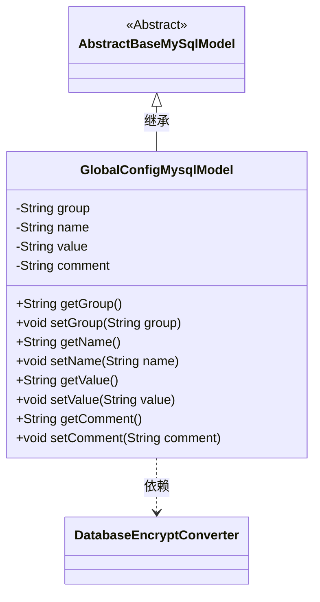
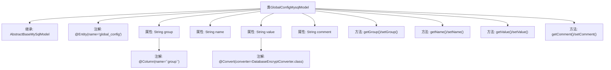

# 基础信息

|      |      |
|------|------|
| 名称 | GlobalConfigMysqlModel |
| 编码语言 | .java |
| 代码路径 | WeFe/board/board-service/src/main/java/com/welab/wefe/board/service/database/entity/GlobalConfigMysqlModel.java |
| 包名 | com.welab.wefe.board.service.database.entity |
| 依赖项 | ['com.welab.wefe.board.service.database.entity.base.AbstractBaseMySqlModel', 'com.welab.wefe.common.web.util.DatabaseEncryptConverter', 'javax.persistence.Column', 'javax.persistence.Convert', 'javax.persistence.Entity'] |
| 概述说明 | GlobalConfigMysqlModel是存储全局配置的实体类，包含组名、配置名、加密值和说明字段，提供对应getter/setter方法。 |

# 说明

这是一个名为GlobalConfigMysqlModel的JPA实体类，映射到数据库表global_config。它继承自AbstractBaseMySqlModel，包含四个主要字段：group表示配置项所属分组，name表示配置项名称，value存储配置值并使用DatabaseEncryptConverter进行加密转换，comment用于存储配置项的说明注释。类中为每个字段提供了标准的getter和setter方法。

# 类列表 Class Summary

| 名称   | 类型  | 说明 |
|-------|------|-------------|
| GlobalConfigMysqlModel | class | GlobalConfigMysqlModel是MySQL实体类，包含组、名称、加密值和注释字段及其getter/setter方法。 |

## 类 GlobalConfigMysqlModel

|      |      |
|------|------|
| 访问范围 | @Entity(name = "global_config");public |
| 类型 | class |
| 名称 | GlobalConfigMysqlModel |
| 说明 | GlobalConfigMysqlModel是MySQL实体类，包含组、名称、加密值和注释字段及其getter/setter方法。 |

### UML类图

该代码定义了一个名为GlobalConfigMysqlModel的实体类，用于表示数据库中的全局配置项。该类继承自AbstractBaseMySqlModel抽象基类，包含四个私有字段：group（配置组）、name（配置名）、value（配置值，使用DatabaseEncryptConverter进行加密转换）和comment（配置说明）。每个字段都有对应的getter和setter方法。类通过@Entity注解标记为JPA实体，@Column和@Convert注解用于指定数据库映射细节。这个模型类主要用于在MySQL数据库中存储和管理系统全局配置信息。

### 内部方法调用关系图

该流程图展示了GlobalConfigMysqlModel类的结构，包括继承关系、属性定义及其注解、以及getter/setter方法。类继承自AbstractBaseMySqlModel，包含四个主要属性：group（带列名注解）、name、value（带加密转换注解）和comment。每个属性都有对应的getter和setter方法，用于数据的存取操作。

### 字段列表 Field List

| 名称  | 类型  | 说明 |
|-------|-------|------|
| comment | String | 声明一个私有字符串变量comment。 |
| group | String | 数据库字段映射：group列对应String类型的group变量。 |
| value | String | 数据库字段加密注解，使用DatabaseEncryptConverter类转换value值。 |
| name | String | 私有字符串变量name |

### 方法列表

| 名称  | 类型  | 说明 |
|-------|-------|------|
| getGroup | String | 获取group值的公共方法。 |
| setGroup | void | 设置对象的分组属性。 |
| setName | void | 设置对象名称的方法，将参数name赋值给对象的name属性。 |
| getValue | String | 获取value值的公共方法。 |
| getName | String | 这是一个Java方法，返回字符串类型的name变量值。 |
| setValue | void | 设置字符串类型的成员变量值。 |
| getComment | String | 获取comment字符串的方法。 |
| setComment | void | 这是一个Java方法，用于设置对象的comment属性值。方法接收一个字符串参数comment，并将其赋值给当前对象的comment成员变量。 |

