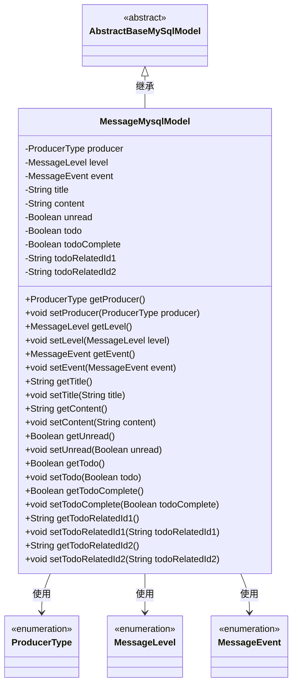

# 基础信息

|      |      |
|------|------|
| 名称 | MessageMysqlModel |
| 编码语言 | .java |
| 代码路径 | WeFe/board/board-service/src/main/java/com/welab/wefe/board/service/database/entity/MessageMysqlModel.java |
| 包名 | com.welab.wefe.board.service.database.entity |
| 依赖项 | ['com.welab.wefe.board.service.database.entity.base.AbstractBaseMySqlModel', 'com.welab.wefe.common.wefe.enums.MessageEvent', 'com.welab.wefe.common.wefe.enums.MessageLevel', 'com.welab.wefe.common.wefe.enums.ProducerType', 'javax.persistence.Entity', 'javax.persistence.EnumType', 'javax.persistence.Enumerated'] |
| 概述说明 | 消息实体类，包含生产者类型、消息级别、事件、标题、内容、未读状态、待办事项标记及完成状态，以及两个关联ID。 |

# 说明

这是一个名为MessageMysqlModel的JPA实体类，映射到数据库表"message"。它继承自AbstractBaseMySqlModel，包含多个属性：producer表示消息生产者类型（枚举值包括board/gateway）；level表示消息级别（枚举值包括info/success/error/warning）；event表示关联的事件类型；title和content分别存储消息标题和内容；unread标识消息是否未读；todo标识是否为待办事项；todoComplete表示待办事项完成状态；todoRelatedId1和todoRelatedId2存储待办事项关联的两个对象ID。类中为每个属性提供了getter和setter方法。

# 类列表 Class Summary

| 名称   | 类型  | 说明 |
|-------|------|-------------|
| MessageMysqlModel | class | 消息实体类，包含生产者、级别、事件、标题、内容、未读状态、待办事项标记及完成状态，以及两个关联ID字段。 |

## 类 MessageMysqlModel

|      |      |
|------|------|
| 访问范围 | @Entity(name = "message");public |
| 类型 | class |
| 名称 | MessageMysqlModel |
| 说明 | 消息实体类，包含生产者、级别、事件、标题、内容、未读状态、待办事项标记及完成状态，以及两个关联ID字段。 |

### UML类图

这段代码定义了一个名为MessageMysqlModel的实体类，继承自AbstractBaseMySqlModel抽象类。该类用于表示数据库中的消息记录，包含消息生产者类型、消息级别、事件类型、标题、内容等属性，以及对应的getter和setter方法。其中producer、level和event是枚举类型字段，分别表示消息来源、消息级别和关联事件。此外，还包含与待办事项相关的字段如todo、todoComplete等。该类通过JPA注解@Entity标记为持久化实体，映射到数据库中的message表。

### 内部方法调用关系图

```mermaid
graph TD
    A["类MessageMysqlModel"]
    B["继承: AbstractBaseMySqlModel"]
    C["注解: @Entity('message')"]
    D["枚举属性: ProducerType producer"]
    E["枚举属性: MessageLevel level"]
    F["枚举属性: MessageEvent event"]
    G["属性: String title"]
    H["属性: String content"]
    I["属性: Boolean unread"]
    J["属性: Boolean todo"]
    K["属性: Boolean todoComplete"]
    L["属性: String todoRelatedId1"]
    M["属性: String todoRelatedId2"]
    N["Getter/Setter方法组"]

    A --> B
    A --> C
    A --> D
    A --> E
    A --> F
    A --> G
    A --> H
    A --> I
    A --> J
    A --> K
    A --> L
    A --> M
    A --> N
```

该流程图展示了MessageMysqlModel类的完整结构，包含继承关系、实体注解、11个属性字段（含3个枚举类型）以及对应的Getter/Setter方法组。作为JPA实体类，它通过@Enumerated注解实现枚举类型持久化，并扩展了基础模型类，主要功能是封装消息系统的数据模型，包含消息来源、级别、事件类型等核心字段，以及待办事项相关的业务字段。所有属性都通过标准JavaBean规范提供访问接口。

### 字段列表 Field List

| 名称  | 类型  | 说明 |
|-------|-------|------|
| todo | Boolean | 布尔类型私有变量，表示待办状态。 |
| unread | Boolean | 布尔类型字段，表示未读状态。 |
| todoRelatedId2 | String | 私有字符串变量todoRelatedId2，用于存储待办事项相关ID。 |
| title | String | 私有字符串变量title |
| level | MessageLevel | 枚举类型字段level，使用字符串形式存储枚举值。 |
| event | MessageEvent | 代码定义了一个枚举类型字段event，使用字符串形式存储枚举值。 |
| todoComplete | Boolean | 布尔类型字段，表示待办事项完成状态。 |
| content | String | 私有字符串变量content。 |
| producer | ProducerType | 枚举类型producer使用字符串值映射到数据库字段。 |
| todoRelatedId1 | String | 私有字符串类型变量，存储待办事项相关ID1。 |

### 方法列表

| 名称  | 类型  | 说明 |
|-------|-------|------|
| getLevel | MessageLevel | 获取消息级别的方法，返回level字段值。 |
| getEvent | MessageEvent | 获取事件对象的方法，返回MessageEvent类型实例。 |
| getTitle | String | 获取标题的方法，返回字符串类型的title变量。 |
| getContent | String | 获取内容方法，返回字符串类型变量content。 |
| setTodoComplete | void | 这是一个Java方法，用于设置待办事项的完成状态。方法接收一个布尔参数，并将其赋值给类的成员变量todoComplete。 |
| setUnread | void | 设置未读状态的布尔值方法。 |
| getTodo | Boolean | 获取待办事项状态的方法，返回布尔值todo。 |
| setProducer | void | 设置生产者对象的方法，将输入参数赋值给类的成员变量producer。 |
| setEvent | void | 方法setEvent接收MessageEvent参数，将其赋值给当前对象的event属性。 |
| getProducer | ProducerType | 获取生产者类型的方法，返回producer对象。 |
| setTodo | void | 设置待办状态的方法，参数为布尔值。 |
| setContent | void | 设置内容属性的方法，将输入字符串赋值给类变量content。 |
| getTodoRelatedId1 | String | 获取待办关联ID1的方法，返回字符串类型。 |
| setTitle | void | 这是一个Java方法，用于设置对象的title属性，接收一个字符串参数title并将其赋值给当前对象的title字段。 |
| getUnread | Boolean | 获取未读状态的布尔值方法，返回unread字段值。 |
| getTodoComplete | Boolean | 方法getTodoComplete返回布尔值todoComplete的状态。 |
| setLevel | void | 设置消息等级的方法，将输入参数level赋值给当前对象的level属性。 |
| setTodoRelatedId1 | void | 设置待办关联ID1的方法，参数为字符串类型。 |
| getTodoRelatedId2 | String | 获取待办关联ID2的方法，返回字符串类型值。 |
| setTodoRelatedId2 | void | 设置待办关联ID2的方法，将参数值赋给类成员变量todoRelatedId2。 |

