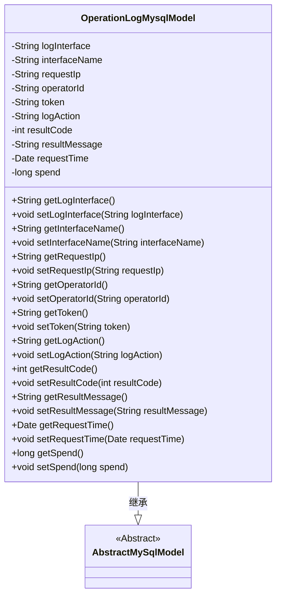

# 基础信息

|      |      |
|------|------|
| 名称 | OperationLogMysqlModel |
| 编码语言 | .java |
| 代码路径 | WeFe/board/board-service/src/main/java/com/welab/wefe/board/service/database/entity/OperationLogMysqlModel.java |
| 包名 | com.welab.wefe.board.service.database.entity |
| 依赖项 | ['com.welab.wefe.board.service.database.entity.base.AbstractMySqlModel', 'javax.persistence.Entity', 'java.util.Date'] |
| 概述说明 | 操作日志实体类，包含接口、IP、操作人、行为、结果、耗时等信息。 |

# 说明

这是一个名为OperationLogMysqlModel的Java实体类，映射到数据库表operator_log，继承自AbstractMySqlModel。它记录了操作日志的详细信息，包括请求接口、接口名称、请求IP、操作人员编号、请求token、操作行为、请求结果编码、请求结果消息、请求时间以及处理耗时。每个字段都有对应的getter和setter方法，用于获取和设置属性值。

# 类列表 Class Summary

| 名称   | 类型  | 说明 |
|-------|------|-------------|
| OperationLogMysqlModel | class | 操作日志实体类，包含接口、IP、操作人、行为、结果、耗时等字段。 |

## 类 OperationLogMysqlModel

|      |      |
|------|------|
| 访问范围 | @Entity(name = "operator_log");public |
| 类型 | class |
| 名称 | OperationLogMysqlModel |
| 说明 | 操作日志实体类，包含接口、IP、操作人、行为、结果、耗时等字段。 |

### UML类图

类图描述：OperationLogMysqlModel类继承自AbstractMySqlModel抽象类，用于记录操作日志信息。包含日志接口、接口名称、请求IP、操作人员编号、token、操作行为、结果编码、结果消息、请求时间和耗时等私有属性，并为每个属性提供了对应的getter和setter方法。该类通过@Entity注解标记为JPA实体，对应数据库表"operator_log"。

### 内部方法调用关系图

```mermaid
graph TD
    A["类OperationLogMysqlModel"]
    B["继承: AbstractMySqlModel"]
    C["注解: @Entity(name='operator_log')"]
    D["属性: String logInterface"]
    E["属性: String interfaceName"]
    F["属性: String requestIp"]
    G["属性: String operatorId"]
    H["属性: String token"]
    I["属性: String logAction"]
    J["属性: int resultCode"]
    K["属性: String resultMessage"]
    L["属性: Date requestTime"]
    M["属性: long spend"]
    N["Getter/Setter方法组 (共11对)"]

    A --> B
    A --> C
    A --> D
    A --> E
    A --> F
    A --> G
    A --> H
    A --> I
    A --> J
    A --> K
    A --> L
    A --> M
    A -.-> N
```

该流程图展示了OperationLogMysqlModel类的完整结构，这是一个用于记录操作日志的JPA实体类。它继承自AbstractMySqlModel基类，包含11个核心属性分别记录接口信息、操作者信息、请求参数和结果数据，并为每个属性提供了标准的Getter/Setter方法。类通过@Entity注解映射到数据库表operator_log，整体设计符合JPA实体规范。

### 字段列表 Field List

| 名称  | 类型  | 说明 |
|-------|-------|------|
| token | String | 声明一个私有字符串变量token。 |
| operatorId | String | 私有字符串变量operatorId，用于存储操作员ID。 |
| interfaceName | String | 私有字符串变量interfaceName，用于存储接口名称。 |
| resultMessage | String | 私有字符串变量resultMessage，用于存储结果信息。 |
| logInterface | String | 日志接口的私有字符串变量。 |
| spend | long | 私有长整型变量spend，用于存储时间或金额等数值。 |
| resultCode | int | 私有整型变量resultCode，用于存储结果代码。 |
| requestIp | String | 声明一个私有字符串变量requestIp，用于存储请求的IP地址。 |
| requestTime | Date | 私有日期类型变量requestTime，用于记录请求时间。 |
| logAction | String | 私有字符串变量logAction，用于记录日志操作。 |

### 方法列表

| 名称  | 类型  | 说明 |
|-------|-------|------|
| setLogAction | void | 定义了一个公共方法setLogAction，用于设置logAction属性的值。 |
| setInterfaceName | void | 设置接口名称的方法，将参数interfaceName赋值给当前对象的同名属性。 |
| setResultMessage | void | 定义了一个公共方法setResultMessage，用于设置成员变量resultMessage的值。参数为字符串类型。 |
| setOperatorId | void | 设置操作员ID的方法，将参数operatorId赋值给当前对象的operatorId属性。 |
| getLogInterface | String | 获取日志接口的方法，返回logInterface字符串。 |
| getOperatorId | String | 获取operatorId的公共方法，返回字符串类型的operatorId值。 |
| getLogAction | String | 获取日志动作的方法，返回logAction字符串。 |
| getRequestIp | String | 获取请求IP地址的方法，返回requestIp变量值。 |
| getToken | String | 获取token的公共方法，返回字符串类型token。 |
| getResultMessage | String | 方法返回结果消息字符串。 |
| getRequestTime | Date | 获取请求时间的方法，返回Date类型的requestTime。 |
| getResultCode | int | 这是一个Java方法，返回整型变量resultCode的值。 |
| setRequestIp | void | 这是一个Java方法，用于设置请求IP地址，将传入的字符串赋值给类的成员变量requestIp。 |
| setLogInterface | void | Java方法：设置日志接口字符串变量。 |
| setToken | void | 设置token字符串值的方法。 |
| setResultCode | void | 设置结果代码的方法，将传入的整数值赋给类的resultCode成员变量。 |
| getInterfaceName | String | 获取接口名称的方法，返回字符串类型的interfaceName。 |
| setRequestTime | void | 设置请求时间的方法，将传入的Date对象赋值给类的requestTime成员变量。 |
| getSpend | long | 这是一个Java方法，返回名为spend的long类型变量值。 |
| setSpend | void | 设置花费金额的方法，参数为长整型spend。 |

