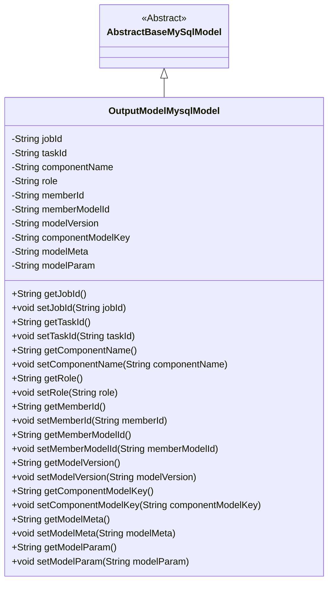

# 基础信息

|      |      |
|------|------|
| 名称 | OutputModelMysqlModel |
| 编码语言 | .java |
| 代码路径 | WeFe/board/board-service/src/main/java/com/welab/wefe/board/service/database/entity/OutputModelMysqlModel.java |
| 包名 | com.welab.wefe.board.service.database.entity |
| 依赖项 | ['com.welab.wefe.board.service.database.entity.base.AbstractBaseMySqlModel', 'javax.persistence.Entity'] |
| 概述说明 | OutputModelMysqlModel类继承AbstractBaseMySqlModel，包含任务ID、子任务ID、组件名称、角色、成员ID、模型ID、版本、key、元信息和参数等字段及其getter/setter方法。 |

# 说明

这是一个名为OutputModelMysqlModel的Java实体类，继承自AbstractBaseMySqlModel，用于映射数据库表output_model。类中包含多个字段：jobId表示任务ID，taskId表示子任务ID，componentName表示组件名称，role表示角色，memberId表示成员ID，memberModelId表示模型ID，modelVersion表示模型版本，componentModelKey表示模型key，modelMeta表示模型信息，modelParam表示模型参数。每个字段都有对应的getter和setter方法用于访问和修改属性值。

# 类列表 Class Summary

| 名称   | 类型  | 说明 |
|-------|------|-------------|
| OutputModelMysqlModel | class | OutputModelMysqlModel类继承AbstractBaseMySqlModel，包含任务ID、子任务ID、组件名称、角色、成员ID、模型ID、版本、key、元信息和参数等字段及其getter/setter方法。 |

## 类 OutputModelMysqlModel

|      |      |
|------|------|
| 访问范围 | @Entity(name = "output_model");public |
| 类型 | class |
| 名称 | OutputModelMysqlModel |
| 说明 | OutputModelMysqlModel类继承AbstractBaseMySqlModel，包含任务ID、子任务ID、组件名称、角色、成员ID、模型ID、版本、key、元信息和参数等字段及其getter/setter方法。 |

### UML类图

该类图展示了OutputModelMysqlModel继承自AbstractBaseMySqlModel的关系，包含12个私有字段及其对应的getter/setter方法。这是一个典型的JPA实体类设计，用于存储任务输出模型的相关元数据，包括任务ID、组件名称、角色信息、模型版本等关键字段，体现了面向对象编程中封装和继承的特性。

### 内部方法调用关系图

```mermaid
graph TD
    A["类OutputModelMysqlModel"]
    B["继承: AbstractBaseMySqlModel"]
    C["注解: @Entity(name='output_model')"]
    D["属性: String jobId"]
    E["属性: String taskId"]
    F["属性: String componentName"]
    G["属性: String role"]
    H["属性: String memberId"]
    I["属性: String memberModelId"]
    J["属性: String modelVersion"]
    K["属性: String componentModelKey"]
    L["属性: String modelMeta"]
    M["属性: String modelParam"]
    N["方法: getJobId/setJobId"]
    O["方法: getTaskId/setTaskId"]
    P["方法: getComponentName/setComponentName"]
    Q["方法: getRole/setRole"]
    R["方法: getMemberId/setMemberId"]
    S["方法: getMemberModelId/setMemberModelId"]
    T["方法: getModelVersion/setModelVersion"]
    U["方法: getComponentModelKey/setComponentModelKey"]
    V["方法: getModelMeta/setModelMeta"]
    W["方法: getModelParam/setModelParam"]

    A --> B
    A --> C
    A --> D
    A --> E
    A --> F
    A --> G
    A --> H
    A --> I
    A --> J
    A --> K
    A --> L
    A --> M
    A --> N
    A --> O
    A --> P
    A --> Q
    A --> R
    A --> S
    A --> T
    A --> U
    A --> V
    A --> W
```

该流程图展示了OutputModelMysqlModel类的完整结构，包括继承关系、实体注解、11个私有属性字段以及对应的getter/setter方法。作为数据库实体类，它通过继承AbstractBaseMySqlModel获得基础功能，并通过@Entity注解映射到名为'output_model'的数据库表。每个属性都有标准的访问器方法，用于管理任务、模型和成员相关的各种元数据信息。

### 字段列表 Field List

| 名称  | 类型  | 说明 |
|-------|-------|------|
| role | String | 私有字符串类型变量role |
| memberId | String | 声明一个私有字符串类型变量memberId。 |
| componentName | String | 私有字符串变量componentName。 |
| modelVersion | String | 私有字符串变量modelVersion，用于存储模型版本信息。 |
| jobId | String | 私有字符串类型变量jobId。 |
| memberModelId | String | 成员模型ID字符串变量 |
| componentModelKey | String | 私有字符串类型变量componentModelKey，用于存储组件模型键值。 |
| modelParam | String | 私有字符串类型变量modelParam。 |
| taskId | String | 任务ID字符串变量 |
| modelMeta | String | 私有字符串变量modelMeta，用于存储模型元数据。 |

### 方法列表

| 名称  | 类型  | 说明 |
|-------|-------|------|
| getModelMeta | String | 获取modelMeta字符串的方法。 |
| getRole | String | 获取角色信息的方法，返回字符串类型的角色值。 |
| getModelVersion | String | 获取模型版本号的方法，直接返回modelVersion变量值。 |
| setRole | void | 设置角色属性的方法，参数为角色字符串。 |
| setTaskId | void | 设置任务ID的方法，将输入参数taskId赋值给当前对象的taskId属性。 |
| setModelVersion | void | 设置模型版本的方法，参数为字符串类型。 |
| setJobId | void | 设置任务ID的方法，将参数jobId赋值给当前对象的jobId属性。 |
| setMemberModelId | void | 这是一个Java方法，用于设置成员变量memberModelId的值。方法接收一个字符串参数，并将其赋值给当前对象的memberModelId属性。 |
| getJobId | String | 这是一个Java方法，返回字符串类型的jobId成员变量值。 |
| setComponentName | void | 这是一个Java方法，用于设置组件名称。方法接收一个字符串参数componentName，并将其赋值给类的成员变量this.componentName。 |
| getTaskId | String | 获取任务ID的方法，返回字符串类型的taskId。 |
| getComponentModelKey | String | 获取组件模型键值的方法。 |
| setMemberId | void | 设置成员ID的方法，将输入参数赋值给类的成员变量memberId。 |
| setComponentModelKey | void | 这是一个Java方法，用于设置组件模型键的值。方法接收一个字符串参数，并将其赋值给类的成员变量componentModelKey。 |
| getMemberId | String | 获取成员ID的方法，返回字符串类型的memberId。 |
| getMemberModelId | String | 获取成员模型ID的方法，返回字符串类型的memberModelId。 |
| getComponentName | String | 获取组件名称的方法，返回字符串类型的componentName。 |
| setModelMeta | void | Java方法：设置modelMeta属性值。 |
| getModelParam | String | 获取模型参数的方法，返回modelParam值。 |
| setModelParam | void | 这是一个Java方法，用于设置类的modelParam属性值。方法接收一个字符串参数modelParam，并将其赋值给类的同名成员变量。 |

