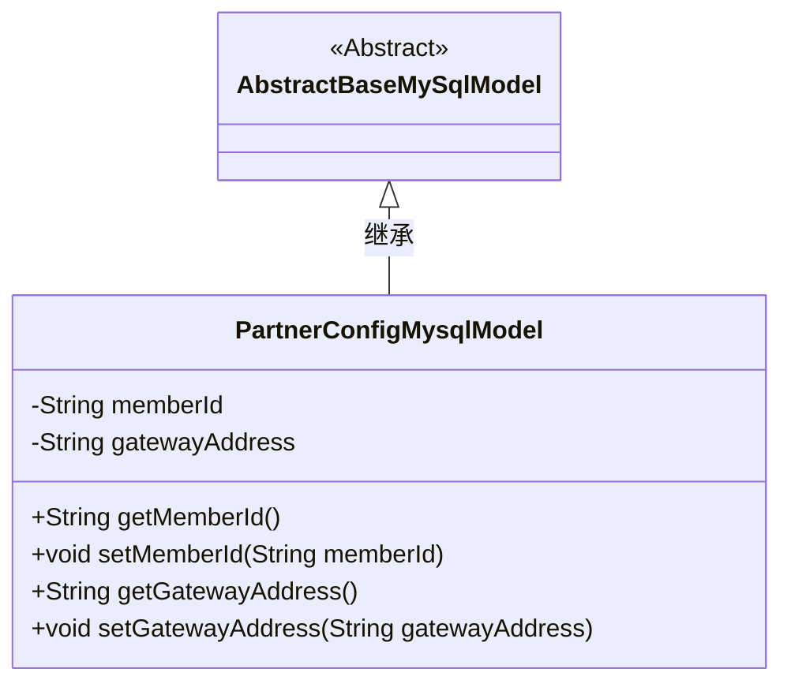
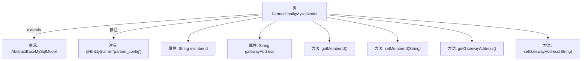

# 基础信息

|      |      |
|------|------|
| 名称 | PartnerConfigMysqlModel |
| 编码语言 | .java |
| 代码路径 | WeFe/board/board-service/src/main/java/com/welab/wefe/board/service/database/entity/PartnerConfigMysqlModel.java |
| 包名 | com.welab.wefe.board.service.database.entity |
| 依赖项 | ['com.welab.wefe.board.service.database.entity.base.AbstractBaseMySqlModel', 'javax.persistence.Entity'] |
| 概述说明 | 这是一个名为partner_config的JPA实体类，继承自AbstractBaseMySqlModel，包含memberId和gatewayAddress两个字段及其getter/setter方法。 |

# 说明

这是一个名为PartnerConfigMysqlModel的JPA实体类，映射到数据库表partner_config。它继承自AbstractBaseMySqlModel基类，包含两个私有字符串字段：memberId和gatewayAddress。类中为这两个字段提供了完整的getter和setter方法，用于访问和修改字段值。该实体类用于存储合作伙伴配置信息，其中memberId表示会员ID，gatewayAddress表示网关地址。

# 类列表 Class Summary

| 名称   | 类型  | 说明 |
|-------|------|-------------|
| PartnerConfigMysqlModel | class | PartnerConfigMysqlModel实体类，包含memberId和gatewayAddress字段及其getter/setter方法。 |

## 类 PartnerConfigMysqlModel

|      |      |
|------|------|
| 访问范围 | @Entity(name = "partner_config");public |
| 类型 | class |
| 名称 | PartnerConfigMysqlModel |
| 说明 | PartnerConfigMysqlModel实体类，包含memberId和gatewayAddress字段及其getter/setter方法。 |

### UML类图

这段类图展示了PartnerConfigMysqlModel继承自AbstractBaseMySqlModel的关系。PartnerConfigMysqlModel是一个实体类，包含两个私有属性memberId和gatewayAddress，以及对应的getter和setter方法。该类通过@Entity注解标记为JPA实体，映射到数据库中的partner_config表。作为抽象基类的子类，它继承了父类的所有特性，同时扩展了自己的业务字段和方法。

### 内部方法调用关系图

这段代码定义了一个名为PartnerConfigMysqlModel的实体类，继承自AbstractBaseMySqlModel，并标注为JPA实体映射到数据库表partner_config。类中包含两个字符串类型属性memberId和gatewayAddress，以及对应的getter和setter方法。流程图展示了类的继承关系、属性声明和方法定义，清晰地呈现了该实体类的结构组成。

### 字段列表 Field List

| 名称  | 类型  | 说明 |
|-------|-------|------|
| gatewayAddress | String | 私有字符串变量gatewayAddress，用于存储网关地址。 |
| memberId | String | 成员ID字符串变量 |

### 方法列表

| 名称  | 类型  | 说明 |
|-------|-------|------|
| getGatewayAddress | String | 获取网关地址的方法，返回字符串类型变量gatewayAddress。 |
| getMemberId | String | 获取成员ID的方法，返回字符串类型的memberId。 |
| setMemberId | void | 设置成员ID的方法，将输入参数赋值给类的成员变量memberId。 |
| setGatewayAddress | void | 设置网关地址的方法，将输入参数gatewayAddress赋值给类的同名成员变量。 |

