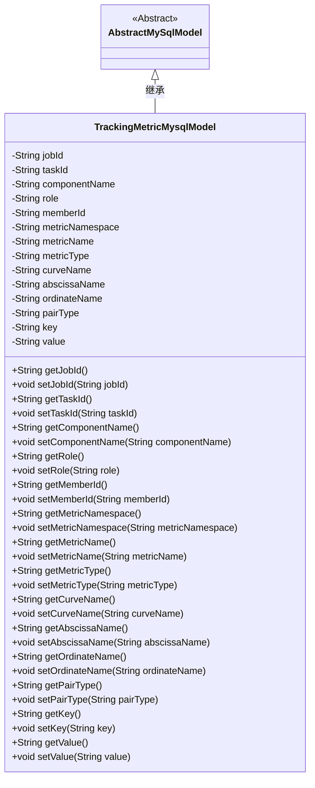

# 基础信息

|      |      |
|------|------|
| 名称 | TrackingMetricMysqlModel |
| 编码语言 | .java |
| 代码路径 | WeFe/board/board-service/src/main/java/com/welab/wefe/board/service/database/entity/TrackingMetricMysqlModel.java |
| 包名 | com.welab.wefe.board.service.database.entity |
| 依赖项 | ['com.welab.wefe.board.service.database.entity.base.AbstractMySqlModel', 'javax.persistence.Entity'] |
| 概述说明 | TrackingMetricMysqlModel类用于存储任务跟踪指标数据，包含任务ID、组件、角色、指标类型、坐标名称等字段。 |

# 说明

这是一个名为TrackingMetricMysqlModel的MySQL实体类，继承自AbstractMySqlModel。它包含多个字段用于跟踪任务指标数据，包括任务ID、子任务ID、组件名称、角色、成员ID、指标命名空间、指标名称、指标类型、曲线名称、横纵坐标名称、配对类型、键值对等。每个字段都有对应的getter和setter方法用于访问和修改数据。该实体类映射到数据库中的tracking_metric表。

# 类列表 Class Summary

| 名称   | 类型  | 说明 |
|-------|------|-------------|
| TrackingMetricMysqlModel | class | TrackingMetricMysqlModel类用于存储任务指标数据，包含任务ID、组件名、角色、指标类型、坐标名称等字段。 |

## 类 TrackingMetricMysqlModel

|      |      |
|------|------|
| 访问范围 | @Entity(name = "tracking_metric");public |
| 类型 | class |
| 名称 | TrackingMetricMysqlModel |
| 说明 | TrackingMetricMysqlModel类用于存储任务指标数据，包含任务ID、组件名、角色、指标类型、坐标名称等字段。 |

### UML类图

这段代码定义了一个名为`TrackingMetricMysqlModel`的实体类，用于存储跟踪指标相关的数据。该类继承自抽象类`AbstractMySqlModel`，包含多个私有字段如任务ID、组件名称、指标类型等，并为每个字段提供了公有的getter和setter方法。通过@Entity注解标记为JPA实体，表明该类将映射到数据库中的`tracking_metric`表。该模型类主要用于持久化存储与任务指标跟踪相关的结构化数据。

### 内部方法调用关系图

```mermaid
graph TD
    A["类TrackingMetricMysqlModel"]
    B["继承: AbstractMySqlModel"]
    C["注解: @Entity(name='tracking_metric')"]
    D["属性: String jobId"]
    E["属性: String taskId"]
    F["属性: String componentName"]
    G["属性: String role"]
    H["属性: String memberId"]
    I["属性: String metricNamespace"]
    J["属性: String metricName"]
    K["属性: String metricType"]
    L["属性: String curveName"]
    M["属性: String abscissaName"]
    N["属性: String ordinateName"]
    O["属性: String pairType"]
    P["属性: String key"]
    Q["属性: String value"]
    R["Getter/Setter方法组 (共14对)"]

    A --> B
    A --> C
    A --> D
    A --> E
    A --> F
    A --> G
    A --> H
    A --> I
    A --> J
    A --> K
    A --> L
    A --> M
    A --> N
    A --> O
    A --> P
    A --> Q
    A -.-> R
```

这段代码定义了一个名为TrackingMetricMysqlModel的JPA实体类，继承自AbstractMySqlModel，用于存储任务跟踪相关的度量指标数据。类中包含14个String类型的属性，每个属性都有对应的getter和setter方法。这些属性记录了任务ID、组件名称、角色信息、度量指标元数据（如命名空间、名称、类型）以及坐标轴和键值对信息。该实体映射到数据库中的tracking_metric表，是一个典型的数据持久化模型类，适用于需要跟踪多维任务指标的分布式系统场景。

### 字段列表 Field List

| 名称  | 类型  | 说明 |
|-------|-------|------|
| value | String | 私有字符串变量value。 |
| metricType | String | 私有字符串类型变量metricType。 |
| curveName | String | 私有字符串变量curveName，用于存储曲线名称。 |
| metricName | String | 私有字符串变量metricName，用于存储指标名称。 |
| jobId | String | 私有字符串类型变量jobId。 |
| taskId | String | 私有字符串类型变量taskId，用于存储任务标识。 |
| ordinateName | String | 私有字符串变量ordinateName |
| abscissaName | String | 私有字符串变量，表示横坐标名称。 |
| memberId | String | 成员ID字符串类型私有变量。 |
| role | String | 声明一个私有字符串变量role。 |
| metricNamespace | String | 私有字符串变量metricNamespace，用于存储指标命名空间。 |
| key | String | 私有字符串类型变量key。 |
| pairType | String | 声明一个私有字符串变量pairType。 |
| componentName | String | 私有字符串变量componentName，用于存储组件名称。 |

### 方法列表

| 名称  | 类型  | 说明 |
|-------|-------|------|
| setComponentName | void | Java方法：设置组件名称属性。将输入参数componentName赋值给类的同名成员变量。 |
| setMetricNamespace | void | 设置指标命名空间的方法，将输入参数赋值给类成员变量metricNamespace。 |
| getMemberId | String | 获取成员ID的方法，返回字符串类型的memberId。 |
| getTaskId | String | 获取任务ID的方法，返回字符串类型的taskId。 |
| setMetricType | void | Java方法：设置metricType属性值，参数为字符串类型。 |
| getMetricNamespace | String | 方法返回metricNamespace字符串值。 |
| getAbscissaName | String | 获取横坐标名称的方法，返回变量abscissaName的值。 |
| getRole | String | 这是一个Java方法，返回字符串类型的role变量值。 |
| setTaskId | void | 设置任务ID的方法，将传入的taskId赋值给当前对象的taskId属性。 |
| getComponentName | String | 获取组件名称的方法，返回字符串类型的componentName。 |
| setAbscissaName | void | 设置横坐标名称的方法，将输入字符串赋值给类成员变量abscissaName。 |
| setRole | void | 设置角色属性的方法，将输入参数role赋值给当前对象的role属性。 |
| getMetricName | String | 获取metricName的方法，返回字符串类型的metricName值。 |
| getCurveName | String | 获取曲线名称的方法，返回变量curveName的值。 |
| getMetricType | String | 获取metricType的方法，返回字符串类型。 |
| setMetricName | void | 设置指标名称的方法，将输入参数赋值给类成员变量metricName。 |
| getOrdinateName | String | 获取纵坐标名称的方法，返回字符串ordinateName。 |
| setJobId | void | 定义公共方法setJobId，接收字符串参数jobId并赋值给类的同名成员变量。 |
| setMemberId | void | 设置成员ID的方法，将输入参数赋值给类的成员变量memberId。 |
| setCurveName | void | 设置曲线名称的方法，将输入参数curveName赋值给当前对象的curveName属性。 |
| setOrdinateName | void | 设置纵坐标名称的方法，将输入字符串赋值给类成员变量ordinateName。 |
| getPairType | String | 方法返回字符串类型的pairType值。 |
| setPairType | void | 设置pairType属性的方法，参数为字符串类型。 |
| getKey | String | 该方法返回字符串类型的key值。 |
| setKey | void | 这是一个Java方法，用于设置类的key属性值。方法接收一个String参数key，并将其赋值给类的成员变量this.key。 |
| getValue | String | 方法返回字符串类型的value值。 |
| setValue | void | 这是一个Java方法，用于设置类成员变量value的值。方法接收一个字符串参数value，并将其赋值给当前对象的value属性。 |
| getJobId | String | 获取当前任务的唯一标识符jobId。 |

