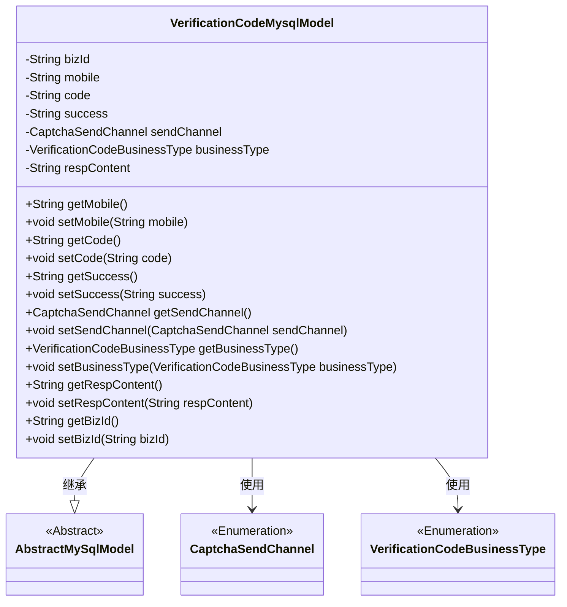

# 基础信息

|      |      |
|------|------|
| 名称 | VerificationCodeMysqlModel |
| 编码语言 | .java |
| 代码路径 | WeFe/board/board-service/src/main/java/com/welab/wefe/board/service/database/entity/VerificationCodeMysqlModel.java |
| 包名 | com.welab.wefe.board.service.database.entity |
| 依赖项 | ['com.welab.wefe.board.service.database.entity.base.AbstractMySqlModel', 'com.welab.wefe.common.verification.code.common.CaptchaSendChannel', 'com.welab.wefe.common.verification.code.common.VerificationCodeBusinessType', 'com.welab.wefe.common.web.util.DatabaseEncryptConverter', 'javax.persistence.Convert', 'javax.persistence.Entity', 'javax.persistence.EnumType', 'javax.persistence.Enumerated'] |
| 概述说明 | VerificationCodeMysqlModel是存储验证码的实体类，包含业务ID、加密手机号、验证码、发送状态、发送渠道、业务类型和响应内容等字段。 |

# 说明

该内容定义了一个名为verification_code的实体类VerificationCodeMysqlModel，继承自AbstractMySqlModel。类中包含多个字段：bizId用于关联业务信息，mobile经过加密转换存储，code表示验证码，success标识发送状态，sendChannel和businessType为枚举类型分别表示发送渠道和业务类型，respContent存储响应内容。每个字段都有对应的getter和setter方法用于访问和修改属性值。

# 类列表 Class Summary

| 名称   | 类型  | 说明 |
|-------|------|-------------|
| VerificationCodeMysqlModel | class | 数据库实体类，存储验证码信息，包含业务ID、加密手机号、验证码、发送状态、渠道、业务类型和响应内容等字段。 |

## 类 VerificationCodeMysqlModel

|      |      |
|------|------|
| 访问范围 | @Entity(name = "verification_code");public |
| 类型 | class |
| 名称 | VerificationCodeMysqlModel |
| 说明 | 数据库实体类，存储验证码信息，包含业务ID、加密手机号、验证码、发送状态、渠道、业务类型和响应内容等字段。 |

### UML类图

这段代码定义了一个名为VerificationCodeMysqlModel的实体类，用于存储验证码相关的信息，包括业务ID、手机号、验证码、发送状态、发送渠道、业务类型和响应内容等。该类继承自AbstractMySqlModel，并使用了两个枚举类型CaptchaSendChannel和VerificationCodeBusinessType来表示验证码的发送渠道和业务类型。所有字段都有对应的getter和setter方法，便于数据的存取和修改。

### 内部方法调用关系图

```mermaid
graph TD
    A["类VerificationCodeMysqlModel"]
    B["继承: AbstractMySqlModel"]
    C["属性: String bizId"]
    D["属性: String mobile"]
    E["属性: String code"]
    F["属性: String success"]
    G["属性: CaptchaSendChannel sendChannel"]
    H["属性: VerificationCodeBusinessType businessType"]
    I["属性: String respContent"]
    J["方法: getMobile/setMobile"]
    K["方法: getCode/setCode"]
    L["方法: getSuccess/setSuccess"]
    M["方法: getSendChannel/setSendChannel"]
    N["方法: getBusinessType/setBusinessType"]
    O["方法: getRespContent/setRespContent"]
    P["方法: getBizId/setBizId"]

    A --> B
    A --> C
    A --> D
    A --> E
    A --> F
    A --> G
    A --> H
    A --> I
    A --> J
    A --> K
    A --> L
    A --> M
    A --> N
    A --> O
    A --> P
```

这段代码定义了一个名为VerificationCodeMysqlModel的实体类，用于存储验证码相关的数据。该类继承自AbstractMySqlModel，包含多个属性如bizId、mobile、code、success等，分别表示业务ID、手机号、验证码、发送状态等信息。每个属性都有对应的getter和setter方法，用于获取和设置属性值。其中mobile属性使用了数据库加密转换器，sendChannel和businessType属性使用了枚举类型。这个类主要用于在MySQL数据库中存储和管理验证码相关的业务数据。

### 字段列表 Field List

| 名称  | 类型  | 说明 |
|-------|-------|------|
| success | String | 私有字符串变量success |
| businessType | VerificationCodeBusinessType | 枚举类型字段businessType，使用字符串形式存储，对应业务类型VerificationCodeBusinessType。 |
| code | String | 私有字符串变量code |
| sendChannel | CaptchaSendChannel | 枚举类型字段sendChannel，使用字符串形式存储枚举值。 |
| bizId | String | 私有字符串类型变量bizId。 |
| mobile | String | 字段mobile使用DatabaseEncryptConverter类进行加密转换。 |
| respContent | String | 私有字符串变量respContent，用于存储响应内容。 |

### 方法列表

| 名称  | 类型  | 说明 |
|-------|-------|------|
| getCode | String | 获取code值的公共方法。 |
| getSuccess | String | 获取成功状态的方法，返回字符串类型变量success。 |
| setMobile | void | 这是一个Java方法，用于设置类的mobile属性值。方法接收一个字符串参数mobile，并将其赋值给类的同名成员变量。 |
| getRespContent | String | 获取响应内容的字符串方法。 |
| getMobile | String | 获取手机号的方法，返回字符串类型变量mobile。 |
| setSuccess | void | 设置成功状态的方法，将输入字符串赋值给success变量。 |
| getBusinessType | VerificationCodeBusinessType | 获取业务类型的方法，返回VerificationCodeBusinessType类型的businessType字段值。 |
| setCode | void | 这是一个Java方法，用于设置对象的code属性值。方法接收一个字符串参数code，并将其赋值给当前对象的code成员变量。 |
| setRespContent | void | 定义了一个公共方法setRespContent，用于设置respContent属性的值。 |
| setSendChannel | void | 设置发送验证码的通道方法，参数为发送通道对象。 |
| setBusinessType | void | 设置业务类型的方法，将传入的VerificationCodeBusinessType赋值给当前对象的businessType属性。 |
| getBizId | String | 获取业务ID的方法，返回bizId。 |
| getSendChannel | CaptchaSendChannel | 获取验证码发送通道的方法，返回sendChannel对象。 |
| setBizId | void | 设置业务ID的方法，将传入的bizId赋值给当前对象的bizId属性。 |

