# 基础信息

|      |      |
|------|------|
| 名称 | entity |
| 编码语言 | .java |
| 代码路径 | WeFe/board/board-service/src/main/java/com/welab/wefe/board/service/database/entity |
| 包名 | docs.board.board-service.src.main.java.com.welab.wefe.board.service.database.entity |
| 概述说明 | 模块管理数字证书全生命周期，含密钥存储、申请签发。数据结构包括CertKeyInfoMysqlModel等，依赖JPA框架。支持联盟链入网认证等场景。 |

# 说明

## 概述  
该模块是联邦学习平台的核心数据持久化层，采用JPA实体规范统一管理多领域数据。核心职责涵盖数字证书生命周期、异构数据资源建模、联邦学习任务流、即时通讯系统等业务实体的CRUD操作，类似企业级数据中台模式。接口规范遵循JPA标准，普遍使用@Column字段映射、JSON类型转换和枚举持久化，基础模型通过AbstractBaseMySqlModel实现审计字段继承。关键数据结构形成三大体系：证书管理类（如CertKeyInfoMysqlModel）、联邦学习类（如JobMySqlModel）、数据资源类（如TableDataSetMysqlModel）。外部依赖集中于MySQL数据库、JPA框架和加密组件（如DatabaseEncryptConverter）。例如GlobalConfigMysqlModel实现配置项加密存储，AccountMysqlModel对手机号进行安全处理。

## 主要业务场景  
模块支撑联邦学习全流程与周边系统协同，类似工作流引擎与消息总线的结合体。典型场景包括：证书签发（CA审核→密钥存储）、数据融合（任务调度→字段分析→结果导出）、流程编排（模板定义→节点DAG构建→动作日志跟踪）。交互模式呈现三种维度：资源型（如ImageDataSetMysqlModel管理标注）、任务型（如FusionTaskMySqlModel监控进度）、消息型（如MessageMysqlModel处理待办事项）。API集成案例丰富，例如通过OperationLogMysqlModel实现操作审计，PartnerConfigMysqlModel维护网关地址，TrackingMetricMysqlModel记录训练指标。完整功能链覆盖从数据准备（DataSourceMysqlModel）、任务执行（OutputModelMysqlModel）到结果应用（DataOutputInfoMysqlModel）的全闭环。

### 包内部结构视图

```mermaid
graph TD
    entity --> cert
    entity --> data_resource
    entity --> job
    entity --> chat
    entity --> data_set
    entity --> flow
    entity --> fusion
    entity --> base
    entity --> MessageMysqlModel.java
    entity --> PartnerConfigMysqlModel.java
    entity --> OutputModelMysqlModel.java
    entity --> GlobalConfigMysqlModel.java
    entity --> BlacklistMysqlModel.java
    entity --> OperationLogMysqlModel.java
    entity --> VerificationCodeMysqlModel.java
    entity --> DataSourceMysqlModel.java
    entity --> TrackingMetricMysqlModel.java
    entity --> AccountMysqlModel.java
    entity --> DataOutputInfoMysqlModel.java
    cert --> CertKeyInfoMysqlModel.java
    cert --> CertRequestInfoMysqlModel.java
    cert --> CertInfoMysqlModel.java
    data_resource --> DataResourceUploadTaskMysqlModel.java
    data_resource --> BloomFilterMysqlModel.java
    data_resource --> TableDataSetMysqlModel.java
    data_resource --> DataResourceMysqlModel.java
    data_resource --> ImageDataSetMysqlModel.java
    job --> ModelOotRecordMysqlModel.java
    job --> TaskMySqlModel.java
    job --> JobMemberMySqlModel.java
    job --> TaskResultMySqlModel.java
    job --> ProjectMemberAuditMySqlModel.java
    job --> JobMySqlModel.java
    job --> ProjectFlowNodeMySqlModel.java
    job --> ProjectFlowMySqlModel.java
    job --> ProjectDataSetMySqlModel.java
    job --> TaskProgressMysqlModel.java
    job --> TaskContextMySqlModel.java
    job --> ProjectMySqlModel.java
    job --> ProjectMemberMySqlModel.java
    chat --> ChatUnreadMessageMySqlModel.java
    chat --> MemberChatMySqlModel.java
    chat --> ChatLastAccountMysqlModel.java
    chat --> MessageQueueMySqlModel.java
    data_set --> ImageDataSetSampleMysqlModel.java
    data_set --> DataSetColumnMysqlModel.java
    flow --> FlowActionLogMySqlModel.java
    flow --> FlowTemplateMySqlModel.java
    flow --> FlowActionQueueMySqlModel.java
    fusion --> bloomfilter
    fusion --> FusionActuatorInfoMySqlModel.java
    fusion --> FusionTaskMySqlModel.java
    fusion --> FusionResultMySqlModel.java
    fusion --> FieldInfoMySqlModel.java
    fusion --> ExportProgressMySqlModel.java
    bloomfilter --> BloomFilterTaskMysqlModel.java
    bloomfilter --> BloomFilterColumnMysqlModel.java
    base --> AbstractBaseMySqlModel.java
    base --> AbstractMySqlModel.java
```

该流程图展示了WeFe项目中board-service模块的数据库实体类层级结构。根节点为entity目录，其下包含cert、data_resource、job等11个子目录，每个子目录又包含若干实体类文件。其中fusion目录具有二级嵌套结构，包含bloomfilter子目录。整体结构清晰地反映了不同业务领域（如任务管理、数据资源、聊天系统等）的实体类组织方式。

# 文件列表

| 名称   | 类型  | 说明 |
|-------|------|-------------|
| [MessageMysqlModel.java](MessageMysqlModel.md) | file | 消息实体类，包含生产者类型、消息级别、事件、标题、内容、未读状态、待办事项标记及完成状态，以及两个关联ID。 |
| [PartnerConfigMysqlModel.java](PartnerConfigMysqlModel.md) | file | 这是一个名为partner_config的JPA实体类，继承自AbstractBaseMySqlModel，包含memberId和gatewayAddress两个字段及其getter/setter方法。 |
| [OutputModelMysqlModel.java](OutputModelMysqlModel.md) | file | OutputModelMysqlModel类继承AbstractBaseMySqlModel，包含任务ID、子任务ID、组件名称、角色、成员ID、模型ID、版本、key、元信息和参数等字段及其getter/setter方法。 |
| [GlobalConfigMysqlModel.java](GlobalConfigMysqlModel.md) | file | GlobalConfigMysqlModel是存储全局配置的实体类，包含组名、配置名、加密值和说明字段，提供对应getter/setter方法。 |
| [BlacklistMysqlModel.java](BlacklistMysqlModel.md) | file | 黑名单实体类，包含成员ID、黑名单成员ID和备注字段，提供getter和setter方法。 |
| [OperationLogMysqlModel.java](OperationLogMysqlModel.md) | file | 操作日志实体类，包含接口、IP、操作人、行为、结果、耗时等信息。 |
| [VerificationCodeMysqlModel.java](VerificationCodeMysqlModel.md) | file | VerificationCodeMysqlModel是存储验证码的实体类，包含业务ID、加密手机号、验证码、发送状态、发送渠道、业务类型和响应内容等字段。 |
| [DataSourceMysqlModel.java](DataSourceMysqlModel.md) | file | MySQL数据源实体类，包含名称、类型、主机、端口、数据库名、用户名和加密密码等字段及对应getter/setter方法。 |
| [TrackingMetricMysqlModel.java](TrackingMetricMysqlModel.md) | file | TrackingMetricMysqlModel类用于存储任务跟踪指标数据，包含任务ID、组件、角色、指标类型、坐标名称等字段。 |
| [AccountMysqlModel.java](AccountMysqlModel.md) | file | 账户实体类，包含手机号、密码、角色、审核状态、活动时间等字段，支持JSON存储和加密转换。 |
| [DataOutputInfoMysqlModel.java](DataOutputInfoMysqlModel.md) | file | DataOutputInfoMysqlModel类存储任务输出信息，包含任务ID、组件、角色、表信息、模型版本等字段。 |
| [chat](chat/_module.md) | package | 定义了四个JPA实体类：ChatUnreadMessageMySqlModel（未读消息）、MemberChatMySqlModel（成员聊天信息）、ChatLastAccountMysqlModel（账户联系人）、MessageQueueMySqlModel（消息队列）。均继承AbstractMySqlModel，包含相关字段及getter/setter方法。 |
| [base](base/_module.md) | package | AbstractBaseMySqlModel继承AbstractMySqlModel，管理创建人和更新人ID，自动设置操作人并更新记录时间。AbstractMySqlModel是抽象基类，包含ID、创建和更新时间字段，可被其他实体类继承复用。 |
| [fusion](fusion/_module.md) | package | 该模块管理布隆过滤器任务及字段元数据，包含任务进度、字段特征等模型，支持CRUD和统计分析。涉及多个MySQL实体类，如任务状态、融合任务、结果、字段信息和导出进度等，均继承基础模型并映射到数据库表。 |
| [flow](flow/_module.md) | package | FlowActionLogMySqlModel记录流程日志，含生产者、优先级、状态等字段。FlowTemplateMySqlModel映射project_flow_template表，含模板名称、类型等属性。FlowActionQueueMySqlModel管理流动作队列，含生产者、优先级等字段。 |
| [data_set](data_set/_module.md) | package | ImageDataSetSampleMysqlModel实体类存储图像数据集样本信息，包含ID、文件名、标签等字段，继承AbstractBaseMySqlModel。DataSetColumnMysqlModel映射data_set_column表，含数据集ID、字段名、数据类型等属性，继承相同基类。两实体均使用JSON格式存储部分数据。 |
| [job](job/_module.md) | package | ModelOotRecordMysqlModel映射model_oot_record表，含流程ID、作业ID、节点ID字段。TaskMySqlModel表示任务实体，含名称、深度、状态等属性。JobMemberMySqlModel映射job_member表，含项目ID、角色等字段。TaskResultMySqlModel对应task_result表，含任务ID、结果类型等字段。ProjectMemberAuditMySqlModel记录成员审核信息。JobMySqlModel表示联邦学习任务。ProjectFlowNodeMySqlModel表示流程节点。ProjectFlowMySqlModel映射project_flow表。ProjectDataSetMySqlModel表示项目数据集。TaskProgressMysqlModel记录任务进度。TaskContextMySqlModel存储任务上下文。ProjectMySqlModel表示项目数据。ProjectMemberMySqlModel记录项目成员信息。 |
| [data_resource](data_resource/_module.md) | package | DataResourceUploadTaskMysqlModel类映射数据资源上传任务表，包含进度、状态等属性。BloomFilterMysqlModel类表示布隆过滤器模型，含RSA密钥等字段。TableDataSetMysqlModel类存储数据集信息，包括特征、Y值等。DataResourceMysqlModel是基类，包含资源通用属性和使用统计。ImageDataSetMysqlModel类专用于图像数据集，含标注信息等。所有类均继承自基础模型并提供完整getter/setter方法。 |
| [cert](cert/_module.md) | package | CertKeyInfoMysqlModel存储密钥PEM、成员ID和算法；CertRequestInfoMysqlModel记录证书申请信息如私钥ID、组织名等；CertInfoMysqlModel管理证书数据如公钥、序列号等。三者均继承AbstractBaseMySqlModel，使用JPA注解映射数据库字段。 |

