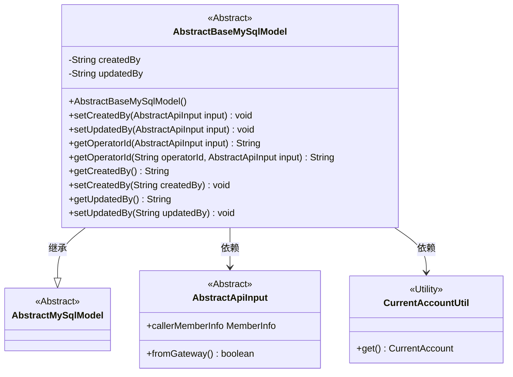
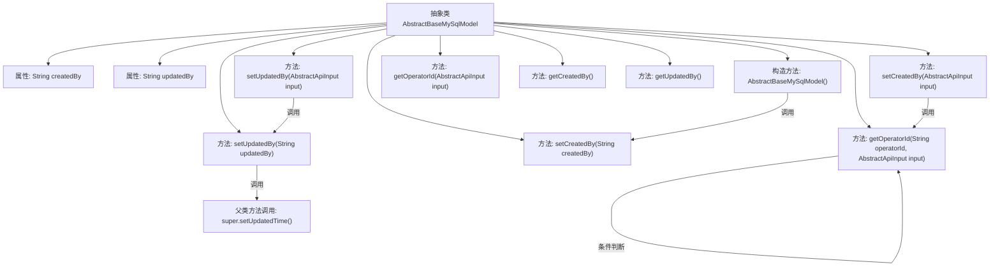

# 基础信息

|      |      |
|------|------|
| 名称 | AbstractBaseMySqlModel |
| 编码语言 | .java |
| 代码路径 | WeFe/board/board-service/src/main/java/com/welab/wefe/board/service/database/entity/base/AbstractBaseMySqlModel.java |
| 包名 | com.welab.wefe.board.service.database.entity.base |
| 依赖项 | ['com.welab.wefe.board.service.service.CacheObjects', 'com.welab.wefe.common.web.dto.AbstractApiInput', 'com.welab.wefe.common.web.util.CurrentAccountUtil', 'javax.persistence.MappedSuperclass', 'java.util.Date'] |
| 概述说明 | 抽象类AbstractBaseMySqlModel继承AbstractMySqlModel，包含创建人和更新人字段，提供设置操作者ID的逻辑，自动处理网关和当前账户信息。 |

# 说明

AbstractBaseMySqlModel是一个抽象基类，继承自AbstractMySqlModel，用于管理创建人和更新人信息。类中包含createdBy和updatedBy字段，分别记录创建者和最后更新者的ID。构造函数自动设置createdBy为当前账户ID。提供了基于AbstractApiInput设置操作人ID的方法getOperatorId，逻辑优先使用缓存成员ID，其次从网关输入获取，最后取当前账户ID。更新updatedBy时会自动设置更新时间。包含标准的getter和setter方法。

# 类列表 Class Summary

| 名称   | 类型  | 说明 |
|-------|------|-------------|
| AbstractBaseMySqlModel | class | 抽象类AbstractBaseMySqlModel继承AbstractMySqlModel，包含创建人和更新人字段，提供设置操作人ID的逻辑，自动记录创建和更新时间。 |

## 类 AbstractBaseMySqlModel

|      |      |
|------|------|
| 访问范围 | @MappedSuperclass;public abstract |
| 类型 | class |
| 名称 | AbstractBaseMySqlModel |
| 说明 | 抽象类AbstractBaseMySqlModel继承AbstractMySqlModel，包含创建人和更新人字段，提供设置操作人ID的逻辑，自动记录创建和更新时间。 |

### UML类图

该类图展示了`AbstractBaseMySqlModel`作为`AbstractMySqlModel`的抽象子类，包含创建人和更新人字段及相关操作方法。它依赖于`AbstractApiInput`接口获取操作者信息，并通过`CurrentAccountUtil`工具类获取当前账户ID。类中实现了操作者ID的智能获取逻辑，根据不同场景（缓存、网关调用或当前账户）返回合适的操作者ID，同时自动维护更新时间戳。

### 内部方法调用关系图

这段代码是用于MySQL数据库模型的抽象基类，主要处理创建人和更新人的操作。流程图展示了类的属性、构造方法和方法调用关系，包括设置创建人和更新人的逻辑，以及通过getOperatorId方法获取操作者ID的流程。特别注意的是setUpdatedBy方法会同时更新父类的更新时间，而getOperatorId方法包含复杂的条件判断逻辑来确定最终的操作者ID。

### 字段列表 Field List

| 名称  | 类型  | 说明 |
|-------|-------|------|
| updatedBy | String | 更新者信息，存储为字符串类型。 |
| createdBy | String | 私有字符串类型变量，记录创建者信息。 |

### 方法列表

| 名称  | 类型  | 说明 |
|-------|-------|------|
| setCreatedBy | void | 定义方法setCreatedBy，用于设置成员变量createdBy的值。 |
| setCreatedBy | void | 方法setCreatedBy接收AbstractApiInput参数，通过getOperatorId获取操作者ID并赋值给createdBy字段。 |
| getOperatorId | String | 该方法根据操作员ID和输入参数决定返回的操作员ID：若操作员ID是会员ID则直接返回；若输入来自网关则返回调用者会员ID；否则返回当前账户ID。 |
| getCreatedBy | String | 获取创建者信息的公有方法，返回字符串类型变量createdBy。 |
| getUpdatedBy | String | 这是一个Java方法，返回字符串类型的updatedBy变量值。 |
| setUpdatedBy | void | 该方法根据输入参数设置更新者ID，先通过getOperatorId获取ID，再调用setUpdatedBy进行设置。 |
| getOperatorId | String | 方法getOperatorId接收AbstractApiInput参数，调用同名方法并传入null和input，返回操作员ID。 |
| setUpdatedBy | void | 方法setUpdatedBy接收字符串参数updatedBy，更新当前对象的updatedBy属性，并调用父类方法设置当前时间为更新时间。 |

