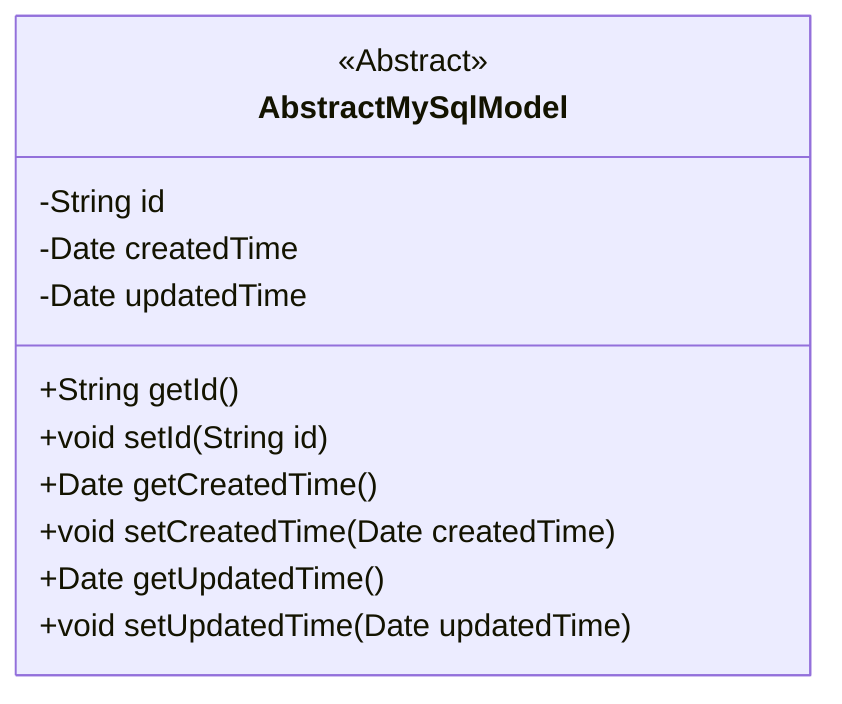
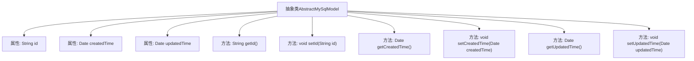

# 基础信息

|      |      |
|------|------|
| 名称 | AbstractMySqlModel |
| 编码语言 | .java |
| 代码路径 | WeFe/board/board-service/src/main/java/com/welab/wefe/board/service/database/entity/base/AbstractMySqlModel.java |
| 包名 | com.welab.wefe.board.service.database.entity.base |
| 依赖项 | ['javax.persistence.Column', 'javax.persistence.Id', 'javax.persistence.MappedSuperclass', 'java.io.Serializable', 'java.util.Date', 'java.util.UUID'] |
| 概述说明 | 抽象MySQL模型基类，包含ID、创建时间和更新时间字段及对应getter/setter方法。ID自动生成，创建时间默认当前时间。 |

# 说明

这是一个名为AbstractMySqlModel的抽象类，使用@MappedSuperclass注解标注，实现了Serializable接口。类中包含三个核心字段：id作为全局唯一标识，使用UUID生成并去除横杠，标注为@Id且不可更新；createdTime记录创建时间，默认当前时间；updatedTime记录更新时间。提供了这三个字段的标准getter和setter方法。该类作为MySQL模型的基础抽象类，可被其他实体类继承复用。

# 类列表 Class Summary

| 名称   | 类型  | 说明 |
|-------|------|-------------|
| AbstractMySqlModel | class | 抽象MySQL模型基类，包含ID、创建时间和更新时间字段及getter/setter方法。ID默认生成无横线UUID。 |

## 类 AbstractMySqlModel

|      |      |
|------|------|
| 访问范围 | @MappedSuperclass;public abstract |
| 类型 | class |
| 名称 | AbstractMySqlModel |
| 说明 | 抽象MySQL模型基类，包含ID、创建时间和更新时间字段及getter/setter方法。ID默认生成无横线UUID。 |

### UML类图

该代码定义了一个名为`AbstractMySqlModel`的抽象类，实现了`Serializable`接口，用于MySQL数据库模型的基类。类中包含三个私有字段：`id`（使用UUID生成并去除横线）、`createdTime`（自动设置为当前日期）和`updatedTime`（更新时间），以及对应的getter和setter方法。通过`@MappedSuperclass`注解标记为JPA实体类的父类，`@Id`和`@Column`注解用于标识主键和列属性。这个抽象类主要用于为其他实体类提供通用的字段和方法，减少重复代码。

### 内部方法调用关系图

这段代码定义了一个名为AbstractMySqlModel的抽象类，该类实现了Serializable接口，表明其实例可以被序列化。类中包含三个主要属性：id（使用UUID生成并去除横线的唯一标识）、createdTime（创建时间，默认为当前时间）和updatedTime（更新时间）。类中为每个属性提供了对应的getter和setter方法，用于获取和设置属性值。这个类使用了JPA注解@MappedSuperclass和@Id，表明它是一个映射超类，并且id属性是其主键。

### 字段列表 Field List

| 名称  | 类型  | 说明 |
|-------|-------|------|
| id = UUID.randomUUID().toString().replaceAll("-", "") | String | 实体ID字段，使用UUID生成并去除横杠，数据库列名id且不可更新。 |
| updatedTime | Date | 更新时间的日期类型变量。 |
| createdTime = new Date() | Date | 声明一个私有Date类型变量createdTime，初始化为当前时间。 |

### 方法列表

| 名称  | 类型  | 说明 |
|-------|-------|------|
| getUpdatedTime | Date | 获取更新时间的方法，返回Date类型变量updatedTime。 |
| setId | void | 设置对象ID的方法，将参数id赋值给当前对象的id属性。 |
| getId | String | 获取对象ID的方法，返回字符串类型的id值。 |
| setUpdatedTime | void | 设置更新时间的方法，将参数updatedTime赋值给类的成员变量updatedTime。 |
| setCreatedTime | void | 设置对象创建时间的方法，参数为Date类型。 |
| getCreatedTime | Date | 获取创建时间的方法，返回createdTime日期对象。 |

