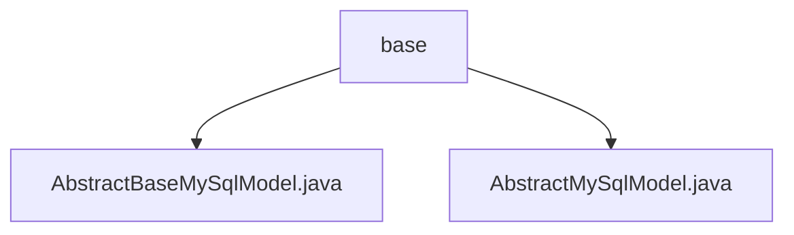

# 基础信息

|      |      |
|------|------|
| 名称 | base |
| 编码语言 | .java |
| 代码路径 | WeFe/board/board-service/src/main/java/com/welab/wefe/board/service/database/entity/base |
| 包名 | docs.board.board-service.src.main.java.com.welab.wefe.board.service.database.entity.base |
| 概述说明 | AbstractBaseMySqlModel继承AbstractMySqlModel，管理创建人和更新人ID，自动设置操作人并更新记录时间。AbstractMySqlModel是抽象基类，包含ID、创建和更新时间字段，可被其他实体类继承复用。 |

# 说明

## 概述  
该模块提供MySQL实体类的抽象基类体系，核心职责是统一管理数据表的基础字段和操作人信息。AbstractMySqlModel定义通用字段结构（如UUID主键、时间戳），AbstractBaseMySqlModel扩展其功能，增加操作人追踪能力（类似审计日志模式）。  

接口规范遵循JPA注解标准，例如@MappedSuperclass实现继承映射，@Id标注主键。关键数据结构包括：基础字段（id/createdTime/updatedTime）、操作人字段（createdBy/updatedBy）。外部依赖仅需JPA和Java序列化支持。例如通过getOperatorId实现三级操作人ID获取策略。  

## 主要业务场景  
主要用于需要记录数据变更溯源的业务场景，如用户操作审计或协同编辑系统。典型交互模式为：创建实体时自动填充createdBy和createdTime，更新时触发updatedBy/updatedTime维护。例如表单提交场景，继承基类的实体会自动记录当前操作者ID。  

API集成表现为标准化getter/setter，支持JPA查询。完整功能覆盖实体生命周期管理，从创建、更新到持久化，形成闭环数据追踪能力。典型应用模式类似CRUD增强版，在基础操作上叠加操作人上下文。

### 包内部结构视图

该流程图展示了WeFe项目中board-service模块的数据库实体基础结构。根节点为base目录，包含两个抽象基类文件：AbstractBaseMySqlModel.java和AbstractMySqlModel.java，这两个文件为MySql数据模型提供了基础实现。层级关系清晰体现了基础实体类的组织方式，符合Java项目典型的分层架构设计。

# 文件列表

| 名称   | 类型  | 说明 |
|-------|------|-------------|
| [AbstractBaseMySqlModel.java](AbstractBaseMySqlModel.md) | file | 抽象类AbstractBaseMySqlModel继承AbstractMySqlModel，包含创建人和更新人字段，提供设置操作者ID的逻辑，自动处理网关和当前账户信息。 |
| [AbstractMySqlModel.java](AbstractMySqlModel.md) | file | 抽象MySQL模型基类，包含ID、创建时间和更新时间字段及对应getter/setter方法。ID自动生成，创建时间默认当前时间。 |

