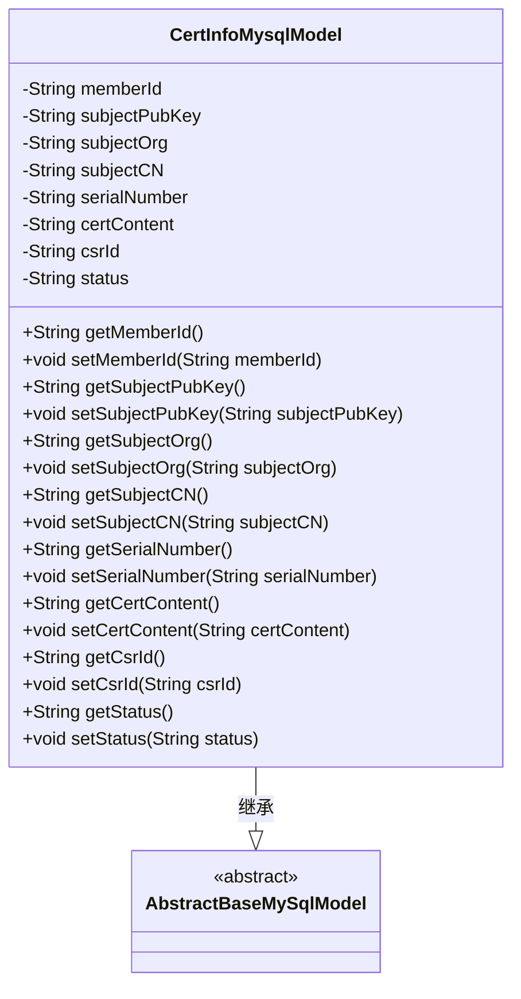

# 基础信息

|      |      |
|------|------|
| 名称 | CertInfoMysqlModel |
| 编码语言 | .java |
| 代码路径 | WeFe/board/board-service/src/main/java/com/welab/wefe/board/service/database/entity/cert/CertInfoMysqlModel.java |
| 包名 | com.welab.wefe.board.service.database.entity.cert |
| 依赖项 | ['javax.persistence.Column', 'javax.persistence.Entity', 'org.hibernate.annotations.TypeDef', 'com.vladmihalcea.hibernate.type.json.JsonStringType', 'com.welab.wefe.board.service.database.entity.base.AbstractBaseMySqlModel'] |
| 概述说明 | CertInfoMysqlModel是存储证书信息的MySQL实体类，包含用户ID、公钥、组织名称、常用名、序列号、证书内容、请求ID和状态等字段。 |

# 说明

这是一个名为CertInfoMysqlModel的Java实体类，映射到数据库表cert_info。它继承自AbstractBaseMySqlModel，包含证书相关信息字段：用户ID、申请人公钥、组织名称、常用名、证书序列号、证书内容、证书请求ID和状态。每个字段都有对应的getter和setter方法，并使用JPA注解进行数据库列映射。类还定义了JSON类型支持，并包含序列化版本UID。

# 类列表 Class Summary

| 名称   | 类型  | 说明 |
|-------|------|-------------|
| CertInfoMysqlModel | class | CertInfoMysqlModel是存储证书信息的MySQL实体类，包含用户ID、公钥、组织名称、常用名、序列号、证书内容、请求ID和状态等字段。 |

## 类 CertInfoMysqlModel

|      |      |
|------|------|
| 访问范围 | @Entity(name = "cert_info");@TypeDef(name = "json", typeClass = JsonStringType.class);public |
| 类型 | class |
| 名称 | CertInfoMysqlModel |
| 说明 | CertInfoMysqlModel是存储证书信息的MySQL实体类，包含用户ID、公钥、组织名称、常用名、序列号、证书内容、请求ID和状态等字段。 |

### UML类图

这段代码定义了一个名为CertInfoMysqlModel的实体类，用于表示数据库中的证书信息。该类继承自AbstractBaseMySqlModel抽象类，包含8个私有字段（如memberId、subjectPubKey等）及其对应的getter和setter方法。通过@Entity和@Column注解，该类与数据库表"cert_info"及其列建立了映射关系。@TypeDef注解指定了json类型的处理类。这个类主要用于ORM框架与MySQL数据库交互时，存储和操作证书相关的数据。

### 内部方法调用关系图

```mermaid
graph TD
    A["类CertInfoMysqlModel"]
    B["父类: AbstractBaseMySqlModel"]
    C["注解: @Entity(name='cert_info')"]
    D["注解: @TypeDef(name='json', typeClass=JsonStringType.class)"]
    E["属性: String memberId"]
    F["属性: String subjectPubKey"]
    G["属性: String subjectOrg"]
    H["属性: String subjectCN"]
    I["属性: String serialNumber"]
    J["属性: String certContent"]
    K["属性: String csrId"]
    L["属性: String status"]
    M["方法: getMemberId/setMemberId"]
    N["方法: getSubjectPubKey/setSubjectPubKey"]
    O["方法: getSubjectOrg/setSubjectOrg"]
    P["方法: getSubjectCN/setSubjectCN"]
    Q["方法: getSerialNumber/setSerialNumber"]
    R["方法: getCertContent/setCertContent"]
    S["方法: getCsrId/setCsrId"]
    T["方法: getStatus/setStatus"]

    A --> B
    A --> C
    A --> D
    A --> E
    A --> F
    A --> G
    A --> H
    A --> I
    A --> J
    A --> K
    A --> L
    A --> M
    A --> N
    A --> O
    A --> P
    A --> Q
    A --> R
    A --> S
    A --> T
```

该流程图展示了CertInfoMysqlModel类的完整结构，包括其继承关系、类级别注解、8个私有属性字段以及对应的getter/setter方法。作为JPA实体类，它通过@Entity注解映射到数据库表"cert_info"，并使用@TypeDef定义了JSON类型处理器。所有属性均通过@Column注解与数据库字段映射，形成标准的ORM实体模型结构。

### 字段列表 Field List

| 名称  | 类型  | 说明 |
|-------|-------|------|
| subjectCN | String | 数据库字段映射：subjectCN对应表列subject_cn，类型为字符串。 |
| certContent | String | 数据库字段cert_content映射为字符串类型变量certContent。 |
| subjectPubKey | String | 数据库字段subject_pub_key映射到私有字符串变量subjectPubKey。 |
| status | String | 数据库字段映射：status字段对应表中的status列，类型为String。 |
| subjectOrg | String | 数据库字段映射：subject_org对应实体类中的subjectOrg字符串属性。 |
| memberId | String | 数据库表字段映射：成员ID，对应列名member_id，类型为字符串。 |
| serialNumber | String | 数据库字段映射：serialNumber对应表列serial_number。 |
| serialVersionUID = 3983194628565221216L | long | 声明一个私有静态不可变的序列化版本UID，值为3983194628565221216L。 |
| csrId | String | 数据库字段映射：csrId对应表列csr_id。 |

### 方法列表

| 名称  | 类型  | 说明 |
|-------|-------|------|
| getMemberId | String | 获取成员ID的方法，返回字符串类型的memberId。 |
| getSubjectPubKey | String | 获取主题公钥的方法，返回字符串类型的subjectPubKey。 |
| setSerialNumber | void | 设置设备序列号的方法，将输入参数赋值给成员变量serialNumber。 |
| setSubjectCN | void | 方法setSubjectCN用于设置subjectCN属性的值，参数为字符串类型。 |
| getSubjectOrg | String | 方法getSubjectOrg返回字符串subjectOrg的值。 |
| getSerialNumber | String | 获取序列号的方法，直接返回serialNumber变量值。 |
| setMemberId | void | 设置成员ID的方法，将输入字符串赋值给类的成员变量memberId。 |
| getSubjectCN | String | 获取主题CN的字符串值。 |
| setSubjectPubKey | void | 设置主题公钥的方法，将输入字符串赋值给类的成员变量subjectPubKey。 |
| setCertContent | void | 设置证书内容的方法，将输入字符串赋值给类成员变量certContent。 |
| getCsrId | String | 获取csrId的字符串值。 |
| setCsrId | void | 设置CSR ID的方法，将参数csrId赋值给类的成员变量csrId。 |
| getStatus | String | 获取当前状态值的方法，返回字符串类型的状态信息。 |
| setStatus | void | 这是一个Java方法，用于设置对象的status属性值。方法接收一个字符串参数status，并将其赋值给当前对象的status字段。 |
| getCertContent | String | 获取证书内容的方法，返回certContent字符串。 |
| setSubjectOrg | void | 设置主题组织字符串的方法。 |

