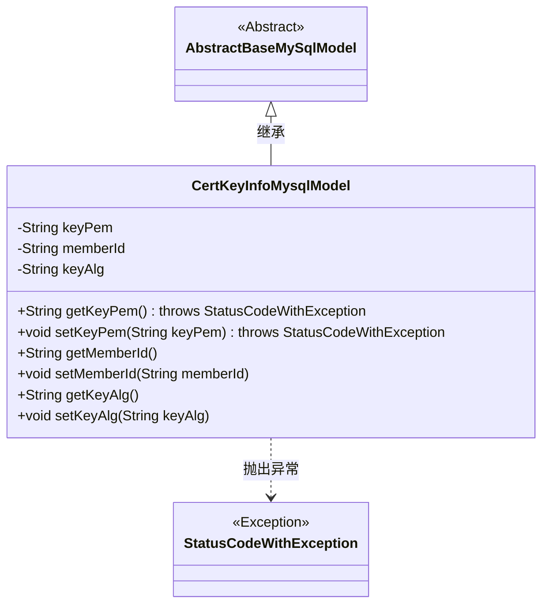

# 基础信息

|      |      |
|------|------|
| 名称 | CertKeyInfoMysqlModel |
| 编码语言 | .java |
| 代码路径 | WeFe/board/board-service/src/main/java/com/welab/wefe/board/service/database/entity/cert/CertKeyInfoMysqlModel.java |
| 包名 | com.welab.wefe.board.service.database.entity.cert |
| 依赖项 | ['javax.persistence.Column', 'javax.persistence.Entity', 'org.hibernate.annotations.TypeDef', 'com.vladmihalcea.hibernate.type.json.JsonStringType', 'com.welab.wefe.board.service.database.entity.base.AbstractBaseMySqlModel', 'com.welab.wefe.common.exception.StatusCodeWithException'] |
| 概述说明 | CertKeyInfoMysqlModel是MySQL实体类，包含keyPem、memberId和keyAlg字段，用于存储证书密钥信息。 |

# 说明

该内容定义了一个名为cert_key_info的JPA实体类CertKeyInfoMysqlModel，继承自AbstractBaseMySqlModel。实体包含三个字段：keyPem存储密钥PEM格式字符串，memberId表示成员标识，keyAlg记录密钥算法。所有字段均有对应的getter和setter方法，其中keyPem的存取方法会抛出StatusCodeWithException异常。类使用@TypeDef注解定义了名为json的自定义类型，并标注了serialVersionUID用于序列化。

# 类列表 Class Summary

| 名称   | 类型  | 说明 |
|-------|------|-------------|
| CertKeyInfoMysqlModel | class | CertKeyInfoMysqlModel是MySQL实体类，包含keyPem、memberId和keyAlg字段，用于存储证书密钥信息。 |

## 类 CertKeyInfoMysqlModel

|      |      |
|------|------|
| 访问范围 | @Entity(name = "cert_key_info");@TypeDef(name = "json", typeClass = JsonStringType.class);public |
| 类型 | class |
| 名称 | CertKeyInfoMysqlModel |
| 说明 | CertKeyInfoMysqlModel是MySQL实体类，包含keyPem、memberId和keyAlg字段，用于存储证书密钥信息。 |

### UML类图

该类图展示了一个基于JPA的数据库实体类CertKeyInfoMysqlModel，它继承自抽象基类AbstractBaseMySqlModel。该类包含三个私有字段（keyPem、memberId和keyAlg）及其对应的getter/setter方法，其中keyPem相关方法会抛出StatusCodeWithException异常。通过@Entity和@Column注解表明这是一个数据库映射实体，@TypeDef注解则指定了JSON类型的处理方式。整个设计体现了JPA实体与MySQL数据库表的映射关系。

### 内部方法调用关系图

```mermaid
graph TD
    A["类CertKeyInfoMysqlModel"]
    B["注解: @Entity(name='cert_key_info')"]
    C["注解: @TypeDef(name='json', typeClass=JsonStringType.class)"]
    D["继承: AbstractBaseMySqlModel"]
    E["属性: String keyPem"]
    F["属性: String memberId"]
    G["属性: String keyAlg"]
    H["方法: getKeyPem() throws StatusCodeWithException"]
    I["方法: setKeyPem(String) throws StatusCodeWithException"]
    J["方法: getMemberId()"]
    K["方法: setMemberId(String)"]
    L["方法: getKeyAlg()"]
    M["方法: setKeyAlg(String)"]

    A --> B
    A --> C
    A --> D
    A --> E
    A --> F
    A --> G
    A --> H
    A --> I
    A --> J
    A --> K
    A --> L
    A --> M
```

该流程图展示了CertKeyInfoMysqlModel类的完整结构，包括类注解、继承关系、属性和方法。这是一个JPA实体类，用于映射数据库表cert_key_info，包含三个核心字段(keyPem、memberId、keyAlg)及其getter/setter方法。特别值得注意的是keyPem字段的相关方法会抛出StatusCodeWithException异常，表明该字段可能涉及敏感数据或复杂业务逻辑验证。类通过@TypeDef注解定义了JSON类型处理器，暗示可能处理JSON格式数据。

### 字段列表 Field List

| 名称  | 类型  | 说明 |
|-------|-------|------|
| serialVersionUID = -7493726478506825680L | long | 定义了一个私有静态不可变的序列化版本ID，值为-7493726478506825680L。 |
| keyAlg | String | 数据库字段映射：key_alg对应私有字符串变量keyAlg。 |
| memberId | String | 数据库字段映射：成员ID对应member_id列。 |
| keyPem | String | 数据库字段映射：keyPem对应表列key_pem，存储为字符串类型。 |

### 方法列表

| 名称  | 类型  | 说明 |
|-------|-------|------|
| getKeyPem | String | 获取密钥PEM字符串，失败时抛出StatusCodeWithException异常。 |
| setKeyPem | void | 设置密钥PEM字符串，可能抛出StatusCodeWithException异常。 |
| getKeyAlg | String | 获取密钥算法的字符串方法。 |
| getMemberId | String | 获取成员ID的方法，返回字符串类型的memberId。 |
| setMemberId | void | 设置成员ID的方法，将输入字符串赋值给成员变量memberId。 |
| setKeyAlg | void | 设置密钥算法的公共方法，参数为字符串类型。 |

