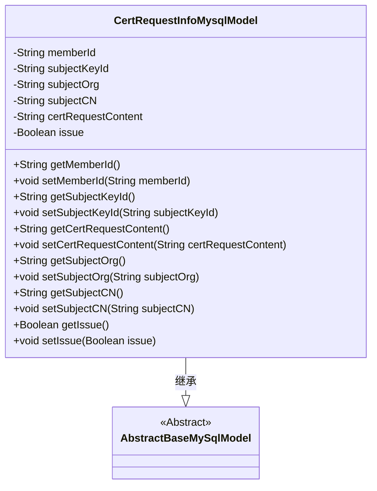

# 基础信息

|      |      |
|------|------|
| 名称 | CertRequestInfoMysqlModel |
| 编码语言 | .java |
| 代码路径 | WeFe/board/board-service/src/main/java/com/welab/wefe/board/service/database/entity/cert/CertRequestInfoMysqlModel.java |
| 包名 | com.welab.wefe.board.service.database.entity.cert |
| 依赖项 | ['javax.persistence.Column', 'javax.persistence.Entity', 'org.hibernate.annotations.TypeDef', 'com.vladmihalcea.hibernate.type.json.JsonStringType', 'com.welab.wefe.board.service.database.entity.base.AbstractBaseMySqlModel'] |
| 概述说明 | 证书请求信息实体类，包含用户ID、私钥ID、组织名称、常用名、申请内容及签发状态等字段。 |

# 说明

这是一个名为cert_request_info的JPA实体类，用于映射数据库中的证书申请信息表。类继承自AbstractBaseMySqlModel基类，包含六个核心字段：用户ID、申请人私钥ID、申请人组织名称、申请人常用名、证书申请内容以及是否签发标志。每个字段都通过@Column注解与数据库列名建立映射，其中member_id对应成员ID，subject_key_id对应私钥ID，subject_org对应组织名称，subject_cn对应常用名，cert_request_content存储证书申请内容，issue表示签发状态。类提供了标准的getter和setter方法用于字段访问和修改，并实现了序列化接口。

# 类列表 Class Summary

| 名称   | 类型  | 说明 |
|-------|------|-------------|
| CertRequestInfoMysqlModel | class | 这是一个名为cert_request_info的数据库实体类，包含用户ID、私钥ID、组织名称、常用名、证书申请内容及签发状态等字段。 |

## 类 CertRequestInfoMysqlModel

|      |      |
|------|------|
| 访问范围 | @Entity(name = "cert_request_info");@TypeDef(name = "json", typeClass = JsonStringType.class);public |
| 类型 | class |
| 名称 | CertRequestInfoMysqlModel |
| 说明 | 这是一个名为cert_request_info的数据库实体类，包含用户ID、私钥ID、组织名称、常用名、证书申请内容及签发状态等字段。 |

### UML类图

该代码定义了一个名为`CertRequestInfoMysqlModel`的实体类，用于表示证书请求信息，继承自抽象基类`AbstractBaseMySqlModel`。类中包含多个私有字段，如用户ID、申请人私钥ID、组织名称等，每个字段都有对应的getter和setter方法。该类使用JPA注解标记为实体，并指定了表名和字段映射关系，主要用于数据库操作。通过继承关系，该类获得了基类的通用数据库操作能力，同时扩展了特定于证书请求的业务属性。

### 内部方法调用关系图

```mermaid
graph TD
    A["类CertRequestInfoMysqlModel"]
    B["继承: AbstractBaseMySqlModel"]
    C["注解: @Entity('cert_request_info')"]
    D["注解: @TypeDef(name='json', typeClass=JsonStringType.class)"]
    E["属性: String memberId"]
    F["属性: String subjectKeyId"]
    G["属性: String subjectOrg"]
    H["属性: String subjectCN"]
    I["属性: String certRequestContent"]
    J["属性: Boolean issue"]
    K["方法: getMemberId()/setMemberId()"]
    L["方法: getSubjectKeyId()/setSubjectKeyId()"]
    M["方法: getSubjectOrg()/setSubjectOrg()"]
    N["方法: getSubjectCN()/setSubjectCN()"]
    O["方法: getCertRequestContent()/setCertRequestContent()"]
    P["方法: getIssue()/setIssue()"]

    A --> B
    A --> C
    A --> D
    A --> E
    A --> F
    A --> G
    A --> H
    A --> I
    A --> J
    A --> K
    A --> L
    A --> M
    A --> N
    A --> O
    A --> P
```

该流程图展示了CertRequestInfoMysqlModel类的完整结构，这是一个基于JPA的实体类，继承自AbstractBaseMySqlModel。类包含6个数据库映射字段（memberId、subjectKeyId等）及其对应的getter/setter方法，使用@Entity和@TypeDef注解定义表名和JSON类型处理。所有属性和方法都正确关联到主类节点，反映了完整的类成员关系。

### 字段列表 Field List

| 名称  | 类型  | 说明 |
|-------|-------|------|
| subjectKeyId | String | 数据库字段subject_key_id映射为字符串类型subjectKeyId。 |
| issue | Boolean | 实体类字段issue，布尔类型，对应数据库列名issue。 |
| serialVersionUID = -6973794829218983299L | long | 声明一个私有静态不可变的序列化版本ID，值为-6973794829218983299L。 |
| memberId | String | 数据库字段member_id映射为成员ID字符串类型。 |
| subjectOrg | String | 数据库字段映射：subject_org对应实体类中的subjectOrg字符串变量。 |
| subjectCN | String | 数据库字段subject_cn映射到Java变量subjectCN，类型为String。 |
| certRequestContent | String | 数据库字段映射：certRequestContent对应表列cert_request_content，类型为String。 |

### 方法列表

| 名称  | 类型  | 说明 |
|-------|-------|------|
| setSubjectOrg | void | 设置主题组织属性的方法，将输入字符串赋值给类的subjectOrg成员变量。 |
| setCertRequestContent | void | 设置证书请求内容的方法，将输入参数赋值给成员变量certRequestContent。 |
| getSubjectCN | String | 获取主题CN的方法，返回字符串类型变量subjectCN的值。 |
| setSubjectCN | void | 设置主题中文名称的方法，参数为字符串类型。 |
| setSubjectKeyId | void | 设置主题密钥ID的方法，将输入字符串赋值给类的成员变量subjectKeyId。 |
| getSubjectKeyId | String | 获取主题密钥ID的方法，返回字符串类型的subjectKeyId值。 |
| setMemberId | void | 设置成员ID的方法，将输入字符串赋值给成员变量memberId。 |
| getCertRequestContent | String | 方法返回证书请求内容字符串。 |
| getSubjectOrg | String | 获取subjectOrg字符串的方法。 |
| getIssue | Boolean | 这是一个Java方法，返回布尔类型的issue变量值。 |
| setIssue | void | 设置问题状态的方法，参数为布尔值issue，用于更新当前对象的问题状态。 |
| getMemberId | String | 获取成员ID的方法，返回字符串类型的memberId。 |

