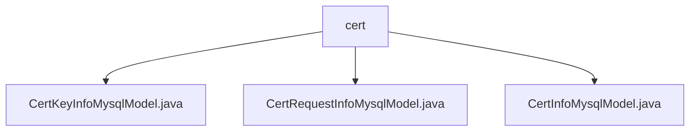

# 基础信息

|      |      |
|------|------|
| 名称 | cert |
| 编码语言 | .java |
| 代码路径 | WeFe/board/board-service/src/main/java/com/welab/wefe/board/service/database/entity/cert |
| 包名 | docs.board.board-service.src.main.java.com.welab.wefe.board.service.database.entity.cert |
| 概述说明 | CertKeyInfoMysqlModel存储密钥PEM、成员ID和算法；CertRequestInfoMysqlModel记录证书申请信息如私钥ID、组织名等；CertInfoMysqlModel管理证书数据如公钥、序列号等。三者均继承AbstractBaseMySqlModel，使用JPA注解映射数据库字段。 |

# 说明

## 概述  
该模块核心职责为管理数字证书全生命周期数据，包括密钥存储、证书申请和签发信息。接口规范遵循JPA实体标准，统一使用@Column注解映射数据库字段，并支持JSON类型转换。关键数据结构包含CertKeyInfoMysqlModel（密钥PEM）、CertRequestInfoMysqlModel（申请表单）和CertInfoMysqlModel（证书元数据）。外部依赖仅涉及JPA框架。例如CertKeyInfoMysqlModel通过keyPem字段存储非对称加密密钥。

## 主要业务场景  
模块完整覆盖证书生成流程：成员提交密钥与申请（CertRequestInfoMysqlModel）、CA机构审核签发（CertInfoMysqlModel）。交互模式类似CRUD操作，通过getter/setter实现字段访问。典型应用包括联盟链成员入网认证，例如subject_cn字段存储用户可识别名称。API类型均为数据实体类，集成案例可见证书状态（issue字段）与请求内容（cert_request_content）的关联更新。

### 包内部结构视图

该流程图展示了WeFe项目中证书相关实体类的层级结构。cert目录下包含三个Java实体类文件，分别表示证书密钥信息、证书请求信息和证书信息的MySQL数据库模型。这些类都位于board-service模块的数据库实体包中，用于处理与证书相关的数据持久化操作。

# 文件列表

| 名称   | 类型  | 说明 |
|-------|------|-------------|
| [CertKeyInfoMysqlModel.java](CertKeyInfoMysqlModel.md) | file | CertKeyInfoMysqlModel是MySQL实体类，包含keyPem、memberId和keyAlg字段，用于存储证书密钥信息。 |
| [CertRequestInfoMysqlModel.java](CertRequestInfoMysqlModel.md) | file | 证书请求信息实体类，包含用户ID、私钥ID、组织名称、常用名、申请内容及签发状态等字段。 |
| [CertInfoMysqlModel.java](CertInfoMysqlModel.md) | file | CertInfoMysqlModel是存储证书信息的MySQL实体类，包含用户ID、公钥、组织名称、常用名、序列号、证书内容、请求ID和状态等字段。 |

