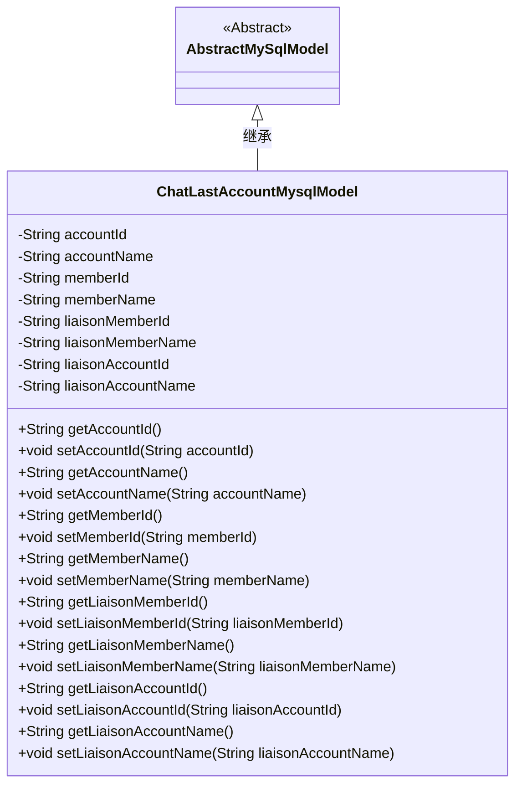

# 基础信息

|      |      |
|------|------|
| 名称 | ChatLastAccountMysqlModel |
| 编码语言 | .java |
| 代码路径 | WeFe/board/board-service/src/main/java/com/welab/wefe/board/service/database/entity/chat/ChatLastAccountMysqlModel.java |
| 包名 | com.welab.wefe.board.service.database.entity.chat |
| 依赖项 | ['com.welab.wefe.board.service.database.entity.base.AbstractMySqlModel', 'javax.persistence.Entity'] |
| 概述说明 | ChatLastAccountMysqlModel是MySQL实体类，包含账户ID、名称，成员ID、名称，及联系人成员和账户的ID、名称字段及其getter/setter方法。 |

# 说明

该内容定义了一个名为ChatLastAccountMysqlModel的Java实体类，映射到数据库表chat_last_account。类继承自AbstractMySqlModel，包含账户和成员信息字段：accountId、accountName、memberId、memberName，以及联系人相关的liaisonMemberId、liaisonMemberName、liaisonAccountId、liaisonAccountName。每个字段都有对应的getter和setter方法，用于数据访问和修改。

# 类列表 Class Summary

| 名称   | 类型  | 说明 |
|-------|------|-------------|
| ChatLastAccountMysqlModel | class | 这是一个名为ChatLastAccountMysqlModel的Java实体类，用于存储聊天相关的账户和成员信息，包括账户ID、名称，成员ID、名称，以及联系人的成员和账户信息。 |

## 类 ChatLastAccountMysqlModel

|      |      |
|------|------|
| 访问范围 | @Entity(name = "chat_last_account");public |
| 类型 | class |
| 名称 | ChatLastAccountMysqlModel |
| 说明 | 这是一个名为ChatLastAccountMysqlModel的Java实体类，用于存储聊天相关的账户和成员信息，包括账户ID、名称，成员ID、名称，以及联系人的成员和账户信息。 |

### UML类图

该类图展示了一个继承自AbstractMySqlModel的ChatLastAccountMysqlModel实体类，主要用于存储聊天相关的账户和成员信息。类中包含8个私有字符串字段，分别记录账户ID/名称、成员ID/名称以及联系人（liaison）的成员ID/名称和账户ID/名称，每个字段都有对应的getter和setter方法。该类通过@Entity注解标记为JPA实体，表明其与数据库表"chat_last_account"的映射关系。

### 内部方法调用关系图

```mermaid
graph TD
    A["类ChatLastAccountMysqlModel"]
    B["继承: AbstractMySqlModel"]
    C["属性: String accountId"]
    D["属性: String accountName"]
    E["属性: String memberId"]
    F["属性: String memberName"]
    G["属性: String liaisonMemberId"]
    H["属性: String liaisonMemberName"]
    I["属性: String liaisonAccountId"]
    J["属性: String liaisonAccountName"]
    K["方法: getAccountId()"]
    L["方法: setAccountId(String)"]
    M["方法: getAccountName()"]
    N["方法: setAccountName(String)"]
    O["方法: getMemberId()"]
    P["方法: setMemberId(String)"]
    Q["方法: getMemberName()"]
    R["方法: setMemberName(String)"]
    S["方法: getLiaisonMemberId()"]
    T["方法: setLiaisonMemberId(String)"]
    U["方法: getLiaisonMemberName()"]
    V["方法: setLiaisonMemberName(String)"]
    W["方法: getLiaisonAccountId()"]
    X["方法: setLiaisonAccountId(String)"]
    Y["方法: getLiaisonAccountName()"]
    Z["方法: setLiaisonAccountName(String)"]

    A --> B
    A --> C
    A --> D
    A --> E
    A --> F
    A --> G
    A --> H
    A --> I
    A --> J
    A --> K
    A --> L
    A --> M
    A --> N
    A --> O
    A --> P
    A --> Q
    A --> R
    A --> S
    A --> T
    A --> U
    A --> V
    A --> W
    A --> X
    A --> Y
    A --> Z
```

该流程图展示了ChatLastAccountMysqlModel类的完整结构，包括其继承关系和所有属性与方法。该类是一个JPA实体，包含8个字符串类型的属性，分别表示账户和成员的相关信息，以及对应的getter和setter方法。每个属性都有明确的数据访问和修改方法，体现了标准的JavaBean设计模式。类继承自AbstractMySqlModel，表明这是一个MySQL数据库映射的实体类。

### 字段列表 Field List

| 名称  | 类型  | 说明 |
|-------|-------|------|
| memberId | String | 声明一个私有字符串类型变量memberId。 |
| liaisonMemberName | String | 私有字符串类型变量，存储联络成员姓名。 |
| memberName | String | 成员变量名称为memberName，类型为String。 |
| liaisonAccountId | String | 私有字符串类型变量，存储联络账户ID。 |
| liaisonAccountName | String | 私有字符串变量，存储联络账户名称。 |
| liaisonMemberId | String | 私有字符串类型变量，存储联络成员ID。 |
| accountName | String | 声明一个私有字符串变量accountName。 |
| accountId | String | 私有字符串类型变量accountId |

### 方法列表

| 名称  | 类型  | 说明 |
|-------|-------|------|
| getMemberId | String | 这是一个Java方法，返回成员ID字符串。 |
| getLiaisonMemberName | String | 获取联络成员姓名的方法，返回字符串类型的成员姓名变量。 |
| getAccountId | String | 获取accountId的公共方法，返回字符串类型。 |
| setLiaisonMemberId | void | 设置联络成员ID的方法，参数为字符串类型liaisonMemberId，将其赋值给当前对象的同名属性。 |
| getAccountName | String | 获取账户名称的方法，返回accountName字符串。 |
| setLiaisonMemberName | void | 设置联络员姓名的方法，将参数值赋给成员变量liaisonMemberName。 |
| getLiaisonMemberId | String | 获取联络成员ID的方法，返回字符串类型的成员ID。 |
| setMemberName | void | 设置成员名称的方法，将输入参数赋值给成员变量。 |
| setAccountId | void | 设置账户ID的方法，将参数accountId赋值给当前对象的accountId属性。 |
| setMemberId | void | 设置成员ID的方法，将输入参数赋值给类的成员变量memberId。 |
| setAccountName | void | 这是一个Java方法，用于设置类的accountName属性值。方法接收一个字符串参数accountName，并将其赋值给类的同名成员变量。 |
| getMemberName | String | 获取成员名称的方法，直接返回成员变量memberName的值。 |
| getLiaisonAccountId | String | 方法返回联络账户ID字符串。 |
| setLiaisonAccountId | void | 设置联络账号ID的方法，将参数值赋给类成员变量liaisonAccountId。 |
| getLiaisonAccountName | String | 获取联络账户名称的方法，返回字符串类型值liaisonAccountName。 |
| setLiaisonAccountName | void | 设置联络账户名称的方法，将参数值赋给类的成员变量liaisonAccountName。 |

