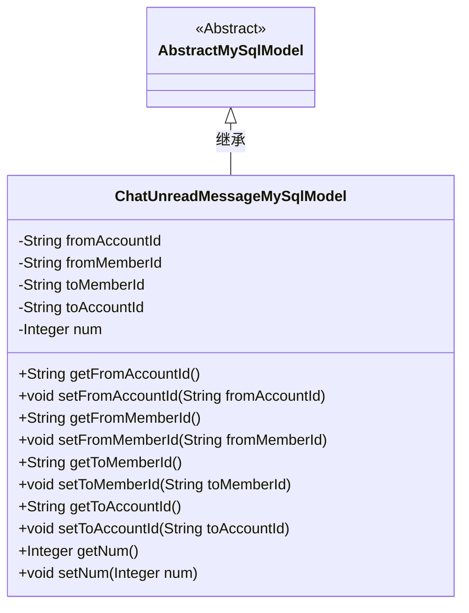

# 基础信息

|      |      |
|------|------|
| 名称 | ChatUnreadMessageMySqlModel |
| 编码语言 | .java |
| 代码路径 | WeFe/board/board-service/src/main/java/com/welab/wefe/board/service/database/entity/chat/ChatUnreadMessageMySqlModel.java |
| 包名 | com.welab.wefe.board.service.database.entity.chat |
| 依赖项 | ['com.welab.wefe.board.service.database.entity.base.AbstractMySqlModel', 'javax.persistence.Entity'] |
| 概述说明 | 数据库实体类ChatUnreadMessageMySqlModel，包含发送方和接收方的账户ID、成员ID及未读消息数量字段。 |

# 说明

该代码定义了一个名为ChatUnreadMessageMySqlModel的JPA实体类，用于表示聊天未读消息的数据库模型。实体包含发送方账户ID、发送方成员ID、接收方成员ID、接收方账户ID以及未读消息数量等字段。所有字段均提供标准的getter和setter方法，用于数据访问和修改。该类继承自AbstractMySqlModel，表明其具有基础的MySQL模型特性。

# 类列表 Class Summary

| 名称   | 类型  | 说明 |
|-------|------|-------------|
| ChatUnreadMessageMySqlModel | class | 数据库实体类ChatUnreadMessageMySqlModel，包含收发双方的账户和成员ID及未读消息数。 |

## 类 ChatUnreadMessageMySqlModel

|      |      |
|------|------|
| 访问范围 | @Entity(name = "chat_unread_message");public |
| 类型 | class |
| 名称 | ChatUnreadMessageMySqlModel |
| 说明 | 数据库实体类ChatUnreadMessageMySqlModel，包含收发双方的账户和成员ID及未读消息数。 |

### UML类图

这段代码定义了一个名为ChatUnreadMessageMySqlModel的实体类，用于表示聊天未读消息的数据库模型。该类继承自AbstractMySqlModel抽象类，包含发送方和接收方的账户ID、成员ID以及未读消息数量等私有字段，并提供了相应的getter和setter方法。类图清晰地展示了继承关系和类的成员结构，体现了该实体类作为数据库模型的核心属性和方法。

### 内部方法调用关系图

```mermaid
graph TD
    A["类ChatUnreadMessageMySqlModel"]
    B["继承: AbstractMySqlModel"]
    C["属性: String fromAccountId"]
    D["属性: String fromMemberId"]
    E["属性: String toMemberId"]
    F["属性: String toAccountId"]
    G["属性: Integer num"]
    H["方法: getFromAccountId()"]
    I["方法: setFromAccountId(String)"]
    J["方法: getFromMemberId()"]
    K["方法: setFromMemberId(String)"]
    L["方法: getToMemberId()"]
    M["方法: setToMemberId(String)"]
    N["方法: getToAccountId()"]
    O["方法: setToAccountId(String)"]
    P["方法: getNum()"]
    Q["方法: setNum(Integer)"]

    A --> B
    A --> C
    A --> D
    A --> E
    A --> F
    A --> G
    A --> H
    A --> I
    A --> J
    A --> K
    A --> L
    A --> M
    A --> N
    A --> O
    A --> P
    A --> Q
```

这段代码定义了一个名为ChatUnreadMessageMySqlModel的实体类，继承自AbstractMySqlModel，用于表示聊天未读消息的数据模型。类中包含五个私有属性：发送者账号ID、发送者成员ID、接收者成员ID、接收者账号ID和未读消息数量，每个属性都有对应的getter和setter方法。该模型映射到数据库表"chat_unread_message"，用于持久化存储聊天消息的未读状态信息。

### 字段列表 Field List

| 名称  | 类型  | 说明 |
|-------|-------|------|
| fromMemberId | String | 私有字符串类型成员变量fromMemberId。 |
| num | Integer | 声明一个私有整型变量num。 |
| toAccountId | String | 私有字符串类型变量toAccountId。 |
| toMemberId | String | 声明一个私有字符串变量toMemberId。 |
| fromAccountId | String | 私有字符串类型变量fromAccountId |

### 方法列表

| 名称  | 类型  | 说明 |
|-------|-------|------|
| getToMemberId | String | 获取接收方成员ID的方法，返回字符串类型的toMemberId值。 |
| setFromAccountId | void | 设置来源账户ID的方法，将参数值赋给类的成员变量fromAccountId。 |
| getToAccountId | String | 获取目标账户ID的方法，返回字符串类型的toAccountId。 |
| setNum | void | 这是一个Java方法，用于设置类成员变量num的值。方法接收一个Integer参数，并将其赋值给当前对象的num属性。 |
| getFromAccountId | String | 该方法返回字符串类型的fromAccountId变量值。 |
| setFromMemberId | void | 设置成员ID的方法，将参数fromMemberId赋值给当前对象的fromMemberId属性。 |
| setToAccountId | void | 设置目标账户ID的方法，将参数值赋给类的成员变量toAccountId。 |
| getNum | Integer | 这是一个Java方法，返回整数类型的num变量值。 |
| getFromMemberId | String | 获取成员ID的方法，返回字符串类型的fromMemberId。 |
| setToMemberId | void | 设置目标成员ID的方法，将参数toMemberId赋值给当前对象的toMemberId属性。 |

