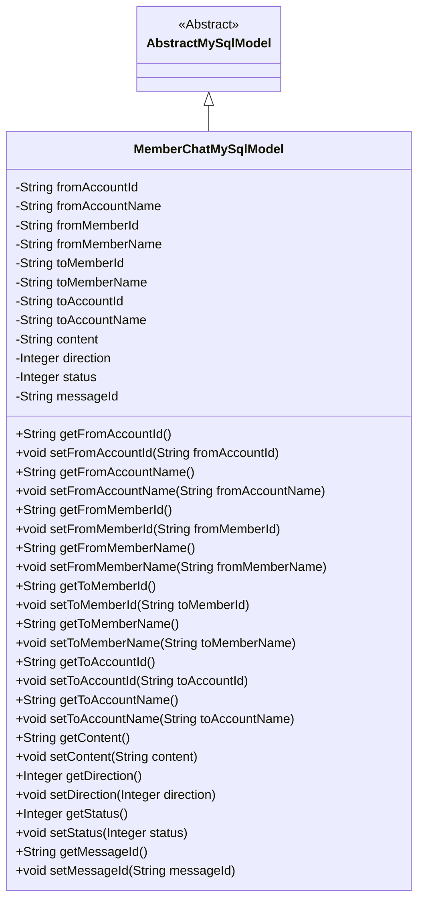

# 基础信息

|      |      |
|------|------|
| 名称 | MemberChatMySqlModel |
| 编码语言 | .java |
| 代码路径 | WeFe/board/board-service/src/main/java/com/welab/wefe/board/service/database/entity/chat/MemberChatMySqlModel.java |
| 包名 | com.welab.wefe.board.service.database.entity.chat |
| 依赖项 | ['com.welab.wefe.board.service.database.entity.base.AbstractMySqlModel', 'javax.persistence.Entity'] |
| 概述说明 | 成员聊天MySQL模型类，包含发送方和接收方的账户及成员ID、名称，聊天内容，消息方向、状态和ID等属性及其getter/setter方法。 |

# 说明

该代码定义了一个名为MemberChatMySqlModel的实体类，用于存储成员聊天信息。类中包含发送方和接收方的账户ID、名称，成员ID、名称，以及聊天内容、消息方向（接收或发送）、状态（如已读、未读等）、消息ID等字段。所有字段均提供了对应的getter和setter方法，用于数据的存取操作。该类继承自AbstractMySqlModel，表明其用于MySQL数据库的持久化存储。

# 类列表 Class Summary

| 名称   | 类型  | 说明 |
|-------|------|-------------|
| MemberChatMySqlModel | class | 成员聊天MySQL模型，包含发送接收方账号、成员ID及名称，消息内容、方向、状态和消息ID等字段。 |

## 类 MemberChatMySqlModel

|      |      |
|------|------|
| 访问范围 | @Entity(name = "member_chat");public |
| 类型 | class |
| 名称 | MemberChatMySqlModel |
| 说明 | 成员聊天MySQL模型，包含发送接收方账号、成员ID及名称，消息内容、方向、状态和消息ID等字段。 |

### UML类图

这段代码定义了一个名为`MemberChatMySqlModel`的实体类，用于表示成员之间的聊天记录。该类继承自`AbstractMySqlModel`，包含发送方和接收方的账户ID、成员ID、名称信息，以及聊天内容、方向、状态和消息ID等属性。所有属性均为私有，通过公共的getter和setter方法进行访问和修改。该类主要用于数据库持久化，通过@Entity注解标记为JPA实体。

### 内部方法调用关系图

```mermaid
graph TD
    A["类MemberChatMySqlModel"]
    B["继承: AbstractMySqlModel"]
    C["属性: String fromAccountId"]
    D["属性: String fromAccountName"]
    E["属性: String fromMemberId"]
    F["属性: String fromMemberName"]
    G["属性: String toMemberId"]
    H["属性: String toMemberName"]
    I["属性: String toAccountId"]
    J["属性: String toAccountName"]
    K["属性: String content"]
    L["属性: Integer direction"]
    M["属性: Integer status"]
    N["属性: String messageId"]
    O["Getter/Setter方法: fromAccountId"]
    P["Getter/Setter方法: fromAccountName"]
    Q["Getter/Setter方法: fromMemberId"]
    R["Getter/Setter方法: fromMemberName"]
    S["Getter/Setter方法: toMemberId"]
    T["Getter/Setter方法: toMemberName"]
    U["Getter/Setter方法: toAccountId"]
    V["Getter/Setter方法: toAccountName"]
    W["Getter/Setter方法: content"]
    X["Getter/Setter方法: direction"]
    Y["Getter/Setter方法: status"]
    Z["Getter/Setter方法: messageId"]

    A --> B
    A --> C
    A --> D
    A --> E
    A --> F
    A --> G
    A --> H
    A --> I
    A --> J
    A --> K
    A --> L
    A --> M
    A --> N
    C -.-> O
    D -.-> P
    E -.-> Q
    F -.-> R
    G -.-> S
    H -.-> T
    I -.-> U
    J -.-> V
    K -.-> W
    L -.-> X
    M -.-> Y
    N -.-> Z
```

这段代码定义了一个名为MemberChatMySqlModel的实体类，用于表示成员间的聊天记录。该类继承自AbstractMySqlModel，包含发送方和接收方的账户ID、成员ID、名称等属性，以及聊天内容、方向、状态和消息ID等字段。每个属性都有对应的getter和setter方法，用于数据的存取操作。这个类主要用于数据库映射，存储和管理聊天记录的相关信息。

### 字段列表 Field List

| 名称  | 类型  | 说明 |
|-------|-------|------|
| direction | Integer | 私有整型变量direction，用于表示方向。 |
| fromAccountName | String | 私有字符串变量，存储账户名称。 |
| messageId | String | 私有字符串类型变量messageId，用于存储消息标识。 |
| toMemberName | String | 声明一个私有字符串变量toMemberName。 |
| toAccountId | String | 声明一个私有字符串变量toAccountId。 |
| toMemberId | String | 发送目标成员ID字符串 |
| status | Integer | 私有整型状态变量。 |
| fromMemberId | String | 私有字符串类型成员变量，表示来源成员ID。 |
| fromAccountId | String | 声明一个私有字符串变量fromAccountId。 |
| fromMemberName | String | 私有字符串类型变量，存储成员名称。 |
| content | String | 私有字符串类型变量content。 |
| toAccountName | String | 私有字符串变量，存储目标账户名称。 |

### 方法列表

| 名称  | 类型  | 说明 |
|-------|-------|------|
| setToMemberName | void | 设置成员名称的方法，将输入参数赋值给类的成员变量toMemberName。 |
| getFromMemberName | String | 获取成员名称的方法，返回字符串类型的成员变量fromMemberName。 |
| setFromMemberId | void | 设置成员ID的方法，将参数fromMemberId赋值给类的同名属性。 |
| getToAccountId | String | 获取目标账户ID的方法，返回字符串类型的toAccountId。 |
| setStatus | void | 这是一个Java方法，用于设置对象的status属性值。方法接收一个Integer参数，并将其赋值给对象的status字段。 |
| setToMemberId | void | 设置接收方成员ID的方法，参数为字符串类型，赋值给类的成员变量toMemberId。 |
| setFromAccountName | void | 设置账户名称的方法，将输入参数赋值给类的成员变量fromAccountName。 |
| setMessageId | void | 设置消息ID的方法，将输入参数messageId赋值给当前对象的messageId属性。 |
| getMessageId | String | 获取messageId的方法，直接返回messageId的值。 |
| getToMemberName | String | 获取接收方成员名称的方法，返回字符串类型值。 |
| setToAccountId | void | 设置目标账户ID的方法，将参数值赋给类的成员变量toAccountId。 |
| setContent | void | 设置内容属性值为输入参数content的值。 |
| getToMemberId | String | 获取接收方成员ID的方法，返回字符串类型的toMemberId值。 |
| setFromMemberName | void | Java方法：设置成员变量fromMemberName的值。 |
| setFromAccountId | void | 设置来源账户ID的方法，将参数值赋给类的成员变量fromAccountId。 |
| getToAccountName | String | 获取目标账户名称的方法，返回字符串类型的账户名。 |
| getFromAccountId | String | 获取来源账户ID的方法，返回字符串类型的账户ID。 |
| setDirection | void | 该方法用于设置方向属性，接收一个整型参数direction并将其赋值给类的成员变量direction。 |
| getDirection | Integer | 获取方向值的方法，返回整数类型的方向值。 |
| getStatus | Integer | 获取状态值的方法，返回整数类型的状态值。 |
| getFromAccountName | String | 获取发送方账户名称的方法，返回字符串类型的账户名。 |
| getContent | String | 获取content字符串的方法。 |
| getFromMemberId | String | 获取成员ID的方法，返回字符串类型的fromMemberId。 |
| setToAccountName | void | 设置目标账户名称的方法，将参数toAccountName赋值给类的成员变量this.toAccountName。 |

