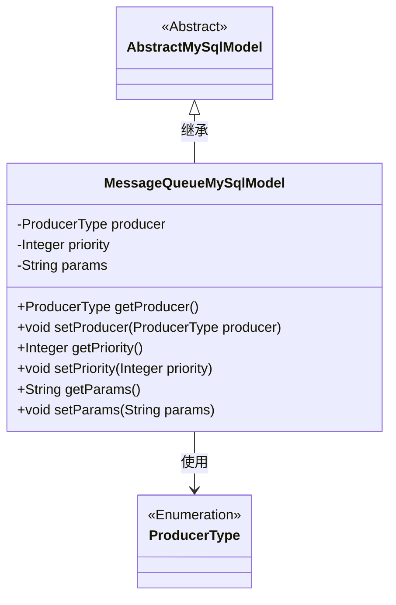
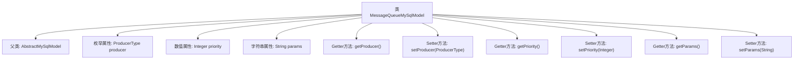

# 基础信息

|      |      |
|------|------|
| 名称 | MessageQueueMySqlModel |
| 编码语言 | .java |
| 代码路径 | WeFe/board/board-service/src/main/java/com/welab/wefe/board/service/database/entity/chat/MessageQueueMySqlModel.java |
| 包名 | com.welab.wefe.board.service.database.entity.chat |
| 依赖项 | ['com.welab.wefe.board.service.database.entity.base.AbstractMySqlModel', 'com.welab.wefe.common.wefe.enums.ProducerType', 'javax.persistence.Entity', 'javax.persistence.EnumType', 'javax.persistence.Enumerated'] |
| 概述说明 | 消息队列MySQL实体类，包含生产者类型、优先级和参数字段及其getter/setter方法。 |

# 说明

这是一个名为MessageQueueMySqlModel的JPA实体类，映射到数据库表message_queue。它继承自AbstractMySqlModel，包含三个核心字段：producer表示消息生产者类型（枚举值board/gateway），priority定义消息优先级（数值越高越优先处理），params存储动作参数。类中为每个字段提供了标准的getter和setter方法。该实体用于实现消息队列的持久化存储。

# 类列表 Class Summary

| 名称   | 类型  | 说明 |
|-------|------|-------------|
| MessageQueueMySqlModel | class | 消息队列MySQL实体类，包含生产者类型（枚举）、优先级和动作参数字段及对应getter/setter方法。 |

## 类 MessageQueueMySqlModel

|      |      |
|------|------|
| 访问范围 | @Entity(name = "message_queue");public |
| 类型 | class |
| 名称 | MessageQueueMySqlModel |
| 说明 | 消息队列MySQL实体类，包含生产者类型（枚举）、优先级和动作参数字段及对应getter/setter方法。 |

### UML类图

这段代码定义了一个名为MessageQueueMySqlModel的实体类，继承自AbstractMySqlModel抽象类。该类包含三个主要属性：producer（生产者类型，枚举值）、priority（优先级数值）和params（参数字符串），并提供了对应的getter和setter方法。ProducerType是一个枚举类型，用于标识消息来源。类通过@Entity注解标记为JPA实体，映射到数据库的message_queue表。该设计用于实现消息队列的持久化存储，支持优先级排序和不同类型生产者的区分。

### 内部方法调用关系图

该流程图展示了MessageQueueMySqlModel类的完整结构，这是一个继承自AbstractMySqlModel的JPA实体类。类中包含三个核心属性：枚举类型的producer表示消息生产者类型，Integer类型的priority表示消息优先级，String类型的params存储动作参数。每个属性都配有对应的getter和setter方法，这些方法通过箭头与主类相连，清晰地呈现了类的成员关系和方法调用路径。实体标注@Entity表明这是一个持久化对象，@Enumerated注解则指定了枚举的存储方式。

### 字段列表 Field List

| 名称  | 类型  | 说明 |
|-------|-------|------|
| producer | ProducerType | 使用@Enumerated注解将枚举类型ProducerType以字符串形式存储到数据库。 |
| params | String | 私有字符串参数params。 |
| priority | Integer | 私有整型变量，表示优先级。 |

### 方法列表

| 名称  | 类型  | 说明 |
|-------|-------|------|
| getProducer | ProducerType | 获取生产者类型的方法，返回producer变量。 |
| getParams | String | 方法返回字符串类型参数params的值。 |
| setPriority | void | 这是一个Java方法，用于设置对象的优先级属性。方法接收一个Integer参数priority，并将其赋值给对象的priority字段。 |
| setProducer | void | 设置生产者对象的方法，将传入的producer参数赋值给当前对象的producer属性。 |
| getPriority | Integer | 获取priority的整数值。 |
| setParams | void | 设置参数方法，将输入参数赋值给类成员变量params。 |

