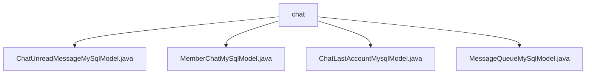

# 基础信息

|      |      |
|------|------|
| 名称 | chat |
| 编码语言 | .java |
| 代码路径 | WeFe/board/board-service/src/main/java/com/welab/wefe/board/service/database/entity/chat |
| 包名 | docs.board.board-service.src.main.java.com.welab.wefe.board.service.database.entity.chat |
| 概述说明 | 定义了四个JPA实体类：ChatUnreadMessageMySqlModel（未读消息）、MemberChatMySqlModel（成员聊天信息）、ChatLastAccountMysqlModel（账户联系人）、MessageQueueMySqlModel（消息队列）。均继承AbstractMySqlModel，包含相关字段及getter/setter方法。 |

# 说明

## 概述  
该模块核心职责是实现聊天系统的数据持久化，包括未读消息、成员聊天记录、最近联系人及消息队列管理。接口规范遵循JPA标准，提供基础字段的getter/setter方法。关键数据结构包含发送方/接收方账户与成员信息、消息内容与状态、队列优先级等。外部依赖仅为MySQL数据库。例如ChatUnreadMessageMySqlModel跟踪未读数，MessageQueueMySqlModel实现优先级队列存储。

## 主要业务场景  
模块支持完整的聊天业务流程：成员间消息收发（MemberChatMySqlModel）、未读状态维护（ChatUnreadMessageMySqlModel）、最近联系人记录（ChatLastAccountMysqlModel）及异步消息处理（MessageQueueMySqlModel）。交互模式类似事件总线，通过数据库表实现状态同步。典型应用包括实时消息推送、未读计数更新等。API类型涵盖CRUD操作，例如通过JPA自动持久化消息实体。

### 包内部结构视图

该流程图展示了WeFe项目中聊天功能相关的数据库实体类结构，所有实体类均位于chat目录下，包含未读消息模型、成员聊天模型、最后账户模型和消息队列模型四个核心组件，形成清晰的层级关系。这些实体类共同支撑了聊天功能的数据库操作需求。

# 文件列表

| 名称   | 类型  | 说明 |
|-------|------|-------------|
| [ChatUnreadMessageMySqlModel.java](ChatUnreadMessageMySqlModel.md) | file | 数据库实体类ChatUnreadMessageMySqlModel，包含发送方和接收方的账户ID、成员ID及未读消息数量字段。 |
| [MemberChatMySqlModel.java](MemberChatMySqlModel.md) | file | 成员聊天MySQL模型类，包含发送方和接收方的账户及成员ID、名称，聊天内容，消息方向、状态和ID等属性及其getter/setter方法。 |
| [ChatLastAccountMysqlModel.java](ChatLastAccountMysqlModel.md) | file | ChatLastAccountMysqlModel是MySQL实体类，包含账户ID、名称，成员ID、名称，及联系人成员和账户的ID、名称字段及其getter/setter方法。 |
| [MessageQueueMySqlModel.java](MessageQueueMySqlModel.md) | file | 消息队列MySQL实体类，包含生产者类型、优先级和参数字段及其getter/setter方法。 |

