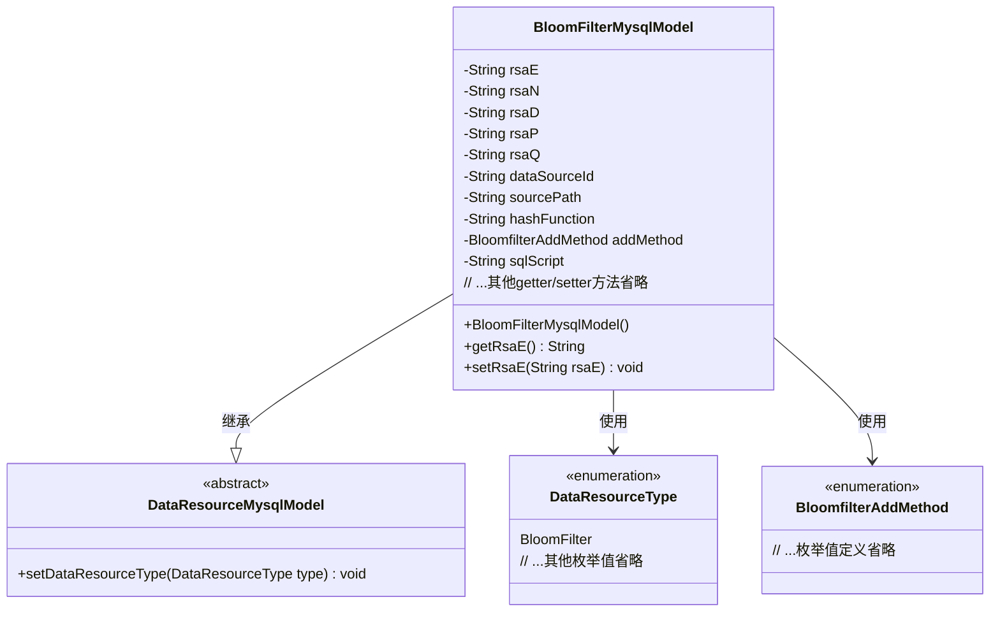

# 基础信息

|      |      |
|------|------|
| 名称 | BloomFilterMysqlModel |
| 编码语言 | .java |
| 代码路径 | WeFe/board/board-service/src/main/java/com/welab/wefe/board/service/database/entity/data_resource/BloomFilterMysqlModel.java |
| 包名 | com.welab.wefe.board.service.database.entity.data_resource |
| 依赖项 | ['com.welab.wefe.board.service.constant.BloomfilterAddMethod', 'com.welab.wefe.common.wefe.enums.DataResourceType', 'javax.persistence'] |
| 概述说明 | 布隆过滤器MySQL模型类，包含RSA密钥参数、数据源ID、路径、哈希函数、添加方法和SQL脚本等字段。 |

# 说明

该代码定义了一个名为BloomFilterMysqlModel的Java类，用于表示布隆过滤器的数据库模型。类中包含多个属性，包括RSA密钥相关字段（e、n、d、p、q）、数据源ID、数据源地址、主键哈希生成方法、布隆过滤器添加方式枚举以及SQL语句。该类继承自DataResourceMysqlModel，并在构造函数中设置了资源类型为布隆过滤器。所有属性均提供了对应的getter和setter方法。

# 类列表 Class Summary

| 名称   | 类型  | 说明 |
|-------|------|-------------|
| BloomFilterMysqlModel | class | BloomFilterMysqlModel类存储布隆过滤器数据，包含RSA密钥参数、数据源信息、哈希函数、添加方式和SQL脚本。 |


## 类 BloomFilterMysqlModel

|      |      |
|------|------|
| 访问范围 | @Entity(name = "bloom_filter");@Table(name = "bloom_filter");public |
| 类型 | class |
| 名称 | BloomFilterMysqlModel |
| 说明 | BloomFilterMysqlModel类存储布隆过滤器数据，包含RSA密钥参数、数据源信息、哈希函数、添加方式和SQL脚本。 |


### UML类图



类图描述：该图展示了BloomFilterMysqlModel类继承自抽象基类DataResourceMysqlModel，并包含多个私有字段用于存储RSA密钥参数、数据源信息和布隆过滤器配置。通过两个枚举类型DataResourceType和BloomfilterAddMethod来限定资源类型和添加方法。所有字段均通过getter/setter方法进行访问控制，体现了标准的JPA实体类设计模式。


### 内部方法调用关系图

```mermaid
graph TD
    A["类BloomFilterMysqlModel"]
    B["继承: DataResourceMysqlModel"]
    C["属性: String rsaE"]
    D["属性: String rsaN"]
    E["属性: String rsaD"]
    F["属性: String rsaP"]
    G["属性: String rsaQ"]
    H["属性: String dataSourceId"]
    I["属性: String sourcePath"]
    J["属性: String hashFunction"]
    K["属性: BloomfilterAddMethod addMethod"]
    L["属性: String sqlScript"]
    M["构造方法: BloomFilterMysqlModel()"]
    N["方法组: getter/setter"]

    A --> B
    A --> C
    A --> D
    A --> E
    A --> F
    A --> G
    A --> H
    A --> I
    A --> J
    A --> K
    A --> L
    A --> M
    A --> N
    M -->|调用| B
    M -->|设置| 'super.setDataResourceType(DataResourceType.BloomFilter)'
```

该流程图展示了BloomFilterMysqlModel类的结构，包括其继承关系、属性定义、构造方法和getter/setter方法组。该类作为数据库实体模型，主要存储布隆过滤器相关配置和RSA密钥参数，通过继承DataResourceMysqlModel实现基础功能，并在构造函数中初始化资源类型。所有属性均通过标准getter/setter方法进行访问控制，符合JavaBean规范。

### 字段列表 Field List

| 名称  | 类型  | 说明 |
|-------|-------|------|
| addMethod | BloomfilterAddMethod | 定义枚举类型字段addMethod，使用字符串形式存储枚举值。 |
| sourcePath | String | 私有字符串变量sourcePath，用于存储源路径。 |
| dataSourceId | String | 私有字符串变量dataSourceId。 |
| rsaE | String | 数据库字段映射：rsaE对应列名rsa_e，类型为String。 |
| sqlScript | String | 私有字符串变量sqlScript，用于存储SQL脚本。 |
| rsaN | String | 数据库字段rsa_n映射为字符串类型变量rsaN。 |
| rsaD | String | 数据库字段映射：rsaD对应表列rsa_d，类型为字符串。 |
| rsaQ | String | 实体类字段rsaQ，对应数据库列名rsa_q，类型为String。 |
| rsaP | String | 数据库列rsa_p映射到私有字符串变量rsaP。 |
| hashFunction | String | 私有字符串变量hashFunction，用于存储哈希函数名称。 |

### 方法列表

| 名称  | 类型  | 说明 |
|-------|-------|------|
| setRsaN | void | Java方法：设置RSA公钥模数字符串值。 |
| getRsaD | String | 获取RSA私钥参数D的方法。 |
| getDataSourceId | String | 这是一个Java方法，返回名为dataSourceId的字符串变量值。 |
| getRsaP | String | 获取RSA私钥的P值。 |
| setHashFunction | void | 这是一个Java方法，用于设置对象的hashFunction属性值。方法接受一个字符串参数，并将其赋值给当前对象的hashFunction字段。 |
| setSqlScript | void | 这是一个Java方法，用于设置sqlScript属性的值。方法名为setSqlScript，接受一个String类型参数sqlScript，并将其赋值给当前对象的同名属性。 |
| getHashFunction | String | 该方法返回字符串类型的hashFunction值。 |
| getSqlScript | String | 方法返回sqlScript字符串。 |
| getSourcePath | String | 方法返回字符串类型的sourcePath值。 |
| setRsaD | void | 设置RSA私钥参数D的值。 |
| getAddMethod | BloomfilterAddMethod | 获取BloomfilterAddMethod类型的addMethod属性值的方法。 |
| setAddMethod | void | 设置布隆过滤器添加方法。 |
| setRsaE | void | 这是一个Java方法，用于设置类中的rsaE字符串变量。方法接受一个字符串参数rsaE，并将其赋值给类的同名成员变量。 |
| setDataSourceId | void | 设置数据源ID的方法，将输入参数赋值给类的成员变量dataSourceId。 |
| getRsaE | String | 获取RSA公钥指数值的方法。 |
| setSourcePath | void | 设置源路径的方法，将输入字符串赋值给类的sourcePath成员变量。 |
| getRsaN | String | 获取RSA公钥模数N的方法。 |
| setRsaP | void | Java方法：设置RSA参数P的值。 |
| getRsaQ | String | 获取RSA参数Q的方法，返回rsaQ的值。 |
| setRsaQ | void | 设置RSA私钥参数Q的值。 |


