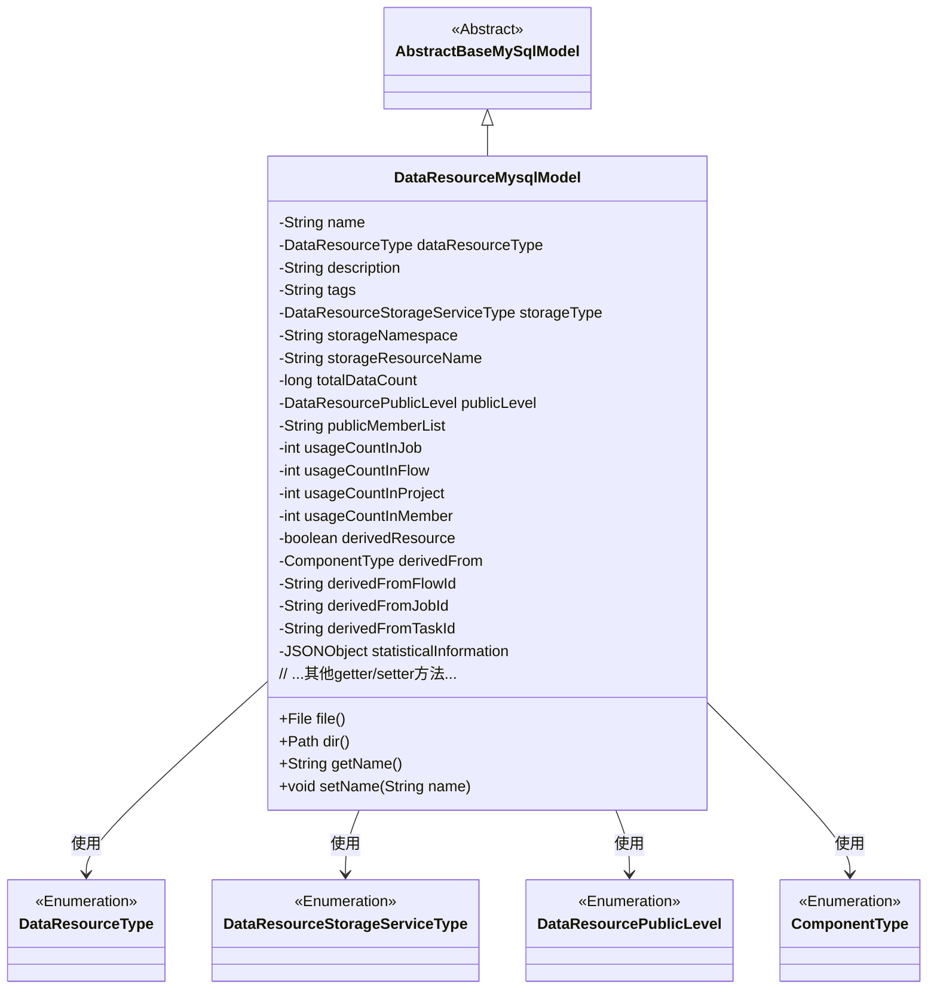
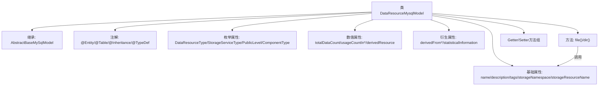

# 基础信息

|      |      |
|------|------|
| 名称 | DataResourceMysqlModel |
| 编码语言 | .java |
| 代码路径 | WeFe/board/board-service/src/main/java/com/welab/wefe/board/service/database/entity/data_resource/DataResourceMysqlModel.java |
| 包名 | com.welab.wefe.board.service.database.entity.data_resource |
| 依赖项 | ['com.alibaba.fastjson.JSONObject', 'com.alibaba.fastjson.annotation.JSONField', 'com.vladmihalcea.hibernate.type.json.JsonStringType', 'com.welab.wefe.board.service.database.entity.base.AbstractBaseMySqlModel', 'com.welab.wefe.common.wefe.enums.ComponentType', 'com.welab.wefe.common.wefe.enums.DataResourcePublicLevel', 'com.welab.wefe.common.wefe.enums.DataResourceStorageServiceType', 'com.welab.wefe.common.wefe.enums.DataResourceType', 'org.hibernate.annotations.Type', 'org.hibernate.annotations.TypeDef', 'javax.persistence', 'java.io.File', 'java.nio.file.Path', 'java.nio.file.Paths'] |
| 概述说明 | 数据资源MySQL模型类，包含名称、类型、描述、标签、存储信息、可见性、使用统计及衍生来源等属性，支持JSON类型字段和自定义文件路径方法。 |

# 说明

该内容描述了一个名为DataResourceMysqlModel的Java类，用于表示数据资源在MySQL中的模型。该类继承自AbstractBaseMySqlModel，使用JPA注解进行实体映射，并采用JOINED继承策略。类中包含多个字段，如资源名称、类型、描述、标签、存储类型、存储命名空间、资源名称、总数据量、可见性级别、可见成员列表等。此外，还记录了资源在不同场景下的使用次数，如任务、流程、项目和成员中的使用情况。对于衍生资源，还包含来源类型、流程ID、任务ID和子任务ID等信息。类中还提供了获取资源文件和目录的自定义方法，以及所有字段的getter和setter方法。

# 类列表 Class Summary

| 名称   | 类型  | 说明 |
|-------|------|-------------|
| DataResourceMysqlModel | class | DataResourceMysqlModel是数据资源实体类，包含名称、类型、描述、存储信息、使用统计、衍生来源等属性，支持JSON存储和文件路径操作。 |

## 类 DataResourceMysqlModel

|      |      |
|------|------|
| 访问范围 | @Entity(name = "data_resource");@Table(name = "data_resource");@Inheritance(strategy = InheritanceType.JOINED);@TypeDef(name = "json", typeClass = JsonStringType.class);public |
| 类型 | class |
| 名称 | DataResourceMysqlModel |
| 说明 | DataResourceMysqlModel是数据资源实体类，包含名称、类型、描述、存储信息、使用统计、衍生来源等属性，支持JSON存储和文件路径操作。 |

### UML类图

这段类图展示了DataResourceMysqlModel作为AbstractBaseMySqlModel的子类，包含多个私有属性和公有方法，其中属性涉及多种枚举类型如DataResourceType、DataResourceStorageServiceType等。该类主要用于表示数据库中的数据资源实体，包含资源名称、类型、描述、存储信息、使用统计等字段，并提供文件路径操作的方法。通过继承关系和枚举类型的关联，清晰地展现了该数据模型的结构和依赖关系。

### 内部方法调用关系图

该流程图展示了DataResourceMysqlModel类的核心结构，它是一个继承自AbstractBaseMySqlModel的JPA实体类，包含四种枚举类型字段、基础资源描述属性、使用统计数值、衍生资源相关字段，以及文件路径操作方法。类通过JOINED继承策略实现表继承，使用json类型处理统计信息字段，并通过标准Getter/Setter方法暴露所有属性。两个工具方法file()和dir()依赖于storageNamespace等路径相关属性。

### 字段列表 Field List

| 名称  | 类型  | 说明 |
|-------|-------|------|
| description | String | 私有字符串类型变量description。 |
| usageCountInProject | int | 项目内使用次数计数器 |
| derivedFromFlowId | String | 字段derivedFromFlowId表示来源流程ID，用于标识当前数据或流程的源头。 |
| tags | String | 私有字符串变量tags |
| name | String | 私有字符串类型变量name |
| totalDataCount | long | 私有长整型变量，记录数据总量。 |
| usageCountInFlow | int | 私有整型变量，记录流程中的使用次数。 |
| storageResourceName | String | 私有字符串变量storageResourceName，用于存储资源名称。 |
| statisticalInformation | JSONObject | JSON类型字段statisticalInformation，使用json列定义存储。 |
| derivedFrom | ComponentType | 枚举类型字段derivedFrom，使用字符串形式存储。 |
| dataResourceType | DataResourceType | 定义枚举类型字段dataResourceType，使用字符串形式存储枚举值。 |
| derivedFromTaskId | String | 私有字符串变量，存储来源任务ID。 |
| derivedResource | boolean | 声明一个布尔类型变量derivedResource，表示资源是否为派生。 |
| usageCountInJob | int | 私有整型变量，记录作业中的使用次数。 |
| usageCountInMember | int | 成员变量usageCountInMember，记录使用次数，类型为私有整型。 |
| publicMemberList | String | 私有字符串变量publicMemberList，用于存储公共成员列表。 |
| storageNamespace | String | 私有字符串变量storageNamespace，用于存储命名空间信息。 |
| derivedFromJobId | String | 私有字符串变量，存储来源任务的ID。 |
| storageType | DataResourceStorageServiceType | 定义枚举类型字段storageType，使用字符串形式存储枚举值。 |
| publicLevel | DataResourcePublicLevel | 枚举类型字段publicLevel，使用字符串值存储。 |

### 方法列表

| 名称  | 类型  | 说明 |
|-------|-------|------|
| getDescription | String | 获取描述信息的方法，返回字符串类型的描述内容。 |
| getDerivedFrom | ComponentType | 获取派生来源的组件类型。 |
| setPublicMemberList | void | 设置公共成员列表的方法，将输入字符串赋值给类的成员变量publicMemberList。 |
| setStorageType | void | 设置数据资源存储服务类型的方法，将输入参数赋值给类的成员变量storageType。 |
| setUsageCountInProject | void | 设置项目内使用次数的方法，参数为整型usageCountInProject。 |
| setDerivedResource | void | 设置派生资源标志的方法，参数为布尔值derivedResource。 |
| getTags | String | 方法getTags返回字符串tags的值。 |
| setStorageResourceName | void | 设置存储资源名称的方法，将输入参数赋值给类成员变量storageResourceName。 |
| setDataResourceType | void | 这是一个Java方法，用于设置类的数据资源类型属性。方法接受一个DataResourceType类型的参数，并将其赋值给类的成员变量dataResourceType。 |
| file | File | 方法返回由存储路径和资源名组合成的File对象，不参与JSON序列化。 |
| setTotalDataCount | void | 设置总数据量的方法，将参数totalDataCount赋值给类的同名成员变量。 |
| getPublicMemberList | String | 获取公共成员列表的方法，返回字符串类型变量publicMemberList。 |
| getStorageType | DataResourceStorageServiceType | 方法返回存储类型对象DataResourceStorageServiceType。 |
| setTags | void | 方法setTags用于设置tags属性，参数为字符串类型。 |
| isDerivedResource | boolean | 方法检查是否为派生资源，返回布尔值derivedResource。 |
| getStorageResourceName | String | 获取存储资源名称的方法，返回变量storageResourceName的值。 |
| getDataResourceType | DataResourceType | 这是一个Java方法，返回名为dataResourceType的DataResourceType类型对象。 |
| dir | Path | 代码定义了一个公共方法dir()，返回Path类型路径，路径由getStorageNamespace()方法的值构建。使用@JSONField(serialize=false)注解禁止JSON序列化。 |
| setPublicLevel | void | 方法设置数据资源的公开级别，参数为publicLevel。 |
| getTotalDataCount | Long | 获取数据总数的方法，返回长整型数值totalDataCount。 |
| setUsageCountInMember | void | 设置成员内使用次数的公共方法，参数为整型usageCountInMember，赋值给类变量usageCountInMember。 |
| getUsageCountInFlow | int | 方法返回流程中的使用次数。 |
| setStorageNamespace | void | 设置存储命名空间的方法，将输入参数赋值给类的成员变量storageNamespace。 |
| setDerivedFrom | void | 设置当前组件的派生来源。参数为组件类型对象。 |
| setUsageCountInJob | void | 设置作业内使用次数的方法，参数为usageCountInJob。 |
| setName | void | 设置对象名称的方法，将参数name赋值给对象的name属性。 |
| getUsageCountInProject | int | 方法返回项目中的使用次数。 |
| getName | String | 获取名称的方法，返回字符串类型的name变量值。 |
| setDescription | void | 这是一个Java方法，用于设置对象的描述属性。方法接收一个字符串参数description，并将其赋值给当前对象的description成员变量。 |
| getPublicLevel | DataResourcePublicLevel | 获取数据资源的公开级别。 |
| getStorageNamespace | String | 获取存储命名空间的方法，返回字符串类型的storageNamespace值。 |
| setDerivedFromFlowId | void | 设置派生流程ID的方法，将参数值赋给类成员变量derivedFromFlowId。 |
| getDerivedFromJobId | String | 获取派生任务ID的方法，返回字符串类型的derivedFromJobId。 |
| setDerivedFromJobId | void | 设置派生任务ID的方法，将输入参数赋值给类的成员变量derivedFromJobId。 |
| getDerivedFromTaskId | String | 获取派生任务ID的方法，返回字符串类型。 |
| setDerivedFromTaskId | void | 设置派生任务ID的方法。 |
| getStatisticalInformation | JSONObject | 获取统计信息的JSON对象方法。 |
| setStatisticalInformation | void | 这是一个Java方法，用于设置类的统计信息属性，参数为JSONObject类型的statisticalInformation。 |
| getUsageCountInMember | int | 获取成员使用次数的整数值。 |
| getUsageCountInJob | int | 方法返回作业中的使用次数。 |
| setUsageCountInFlow | void | 设置流程内使用次数的公共方法，参数为usageCountInFlow。 |
| getDerivedFromFlowId | String | 获取派生流程ID的方法，返回字符串类型变量derivedFromFlowId。 |

