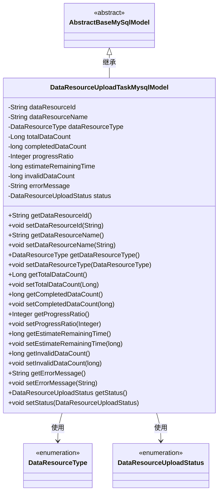

# 基础信息

|      |      |
|------|------|
| 名称 | DataResourceUploadTaskMysqlModel |
| 编码语言 | .java |
| 代码路径 | WeFe/board/board-service/src/main/java/com/welab/wefe/board/service/database/entity/data_resource/DataResourceUploadTaskMysqlModel.java |
| 包名 | com.welab.wefe.board.service.database.entity.data_resource |
| 依赖项 | ['com.welab.wefe.board.service.database.entity.base.AbstractBaseMySqlModel', 'com.welab.wefe.common.wefe.enums.DataResourceType', 'com.welab.wefe.common.wefe.enums.DataResourceUploadStatus', 'javax.persistence.Entity', 'javax.persistence.EnumType', 'javax.persistence.Enumerated', 'javax.persistence.Table'] |
| 概述说明 | 数据资源上传任务实体类，包含资源ID、名称、类型、总数据量、完成量、进度、剩余时间、无效数据量、错误信息和状态等字段。 |

# 说明

这是一个名为DataResourceUploadTaskMysqlModel的Java实体类，映射到数据库表data_resource_upload_task。它继承自AbstractBaseMySqlModel，包含数据资源上传任务的相关属性：资源ID、名称、类型、总数据行数、已完成行数、进度百分比、预计剩余时间、无效数据量、错误消息和任务状态（上传中/已完成/已失败）。类中为每个属性提供了getter和setter方法。

# 类列表 Class Summary

| 名称   | 类型  | 说明 |
|-------|------|-------------|
| DataResourceUploadTaskMysqlModel | class | 数据资源上传任务实体类，包含资源ID、名称、类型、总行数、已完成行数、进度、剩余时间、无效数据量、错误信息和状态等字段。 |

## 类 DataResourceUploadTaskMysqlModel

|      |      |
|------|------|
| 访问范围 | @Entity(name = "data_resource_upload_task");@Table(name = "data_resource_upload_task");public |
| 类型 | class |
| 名称 | DataResourceUploadTaskMysqlModel |
| 说明 | 数据资源上传任务实体类，包含资源ID、名称、类型、总行数、已完成行数、进度、剩余时间、无效数据量、错误信息和状态等字段。 |

### UML类图

这段代码定义了一个名为DataResourceUploadTaskMysqlModel的实体类，用于表示数据资源上传任务的相关信息。该类继承自AbstractBaseMySqlModel抽象基类，包含数据资源ID、名称、类型、总数据量、已完成数据量、进度百分比、预计剩余时间、无效数据量、错误信息和任务状态等字段。其中DataResourceType和DataResourceUploadStatus是枚举类型，分别表示资源类型和任务状态。该类提供了所有字段的getter和setter方法，用于访问和修改这些属性。这个类主要用于在MySQL数据库中存储和管理数据资源上传任务的相关信息。

### 内部方法调用关系图

```mermaid
graph TD
    A["类DataResourceUploadTaskMysqlModel"]
    B["继承: AbstractBaseMySqlModel"]
    C["注解: @Entity, @Table"]
    D["属性: String dataResourceId"]
    E["属性: String dataResourceName"]
    F["属性: DataResourceType dataResourceType"]
    G["属性: Long totalDataCount"]
    H["属性: long completedDataCount"]
    I["属性: Integer progressRatio"]
    J["属性: long estimateRemainingTime"]
    K["属性: long invalidDataCount"]
    L["属性: String errorMessage"]
    M["属性: DataResourceUploadStatus status"]
    N["getter/setter方法组"]

    A --> B
    A --> C
    A --> D
    A --> E
    A --> F
    A --> G
    A --> H
    A --> I
    A --> J
    A --> K
    A --> L
    A --> M
    A --> N
```

这段代码定义了一个名为DataResourceUploadTaskMysqlModel的JPA实体类，用于映射数据库表data_resource_upload_task。该类继承自AbstractBaseMySqlModel，包含12个属性分别记录数据资源ID、名称、类型、数据统计信息、任务进度和状态等。所有属性都配有对应的getter和setter方法，其中status属性使用@Enumerated注解表示枚举类型存储方式。该实体类主要用于跟踪数据资源上传任务的详细状态信息。

### 字段列表 Field List

| 名称  | 类型  | 说明 |
|-------|-------|------|
| completedDataCount | long | 私有长整型变量，记录已完成数据数量。 |
| status | DataResourceUploadStatus | 定义枚举类型字段status，使用字符串形式存储枚举值。 |
| dataResourceId | String | 声明一个私有字符串变量dataResourceId。 |
| progressRatio | Integer | 整型变量progressRatio，用于存储进度比例。 |
| dataResourceType | DataResourceType | 私有数据资源类型变量dataResourceType。 |
| errorMessage | String | 私有字符串变量，用于存储错误信息。 |
| invalidDataCount | long | 私有长整型变量，记录无效数据数量。 |
| totalDataCount | Long | 私有长整型变量，记录数据总量。 |
| estimateRemainingTime | long | 私有长整型变量，用于预估剩余时间。 |
| dataResourceName | String | 声明一个私有字符串变量dataResourceName。 |

### 方法列表

| 名称  | 类型  | 说明 |
|-------|-------|------|
| setInvalidDataCount | void | 设置无效数据计数的方法，将参数invalidDataCount赋值给类成员变量invalidDataCount。 |
| getErrorMessage | String | 获取错误信息的方法，返回字符串类型的errorMessage。 |
| getEstimateRemainingTime | long | 获取剩余时间估计值的方法，返回长整型变量estimateRemainingTime。 |
| setCompletedDataCount | void | 设置已完成数据计数的方法。 |
| getInvalidDataCount | long | 获取无效数据计数的方法，返回无效数据的数量。 |
| setEstimateRemainingTime | void | 设置剩余时间估计值的方法，参数为长整型。 |
| setDataResourceType | void | 设置数据资源类型的方法，将输入参数赋值给类的成员变量。 |
| setDataResourceName | void | 设置数据资源名称的方法，将输入参数赋值给类成员变量dataResourceName。 |
| setProgressRatio | void | 设置进度比例的方法，接收整数参数并赋值给类成员变量progressRatio。 |
| getProgressRatio | Integer | 获取进度比例的方法，返回整数值progressRatio。 |
| setDataResourceId | void | 设置数据资源ID的方法，将输入参数赋值给类的成员变量dataResourceId。 |
| setTotalDataCount | void | 设置总数据量的方法，参数为Long类型totalDataCount，赋值给类变量totalDataCount。 |
| getCompletedDataCount | long | 获取已完成数据计数的方法，返回长整型数值completedDataCount。 |
| getTotalDataCount | Long | 方法返回总数据计数值。 |
| getDataResourceName | String | 获取数据资源名称的方法，返回字符串类型值dataResourceName。 |
| getDataResourceType | DataResourceType | 获取数据资源类型的方法，返回dataResourceType字段值。 |
| getDataResourceId | String | 获取数据资源ID的方法，返回字符串类型dataResourceId。 |
| setErrorMessage | void | 设置错误信息的方法，将输入字符串赋值给类的errorMessage变量。 |
| getStatus | DataResourceUploadStatus | 获取当前数据资源上传状态的方法，返回值为DataResourceUploadStatus类型。 |
| setStatus | void | 设置数据资源上传状态的方法。 |

