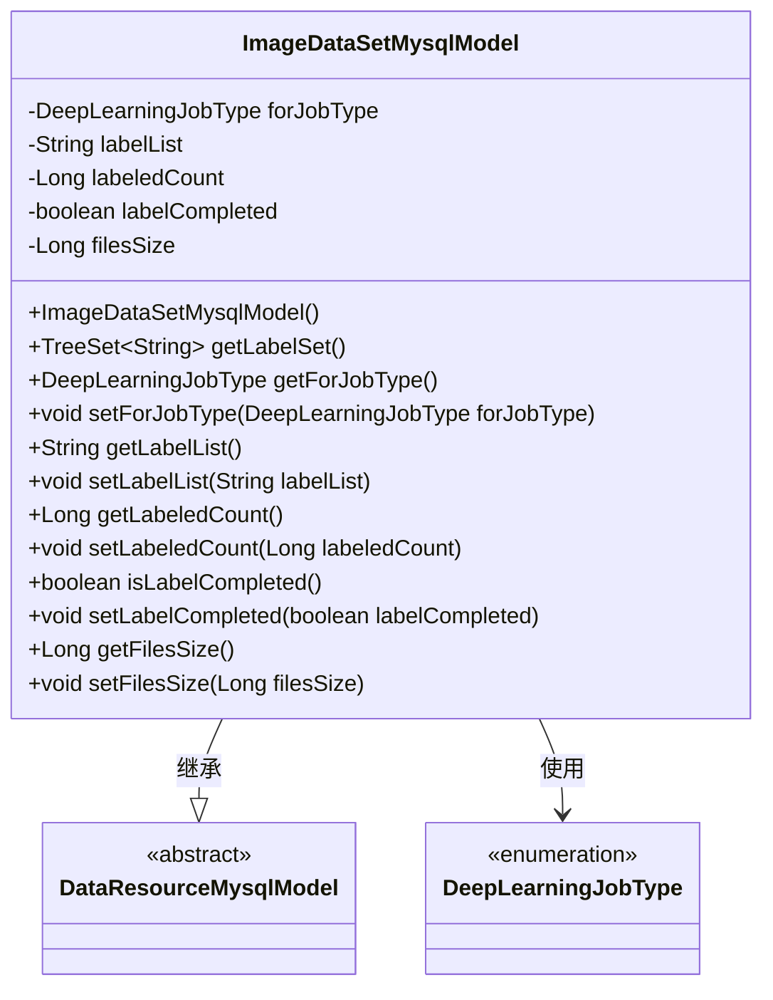
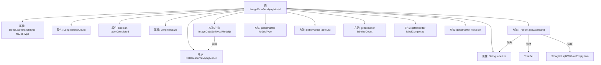

# 基础信息

|      |      |
|------|------|
| 名称 | ImageDataSetMysqlModel |
| 编码语言 | .java |
| 代码路径 | WeFe/board/board-service/src/main/java/com/welab/wefe/board/service/database/entity/data_resource/ImageDataSetMysqlModel.java |
| 包名 | com.welab.wefe.board.service.database.entity.data_resource |
| 依赖项 | ['com.alibaba.fastjson.annotation.JSONField', 'com.welab.wefe.common.util.StringUtil', 'com.welab.wefe.common.wefe.enums.DataResourceType', 'com.welab.wefe.common.wefe.enums.DeepLearningJobType', 'javax.persistence.Entity', 'javax.persistence.EnumType', 'javax.persistence.Enumerated', 'javax.persistence.Table', 'java.util.List', 'java.util.TreeSet'] |
| 概述说明 | 图像数据集实体类，包含任务类型、标签列表、标注数量、完成状态及文件大小等属性，提供标签集转换方法。 |

# 说明

该代码定义了一个名为ImageDataSetMysqlModel的实体类，用于表示图像数据集。该类继承自DataResourceMysqlModel，并标注为数据库表image_data_set。主要属性包括任务类型（如物体检测）、标签列表、已标注数量、标注完成状态和数据集大小。构造函数初始化资源类型为ImageDataSet。提供了获取标签集合的方法，将逗号分隔的标签字符串转换为有序集合。包含所有属性的getter和setter方法，支持数据访问和修改。

# 类列表 Class Summary

| 名称   | 类型  | 说明 |
|-------|------|-------------|
| ImageDataSetMysqlModel | class | 图像数据集实体类，包含任务类型、标签列表、标注数量、完成状态及大小等属性，提供标签集转换方法。 |

## 类 ImageDataSetMysqlModel

|      |      |
|------|------|
| 访问范围 | @Entity(name = "image_data_set");@Table(name = "image_data_set");public |
| 类型 | class |
| 名称 | ImageDataSetMysqlModel |
| 说明 | 图像数据集实体类，包含任务类型、标签列表、标注数量、完成状态及大小等属性，提供标签集转换方法。 |

### UML类图

该代码定义了一个名为ImageDataSetMysqlModel的实体类，继承自DataResourceMysqlModel，用于存储图像数据集的相关信息。类中包含任务类型、标签列表、已标注数量、标注完成状态和数据集大小等属性，并提供了相应的getter和setter方法。特别地，getLabelSet方法将逗号分隔的标签字符串转换为TreeSet集合。该类通过JPA注解标记为数据库实体，并与枚举类型DeepLearningJobType关联。

### 内部方法调用关系图

这段代码定义了一个名为ImageDataSetMysqlModel的实体类，用于表示图像数据集的相关信息。该类继承自DataResourceMysqlModel，包含任务类型、标签列表、已标注数量、标注完成状态和数据集大小等属性。其中getLabelSet方法将逗号分隔的标签字符串转换为TreeSet集合，提供了完整的getter和setter方法。构造方法中设置了数据资源类型为ImageDataSet。

### 字段列表 Field List

| 名称  | 类型  | 说明 |
|-------|-------|------|
| labelCompleted | boolean | 私有布尔变量，标记是否完成。 |
| forJobType | DeepLearningJobType | 枚举类型字段forJobType，使用字符串形式存储DeepLearningJobType枚举值。 |
| labelList | String | 私有字符串变量labelList，用于存储标签列表。 |
| labeledCount | Long | 私有长整型变量，记录标记数量。 |
| filesSize | Long | 私有长整型变量，用于存储文件大小。 |

### 方法列表

| 名称  | 类型  | 说明 |
|-------|-------|------|
| getLabelSet | TreeSet<String> | 方法getLabelSet返回TreeSet，若labelList为空则返回空集，否则将逗号分隔的labelList转为TreeSet并返回。 |
| getForJobType | DeepLearningJobType | 获取当前任务的深度学习作业类型。 |
| getLabelList | String | 方法返回字符串类型的labelList变量值。 |
| isLabelCompleted | boolean | 这是一个Java方法，用于检查标签是否完成，返回布尔值labelCompleted。 |
| setLabelList | void | 这是一个Java方法，用于设置类的labelList属性值。方法接收一个字符串参数labelList，并将其赋值给类的同名成员变量。 |
| setForJobType | void | 该方法用于设置深度学习作业类型，将参数forJobType赋值给类的成员变量forJobType。 |
| setLabelCompleted | void | 设置标签完成状态的公共方法，参数为布尔值。 |
| getLabeledCount | Long | 获取已标记数量的方法，返回长整型值labeledCount。 |
| setLabeledCount | void | 设置已标记数量的方法，参数为长整型。 |
| getFilesSize | Long | 这是一个Java方法，返回文件大小的长整型值。 |
| setFilesSize | void | 设置文件大小的方法，参数为长整型filesSize，将其赋值给类成员变量filesSize。 |

