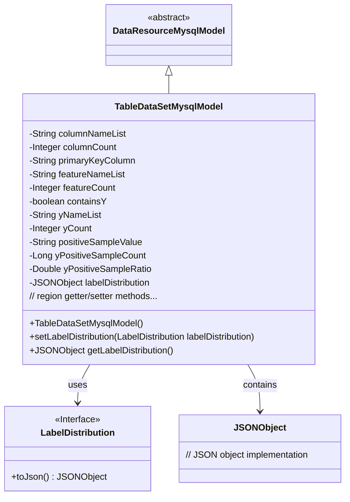

# 基础信息

|      |      |
|------|------|
| 名称 | TableDataSetMysqlModel |
| 编码语言 | .java |
| 代码路径 | WeFe/board/board-service/src/main/java/com/welab/wefe/board/service/database/entity/data_resource/TableDataSetMysqlModel.java |
| 包名 | com.welab.wefe.board.service.database.entity.data_resource |
| 依赖项 | ['com.alibaba.fastjson.JSONObject', 'com.vladmihalcea.hibernate.type.json.JsonStringType', 'com.welab.wefe.board.service.dto.vo.data_set.table_data_set.LabelDistribution', 'com.welab.wefe.common.wefe.enums.DataResourceType', 'org.hibernate.annotations.Type', 'org.hibernate.annotations.TypeDef', 'javax.persistence.Column', 'javax.persistence.Entity', 'javax.persistence.Table'] |
| 概述说明 | 数据集实体类，包含字段列表、主键、特征、Y值相关属性及标签分布，用于存储表格数据信息。 |

# 说明

这是一个名为TableDataSetMysqlModel的Java类，用于映射数据库表table_data_set。它继承自DataResourceMysqlModel，主要存储数据集相关属性。类中包含数据集字段列表、列数、主键字段、特征列表及数量等基本信息。特别关注是否包含Y值、Y列信息、正样本值及其数量比例。使用JSON类型存储标签分布情况，并提供了完整的getter和setter方法。构造函数初始化时将资源类型设为TableDataSet。

# 类列表 Class Summary

| 名称   | 类型  | 说明 |
|-------|------|-------------|
| TableDataSetMysqlModel | class | TableDataSetMysqlModel类表示表数据集，包含字段列表、主键、特征、Y值相关属性和标签分布，使用JSON存储标签分布。 |

## 类 TableDataSetMysqlModel

|      |      |
|------|------|
| 访问范围 | @Entity(name = "table_data_set");@Table(name = "table_data_set");@TypeDef(name = "json", typeClass = JsonStringType.class);public |
| 类型 | class |
| 名称 | TableDataSetMysqlModel |
| 说明 | TableDataSetMysqlModel类表示表数据集，包含字段列表、主键、特征、Y值相关属性和标签分布，使用JSON存储标签分布。 |

### UML类图

这段代码展示了一个继承自DataResourceMysqlModel的TableDataSetMysqlModel类，用于表示数据库中的表格数据集。该类包含多个字段用于存储数据集的各种属性，如列名列表、特征数量、主键字段等，并通过JSONObject存储标签分布信息。类中提供了完整的getter/setter方法，并通过LabelDistribution接口处理标签分布数据的转换。该设计实现了数据资源的持久化存储，特别适合处理结构化表格数据。

### 内部方法调用关系图

```mermaid
graph TD
    A["类TableDataSetMysqlModel"]
    B["继承: DataResourceMysqlModel"]
    C["属性: String columnNameList"]
    D["属性: Integer columnCount"]
    E["属性: String primaryKeyColumn"]
    F["属性: String featureNameList"]
    G["属性: Integer featureCount"]
    H["属性: boolean containsY"]
    I["属性: String yNameList"]
    J["属性: Integer yCount"]
    K["属性: String positiveSampleValue"]
    L["属性: Long yPositiveSampleCount"]
    M["属性: Double yPositiveSampleRatio"]
    N["属性: JSONObject labelDistribution"]
    O["构造方法: TableDataSetMysqlModel()"]
    P["方法: setLabelDistribution(LabelDistribution)"]
    Q["方法: getLabelDistribution()"]
    R["方法组: getter/setter"]

    A --> B
    A --> C
    A --> D
    A --> E
    A --> F
    A --> G
    A --> H
    A --> I
    A --> J
    A --> K
    A --> L
    A --> M
    A --> N
    A --> O
    A --> P
    A --> Q
    A --> R
    O -->|调用| B
    P -->|转换| N
    Q -->|空检查| N
```

该流程图展示了TableDataSetMysqlModel类的完整结构，包含12个核心属性和关键方法。作为数据表实体类，它继承了DataResourceMysqlModel，通过构造方法初始化资源类型，特别处理了JSON格式的labelDistribution属性（包含空值检查和类型转换），并提供了完整的getter/setter方法组。所有属性均映射到数据库表字段，其中containsY使用特定列名，labelDistribution配置了JSON类型转换。

### 字段列表 Field List

| 名称  | 类型  | 说明 |
|-------|-------|------|
| labelDistribution | JSONObject | 实体类字段labelDistribution使用JSON类型，数据库列定义为json格式。 |
| yNameList | String | 私有字符串变量yNameList，用于存储名称列表。 |
| yCount | Integer | 私有整型变量yCount。 |
| featureCount | Integer | 私有整型变量，用于记录特征数量。 |
| yPositiveSampleRatio | Double | 私有双精度浮点变量，表示正样本比例。 |
| containsY | boolean | 数据库字段名为contains_y，对应布尔类型变量containsY。 |
| primaryKeyColumn | String | 主键列字段声明，类型为String。 |
| columnCount | Integer | 私有整型变量，表示列数。 |
| yPositiveSampleCount | Long | 私有长整型变量，记录正样本数量。 |
| positiveSampleValue | String | 私有字符串变量，存储正样本值。 |
| featureNameList | String | 私有字符串变量featureNameList，用于存储特征名称列表。 |
| columnNameList | String | 私有字符串变量columnNameList，用于存储列名列表。 |

### 方法列表

| 名称  | 类型  | 说明 |
|-------|-------|------|
| getyPositiveSampleRatio | Double | 获取y正样本比例的方法，返回Double类型值。 |
| getFeatureCount | Integer | 获取特征数量方法，返回整型值featureCount。 |
| setPositiveSampleValue | void | 设置正样本值的公共方法，参数为字符串类型。 |
| getyCount | Integer | 获取yCount值的公共方法，返回Integer类型。 |
| getPrimaryKeyColumn | String | 方法返回主键列名。 |
| setFeatureCount | void | 设置特征数量方法，将输入参数赋给类变量featureCount。 |
| getyPositiveSampleCount | Long | 获取yPositiveSampleCount值的方法，返回类型为Long。 |
| setFeatureNameList | void | 这是一个Java方法，用于设置featureNameList属性的值。方法接收一个字符串参数并将其赋值给类的成员变量。 |
| setContainsY | void | 这是一个Java方法，用于设置布尔类型成员变量containsY的值。方法接受一个布尔参数，并将其赋值给当前对象的containsY属性。 |
| isContainsY | boolean | 方法isContainsY返回布尔值containsY的状态。 |
| setyNameList | void | Java方法：设置yNameList字符串属性值。 |
| setyPositiveSampleRatio | void | 设置正样本比例的方法，接受一个Double类型参数并赋值给类成员变量yPositiveSampleRatio。 |
| setLabelDistribution | void | 方法setLabelDistribution用于设置labelDistribution属性，参数为JSONObject类型。 |
| getPositiveSampleValue | String | 获取正样本值的公共方法，返回字符串类型变量positiveSampleValue。 |
| setPrimaryKeyColumn | void | 设置主键列的方法，将输入字符串赋值给类的primaryKeyColumn成员变量。 |
| getColumnCount | Integer | 该方法返回一个整数值，表示列数。 |
| getColumnNameList | String | 获取列名列表的方法，返回字符串类型的列名列表。 |
| setLabelDistribution | void | 设置标签分布，将输入对象转为JSON格式存储。 |
| setyPositiveSampleCount | void | 设置Y正样本计数方法，参数为长整型yPositiveSampleCount，赋值给类成员变量。 |
| getyNameList | String | 获取yNameList字符串的方法。 |
| getFeatureNameList | String | 获取特性名称列表的方法，返回字符串类型的featureNameList。 |
| setyCount | void | 设置yCount属性的方法，参数为Integer类型。 |
| setColumnCount | void | 设置列数方法，接收整型参数columnCount并赋值给类成员变量columnCount。 |
| setColumnNameList | void | 设置列名列表的方法，将输入字符串赋值给类的成员变量columnNameList。 |
| getLabelDistribution | JSONObject | 获取标签分布数据，若为空则返回空JSON对象。 |

