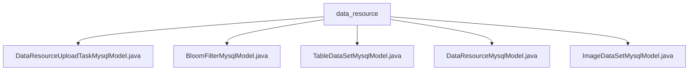

# 基础信息

|      |      |
|------|------|
| 名称 | data_resource |
| 编码语言 | .java |
| 代码路径 | WeFe/board/board-service/src/main/java/com/welab/wefe/board/service/database/entity/data_resource |
| 包名 | docs.board.board-service.src.main.java.com.welab.wefe.board.service.database.entity.data_resource |
| 概述说明 | DataResourceUploadTaskMysqlModel类映射数据资源上传任务表，包含进度、状态等属性。BloomFilterMysqlModel类表示布隆过滤器模型，含RSA密钥等字段。TableDataSetMysqlModel类存储数据集信息，包括特征、Y值等。DataResourceMysqlModel是基类，包含资源通用属性和使用统计。ImageDataSetMysqlModel类专用于图像数据集，含标注信息等。所有类均继承自基础模型并提供完整getter/setter方法。 |

# 说明

## 概述  
该模块核心职责是管理异构数据资源的存储与元数据建模，通过继承体系实现多种数据类型的统一抽象。接口规范遵循JPA实体映射标准，采用JOINED继承策略，所有子类均提供完整getter/setter方法。关键数据结构包括基础资源模型（DataResourceMysqlModel）及其子类：表格数据集（TableDataSetMysqlModel）、图像数据集（ImageDataSetMysqlModel）、布隆过滤器（BloomFilterMysqlModel）和上传任务（DataResourceUploadTaskMysqlModel）。外部依赖主要为MySQL数据库和JPA注解框架。例如TableDataSetMysqlModel通过JSON存储标签分布，ImageDataSetMysqlModel实现标签字符串到集合的转换。

## 主要业务场景  
模块支持数据资源全生命周期管理，类似数字资产仓库模式。业务流程涵盖数据上传（通过UploadTask记录进度）、结构化存储（如表数据的主键/特征管理）、非结构化处理（如图像标注状态跟踪）和密码学应用（布隆过滤器的RSA参数）。典型交互包括：任务状态实时更新（如进度百分比计算）、数据集特征分析（如Y值统计）、资源溯源（通过衍生信息记录）。例如BloomFilterMysqlModel存储SQL语句执行上下文，TableDataSetMysqlModel跟踪正样本比例。API集成案例涉及资源类型识别（构造函数初始化）和跨场景使用统计（如项目/任务引用计数）。

### 包内部结构视图

该流程图展示了data_resource目录下的5个Java实体类文件关系。所有文件均直接隶属于data_resource节点，无中间层级，结构为扁平化设计。每个MysqlModel类代表不同类型的数据资源模型，包括上传任务、布隆过滤器、表格数据集、基础数据资源和图片数据集等业务实体。

# 文件列表

| 名称   | 类型  | 说明 |
|-------|------|-------------|
| [DataResourceUploadTaskMysqlModel.java](DataResourceUploadTaskMysqlModel.md) | file | 数据资源上传任务实体类，包含资源ID、名称、类型、总数据量、完成量、进度、剩余时间、无效数据量、错误信息和状态等字段。 |
| [BloomFilterMysqlModel.java](BloomFilterMysqlModel.md) | file | 布隆过滤器MySQL模型类，包含RSA密钥参数、数据源ID、路径、哈希函数、添加方法和SQL脚本等字段。 |
| [TableDataSetMysqlModel.java](TableDataSetMysqlModel.md) | file | 数据集实体类，包含字段列表、主键、特征、Y值相关属性及标签分布，用于存储表格数据信息。 |
| [DataResourceMysqlModel.java](DataResourceMysqlModel.md) | file | 数据资源MySQL模型类，包含名称、类型、描述、标签、存储信息、可见性、使用统计及衍生来源等属性，支持JSON类型字段和自定义文件路径方法。 |
| [ImageDataSetMysqlModel.java](ImageDataSetMysqlModel.md) | file | 图像数据集实体类，包含任务类型、标签列表、标注数量、完成状态及文件大小等属性，提供标签集转换方法。 |

