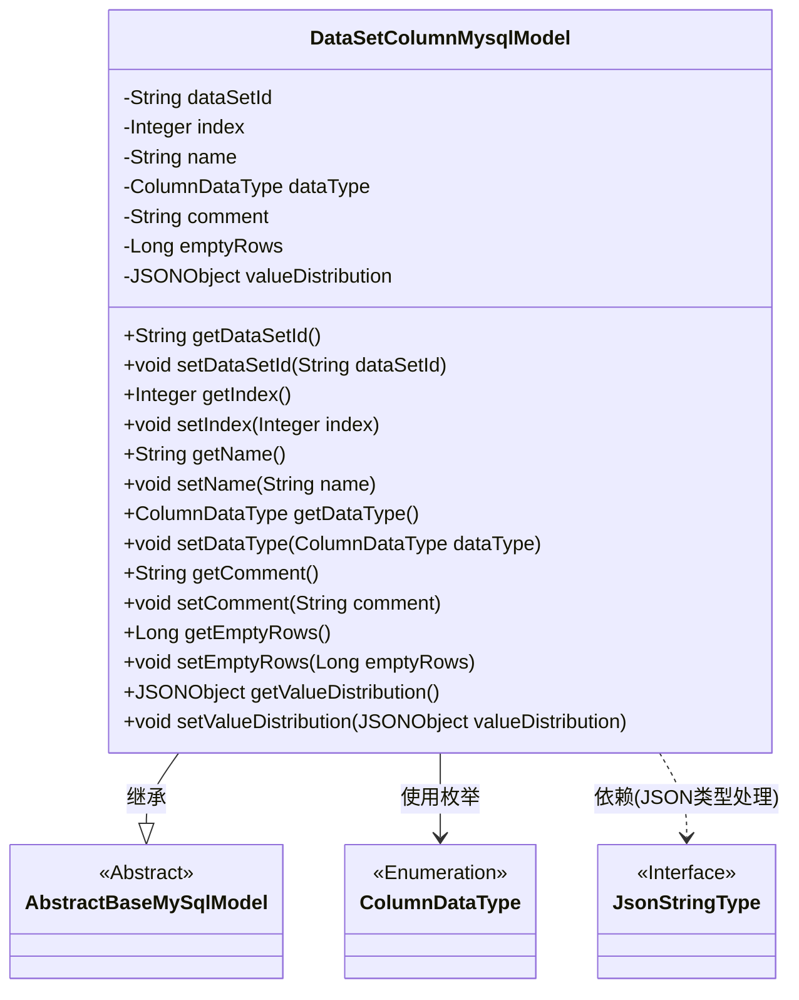

# 基础信息

|      |      |
|------|------|
| 名称 | DataSetColumnMysqlModel |
| 编码语言 | .java |
| 代码路径 | WeFe/board/board-service/src/main/java/com/welab/wefe/board/service/database/entity/data_set/DataSetColumnMysqlModel.java |
| 包名 | com.welab.wefe.board.service.database.entity.data_set |
| 依赖项 | ['com.alibaba.fastjson.JSONObject', 'com.vladmihalcea.hibernate.type.json.JsonStringType', 'com.welab.wefe.board.service.database.entity.base.AbstractBaseMySqlModel', 'com.welab.wefe.common.wefe.enums.ColumnDataType', 'org.hibernate.annotations.Type', 'org.hibernate.annotations.TypeDef', 'javax.persistence.Column', 'javax.persistence.Entity', 'javax.persistence.EnumType', 'javax.persistence.Enumerated'] |
| 概述说明 | 数据集列实体类，包含ID、序号、名称、类型、注释、空值行数和JSON格式的数值分布字段。 |

# 说明

这是一个名为DataSetColumnMysqlModel的Java实体类，用于映射数据库中的data_set_column表。它继承自AbstractBaseMySqlModel，包含数据集ID、字段序号、字段名称、枚举类型的数据类型、注释、空值行数等属性。其中valueDistribution字段使用JSON格式存储数值分布信息，通过@Type注解指定为json类型。类中为所有属性提供了标准的getter和setter方法。

# 类列表 Class Summary

| 名称   | 类型  | 说明 |
|-------|------|-------------|
| DataSetColumnMysqlModel | class | 数据集列实体类，包含ID、序号、名称、数据类型、注释、空值行数和JSON格式的数值分布字段。 |

## 类 DataSetColumnMysqlModel

|      |      |
|------|------|
| 访问范围 | @Entity(name = "data_set_column");@TypeDef(name = "json", typeClass = JsonStringType.class);public |
| 类型 | class |
| 名称 | DataSetColumnMysqlModel |
| 说明 | 数据集列实体类，包含ID、序号、名称、数据类型、注释、空值行数和JSON格式的数值分布字段。 |

### UML类图

这段代码展示了一个表示数据集列的JPA实体类`DataSetColumnMysqlModel`，它继承自抽象基类`AbstractBaseMySqlModel`。该类包含数据集ID、字段索引、名称、数据类型枚举、注释、空值行数和JSON格式的数值分布等属性，通过getter/setter方法进行访问。使用`@TypeDef`注解指定JSON字段的处理类型为`JsonStringType`，体现了JPA实体与JSON数据类型的集成。类图清晰地展示了继承关系、枚举使用和JSON类型处理的依赖关系。

### 内部方法调用关系图

```mermaid
graph TD
    A["类DataSetColumnMysqlModel"]
    B["继承: AbstractBaseMySqlModel"]
    C["注解: @Entity('data_set_column')"]
    D["注解: @TypeDef(name='json', typeClass=JsonStringType.class)"]
    E["属性: String dataSetId"]
    F["属性: @Column('index') Integer index"]
    G["属性: String name"]
    H["属性: @Enumerated ColumnDataType dataType"]
    I["属性: String comment"]
    J["属性: Long emptyRows"]
    K["属性: @Type('json') @Column JSONObject valueDistribution"]
    L["方法: getDataSetId/setDataSetId"]
    M["方法: getIndex/setIndex"]
    N["方法: getName/setName"]
    O["方法: getDataType/setDataType"]
    P["方法: getComment/setComment"]
    Q["方法: getEmptyRows/setEmptyRows"]
    R["方法: getValueDistribution/setValueDistribution"]

    A --> B
    A --> C
    A --> D
    A --> E
    A --> F
    A --> G
    A --> H
    A --> I
    A --> J
    A --> K
    A --> L
    A --> M
    A --> N
    A --> O
    A --> P
    A --> Q
    A --> R
```

这段代码定义了一个名为DataSetColumnMysqlModel的JPA实体类，用于映射数据库中的data_set_column表。该类继承自AbstractBaseMySqlModel，包含7个主要属性：dataSetId、index、name、dataType、comment、emptyRows和valueDistribution。其中index字段使用@Column注解指定数据库列名，dataType使用@Enumerated注解表示枚举类型，valueDistribution使用@Type和@Column注解指定为JSON类型。每个属性都有对应的getter和setter方法，位于//region标记的代码块中。

### 字段列表 Field List

| 名称  | 类型  | 说明 |
|-------|-------|------|
| name | String | 私有字符串变量name |
| index | Integer | 数据库字段"index"映射为私有整型变量index。 |
| valueDistribution | JSONObject | 字段valueDistribution使用JSON类型存储，数据库列定义为json格式。 |
| dataType | ColumnDataType | 使用@Enumerated注解将枚举类型ColumnDataType以字符串形式存储到数据库。 |
| comment | String | 声明一个私有字符串变量comment。 |
| emptyRows | Long | 空行数量，长整型。 |
| dataSetId | String | 数据集ID的私有字符串变量。 |

### 方法列表

| 名称  | 类型  | 说明 |
|-------|-------|------|
| getValueDistribution | JSONObject | 获取valueDistribution的JSON对象。 |
| setDataSetId | void | 设置数据集ID的方法，将输入参数赋值给类的成员变量dataSetId。 |
| getDataSetId | String | 获取数据集ID的方法，返回dataSetId字段值。 |
| setDataType | void | 方法setDataType用于设置列数据类型，参数为ColumnDataType类型，赋值给成员变量dataType。 |
| setIndex | void | 这是一个Java方法，用于设置类的整型成员变量index的值。方法接受一个Integer参数，并将其赋值给类的index属性。 |
| getComment | String | 获取comment字符串的方法。 |
| getDataType | ColumnDataType | 方法getDataType返回ColumnDataType类型的dataType字段值。 |
| setName | void | 这是一个Java方法，用于设置对象的名称属性，将传入的字符串参数赋值给对象的name变量。 |
| getEmptyRows | Long | 获取空行数量的方法，返回emptyRows值。 |
| getIndex | Integer | 方法返回整型变量index的值。 |
| setEmptyRows | void | 设置空行数方法，参数为Long类型emptyRows，赋值给类成员变量emptyRows。 |
| getName | String | 这是一个Java方法，返回私有成员变量name的值。 |
| setComment | void | 这是一个Java方法，用于设置对象的comment属性值。方法接收一个字符串参数comment，并将其赋值给当前对象的comment成员变量。 |
| setValueDistribution | void | 设置值分布方法，接收JSONObject参数并赋值给成员变量valueDistribution。 |

