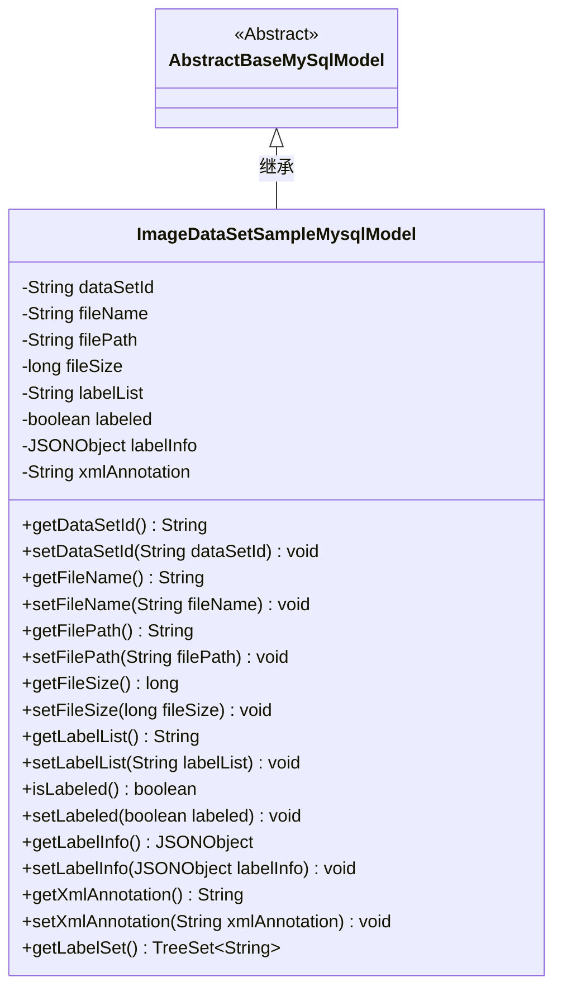
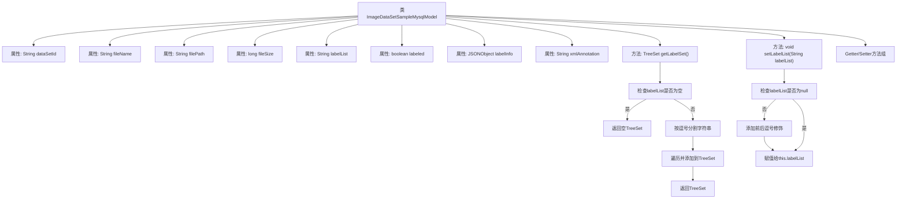

# 基础信息

|      |      |
|------|------|
| 名称 | ImageDataSetSampleMysqlModel |
| 编码语言 | .java |
| 代码路径 | WeFe/board/board-service/src/main/java/com/welab/wefe/board/service/database/entity/data_set/ImageDataSetSampleMysqlModel.java |
| 包名 | com.welab.wefe.board.service.database.entity.data_set |
| 依赖项 | ['com.alibaba.fastjson.JSONObject', 'com.alibaba.fastjson.annotation.JSONField', 'com.vladmihalcea.hibernate.type.json.JsonStringType', 'com.welab.wefe.board.service.database.entity.base.AbstractBaseMySqlModel', 'com.welab.wefe.common.util.StringUtil', 'org.hibernate.annotations.Type', 'org.hibernate.annotations.TypeDef', 'javax.persistence.Column', 'javax.persistence.Entity', 'java.util.List', 'java.util.TreeSet'] |
| 概述说明 | 图像数据集样本实体类，包含数据集ID、文件名、路径、大小、标签列表、标注状态及JSON/XML标注信息，提供标签集处理和getter/setter方法。 |

# 说明

该代码定义了一个名为ImageDataSetSampleMysqlModel的实体类，用于存储图像数据集样本信息。实体包含数据集ID、文件名、文件路径、文件大小、标签列表、是否已标注标志、JSON格式标注信息和XML格式标注信息等字段。类中提供了获取标签集合的方法，并对标签列表进行了格式化处理，确保前后有逗号以便SQL匹配。所有字段均配有相应的getter和setter方法。该类继承自AbstractBaseMySqlModel，并使用@Entity注解标记为数据库实体，同时通过@TypeDef注解定义了JSON类型处理方式。

# 类列表 Class Summary

| 名称   | 类型  | 说明 |
|-------|------|-------------|
| ImageDataSetSampleMysqlModel | class | 图像数据集样本实体类，包含数据集ID、文件名、路径、大小、标签列表、标注状态及JSON/XML标注信息，提供标签集处理和getter/setter方法。 |

## 类 ImageDataSetSampleMysqlModel

|      |      |
|------|------|
| 访问范围 | @Entity(name = "image_data_set_sample");@TypeDef(name = "json", typeClass = JsonStringType.class);public |
| 类型 | class |
| 名称 | ImageDataSetSampleMysqlModel |
| 说明 | 图像数据集样本实体类，包含数据集ID、文件名、路径、大小、标签列表、标注状态及JSON/XML标注信息，提供标签集处理和getter/setter方法。 |

### UML类图

这段类图展示了ImageDataSetSampleMysqlModel继承自AbstractBaseMySqlModel的结构。该类作为数据库实体，包含数据集ID、文件名、文件路径、文件大小等基础属性，以及标注相关的labelList、labeled、labelInfo和xmlAnnotation等字段。特别值得注意的是getLabelSet()方法，它将逗号分隔的labelList转换为TreeSet集合，而setLabelList()方法则对输入值进行了特殊处理，确保前后都有逗号以便SQL匹配。类中所有字段都有对应的getter和setter方法，体现了标准的JavaBean设计模式。

### 内部方法调用关系图

这段代码定义了一个名为ImageDataSetSampleMysqlModel的JPA实体类，用于存储图像数据集样本信息。类包含文件基本信息（名称、路径、大小）、标注信息（标签列表、JSON标注、XML标注）等属性，其中getLabelSet()方法实现了将逗号分隔的标签字符串转换为有序集合，setLabelList()方法则对标签字符串进行规范化处理（添加前后逗号）。所有属性均通过标准getter/setter方法访问，符合JavaBean规范。

### 字段列表 Field List

| 名称  | 类型  | 说明 |
|-------|-------|------|
| xmlAnnotation | String | 私有字符串变量xmlAnnotation，用于存储XML注解内容。 |
| fileName | String | 私有字符串变量fileName，用于存储文件名。 |
| labelList | String | 声明一个私有字符串变量labelList。 |
| labelInfo | JSONObject | 字段labelInfo使用JSON类型存储，数据库列定义为json格式。 |
| labeled | boolean | 布尔变量labeled，表示是否已标记。 |
| filePath | String | 私有字符串变量，存储文件路径。 |
| fileSize | long | 私有长整型变量fileSize，用于存储文件大小。 |
| dataSetId | String | 私有字符串类型变量dataSetId。 |

### 方法列表

| 名称  | 类型  | 说明 |
|-------|-------|------|
| getFileName | String | 方法返回文件名。 |
| getDataSetId | String | 获取数据集ID的方法，返回dataSetId。 |
| isLabeled | boolean | 方法isLabeled返回布尔值labeled的状态。 |
| setFileName | void | 设置文件名的方法，将输入字符串赋值给类的fileName属性。 |
| getFileSize | long | 这是一个Java方法，返回文件大小的长整型值fileSize。 |
| getLabelList | String | 这是一个Java方法，返回字符串类型的labelList变量值。 |
| setLabeled | void | 设置对象标签状态的方法，参数决定是否标记。 |
| getLabelInfo | JSONObject | 方法返回labelInfo的JSONObject对象。 |
| setLabelInfo | void | 方法setLabelInfo接收JSONObject参数labelInfo，并将其赋值给当前对象的同名属性。 |
| getXmlAnnotation | String | 获取xmlAnnotation字符串的方法。 |
| setXmlAnnotation | void | Java方法：设置xmlAnnotation属性值。参数为字符串xmlAnnotation，直接赋值给类成员变量。 |
| setDataSetId | void | 设置数据集ID的方法，将输入参数赋值给类的dataSetId成员变量。 |
| getFilePath | String | 获取文件路径的方法，返回filePath字符串。 |
| getLabelSet | TreeSet<String> | 方法getLabelSet返回TreeSet，若labelList为空则返回空集，否则按逗号分割非空项填充集合并返回。 |
| setFilePath | void | 设置文件路径的方法，将输入参数赋值给成员变量filePath。 |
| setLabelList | void | 方法setLabelList用于处理标签列表字符串，确保前后有逗号以便SQL匹配。若输入非空，检查并添加缺失的逗号，最后赋值给成员变量labelList。 |
| setFileSize | void | 设置文件大小的方法，将参数fileSize赋值给类的成员变量fileSize。 |

