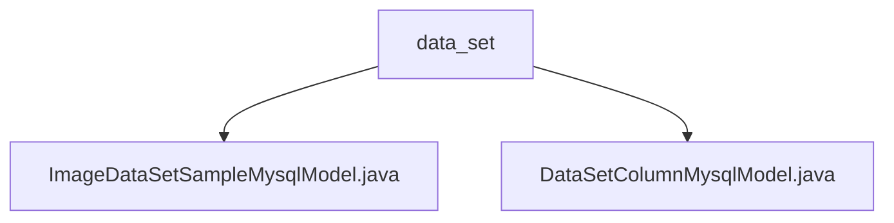

# 基础信息

|      |      |
|------|------|
| 名称 | data_set |
| 编码语言 | .java |
| 代码路径 | WeFe/board/board-service/src/main/java/com/welab/wefe/board/service/database/entity/data_set |
| 包名 | docs.board.board-service.src.main.java.com.welab.wefe.board.service.database.entity.data_set |
| 概述说明 | ImageDataSetSampleMysqlModel实体类存储图像数据集样本信息，包含ID、文件名、标签等字段，继承AbstractBaseMySqlModel。DataSetColumnMysqlModel映射data_set_column表，含数据集ID、字段名、数据类型等属性，继承相同基类。两实体均使用JSON格式存储部分数据。 |

# 说明

## 概述  
该模块核心职责是管理结构化数据集元信息与图像样本数据，通过JPA实体类实现数据库映射。接口规范包含标准字段访问方法，支持JSON格式存储特殊字段（如数值分布、标注信息）。关键数据结构包括带数据集ID的基础模型、图像样本的多元标注格式（JSON/XML）、字段统计分布数据。外部依赖涉及JPA注解、Hibernate类型扩展（JSON）和MySQL数据库。例如ImageDataSetSampleMysqlModel处理多格式标注，DataSetColumnMysqlModel记录字段分析指标。

## 主要业务场景  
模块支撑数据集的字段级元数据管理和图像样本标注存储，类似数据目录模式。完整业务流程涵盖：字段统计分析（如空值计数）、图像样本的多格式标注持久化、基于标签集合的检索优化。典型应用包括数据质量分析（通过valueDistribution字段）和标注系统集成（如XML/JSON互转）。API类型聚焦实体CRUD操作，例如通过格式化标签列表实现高效SQL查询。

### 包内部结构视图

该流程图展示了data_set目录下的两个Java实体类文件关系。顶层节点为data_set文件夹，它直接包含两个子节点：ImageDataSetSampleMysqlModel.java和DataSetColumnMysqlModel.java，这两个文件分别表示图像数据集样本和数据集列的MySQL数据模型，属于同一层级的数据库实体类文件。

# 文件列表

| 名称   | 类型  | 说明 |
|-------|------|-------------|
| [ImageDataSetSampleMysqlModel.java](ImageDataSetSampleMysqlModel.md) | file | 图像数据集样本实体类，包含数据集ID、文件名、路径、大小、标签列表、标注状态及JSON/XML标注信息，提供标签集处理和getter/setter方法。 |
| [DataSetColumnMysqlModel.java](DataSetColumnMysqlModel.md) | file | 数据集列实体类，包含ID、序号、名称、类型、注释、空值行数和JSON格式的数值分布字段。 |

