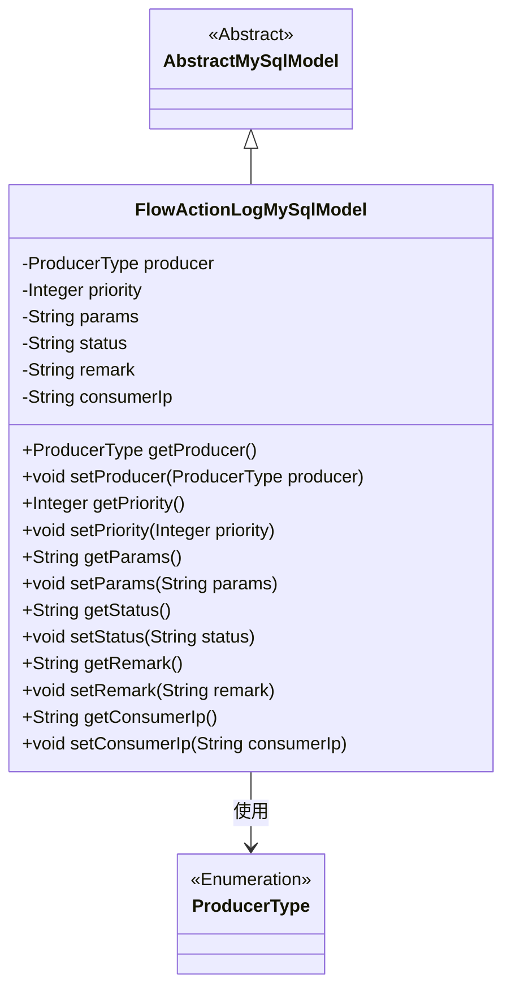

# 基础信息

|      |      |
|------|------|
| 名称 | FlowActionLogMySqlModel |
| 编码语言 | .java |
| 代码路径 | WeFe/board/board-service/src/main/java/com/welab/wefe/board/service/database/entity/flow/FlowActionLogMySqlModel.java |
| 包名 | com.welab.wefe.board.service.database.entity.flow |
| 依赖项 | ['com.welab.wefe.board.service.database.entity.base.AbstractMySqlModel', 'com.welab.wefe.common.wefe.enums.ProducerType', 'javax.persistence.Entity', 'javax.persistence.EnumType', 'javax.persistence.Enumerated'] |
| 概述说明 | FlowActionLogMySqlModel是MySQL实体类，包含生产者类型、优先级、动作参数、执行状态、备注和消费者IP字段，提供getter/setter方法。 |

# 说明

FlowActionLogMySqlModel是一个MySQL数据库实体类，用于记录流程动作日志。它包含以下字段：producer表示消息生产者类型（枚举值board/gateway），priority表示优先级，params存储动作参数，status记录执行状态（枚举值success/fail），remark保存备注信息，consumerIp记录消费者IP地址。类中为每个字段提供了对应的getter和setter方法。

# 类列表 Class Summary

| 名称   | 类型  | 说明 |
|-------|------|-------------|
| FlowActionLogMySqlModel | class | FlowActionLogMySqlModel是记录流动作的MySQL实体类，包含生产者类型、优先级、动作参数、执行状态、备注和消费者IP字段，并提供getter/setter方法。 |


## 类 FlowActionLogMySqlModel

|      |      |
|------|------|
| 访问范围 | @Entity(name = "flow_action_log");public |
| 类型 | class |
| 名称 | FlowActionLogMySqlModel |
| 说明 | FlowActionLogMySqlModel是记录流动作的MySQL实体类，包含生产者类型、优先级、动作参数、执行状态、备注和消费者IP字段，并提供getter/setter方法。 |


### UML类图



这段代码定义了一个名为FlowActionLogMySqlModel的实体类，继承自AbstractMySqlModel抽象类。该类用于记录流程动作日志，包含生产者类型、优先级、动作参数、执行状态、备注信息和消费者IP等字段，并提供了相应的getter和setter方法。其中producer字段使用了枚举类型ProducerType。该类通过JPA注解标记为数据库实体，映射到名为"flow_action_log"的表。


### 内部方法调用关系图

```mermaid
graph TD
    A["类FlowActionLogMySqlModel"]
    B["继承: AbstractMySqlModel"]
    C["注解: @Entity(name='flow_action_log')"]
    D["枚举属性: ProducerType producer"]
    E["属性: Integer priority"]
    F["属性: String params"]
    G["属性: String status"]
    H["属性: String remark"]
    I["属性: String consumerIp"]
    J["getter/setter方法组"]

    A --> B
    A --> C
    A --> D
    A --> E
    A --> F
    A --> G
    A --> H
    A --> I
    A --> J
    D -->|@Enumerated| K["EnumType.STRING"]
```

这段代码定义了一个名为FlowActionLogMySqlModel的JPA实体类，继承自AbstractMySqlModel。类中包含6个核心属性：使用枚举类型的producer（标注@Enumerated注解）、整型priority、字符串类型的params/status/remark/consumerIp，并为每个属性提供了标准的getter/setter方法。该实体映射到数据库表"flow_action_log"，主要用于记录流程动作日志，包含生产者类型、执行状态、参数等关键信息，体现了JPA实体与数据库表的结构映射关系。

### 字段列表 Field List

| 名称  | 类型  | 说明 |
|-------|-------|------|
| status | String | 私有字符串变量status，用于存储状态信息。 |
| params | String | 声明一个私有字符串变量params。 |
| remark | String | 私有字符串类型备注字段。 |
| producer | ProducerType | 枚举字段producer使用字符串类型存储。 |
| priority | Integer | 私有整型变量priority，表示优先级。 |
| consumerIp | String | 私有字符串变量，存储消费者IP地址。 |

### 方法列表

| 名称  | 类型  | 说明 |
|-------|-------|------|
| setPriority | void | 设置优先级的方法，将输入参数赋值给类的priority属性。 |
| getProducer | ProducerType | 获取生产者类型的方法，返回producer变量。 |
| getStatus | String | 获取状态值的方法，返回字符串类型的状态变量。 |
| getPriority | Integer | 获取priority的整数值方法。 |
| setParams | void | 设置参数方法，将输入字符串赋值给类成员变量params。 |
| setStatus | void | 这是一个Java方法，用于设置对象的status属性值。方法接收一个字符串参数status，并将其赋值给对象的同名成员变量。 |
| getParams | String | 这是一个Java方法，返回字符串类型的成员变量params的值。 |
| setProducer | void | 设置生产者对象的方法，将输入参数赋值给类的成员变量producer。 |
| getRemark | String | 获取备注信息的公共方法，返回字符串类型备注内容。 |
| setRemark | void | 设置备注信息的方法，将输入字符串赋值给类的备注字段。 |
| getConsumerIp | String | 获取消费者IP地址的方法，返回字符串类型。 |
| setConsumerIp | void | 设置消费者IP地址的方法，将输入参数赋值给类成员变量consumerIp。 |


