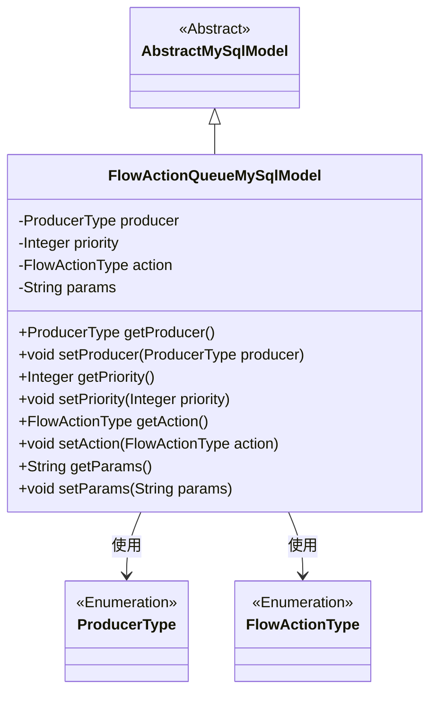
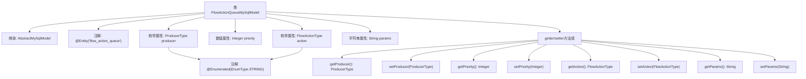

# 基础信息

|      |      |
|------|------|
| 名称 | FlowActionQueueMySqlModel |
| 编码语言 | .java |
| 代码路径 | WeFe/board/board-service/src/main/java/com/welab/wefe/board/service/database/entity/flow/FlowActionQueueMySqlModel.java |
| 包名 | com.welab.wefe.board.service.database.entity.flow |
| 依赖项 | ['com.welab.wefe.board.service.database.entity.base.AbstractMySqlModel', 'com.welab.wefe.common.wefe.enums.FlowActionType', 'com.welab.wefe.common.wefe.enums.ProducerType', 'javax.persistence.Entity', 'javax.persistence.EnumType', 'javax.persistence.Enumerated'] |
| 概述说明 | FlowActionQueueMySqlModel是MySQL实体类，包含生产者类型、优先级、动作类型和参数字段，提供getter/setter方法。 |

# 说明

这是一个名为FlowActionQueueMySqlModel的JPA实体类，映射到数据库表flow_action_queue。它继承自AbstractMySqlModel基类，包含四个核心字段：producer表示消息生产者类型（枚举值为board/gateway），priority定义消费优先级（数值越大越优先），action存储动作类型（枚举值），params保存动作参数。每个字段都有对应的getter和setter方法，其中producer和action字段使用字符串形式存储枚举值。该模型用于管理流动作队列数据。

# 类列表 Class Summary

| 名称   | 类型  | 说明 |
|-------|------|-------------|
| FlowActionQueueMySqlModel | class | FlowActionQueueMySqlModel类定义流程动作队列，包含生产者类型、优先级、动作类型和参数字段，提供getter/setter方法。 |

## 类 FlowActionQueueMySqlModel

|      |      |
|------|------|
| 访问范围 | @Entity(name = "flow_action_queue");public |
| 类型 | class |
| 名称 | FlowActionQueueMySqlModel |
| 说明 | FlowActionQueueMySqlModel类定义流程动作队列，包含生产者类型、优先级、动作类型和参数字段，提供getter/setter方法。 |

### UML类图

该代码定义了一个名为`FlowActionQueueMySqlModel`的实体类，继承自抽象类`AbstractMySqlModel`，用于表示流程动作队列的数据模型。类中包含四个私有字段：`producer`（生产者类型枚举）、`priority`（优先级数值）、`action`（动作类型枚举）和`params`（动作参数字符串），并为每个字段提供了对应的getter和setter方法。该类通过JPA注解标记为数据库实体，两个枚举类型字段采用字符串形式存储。

### 内部方法调用关系图

这段代码定义了一个名为FlowActionQueueMySqlModel的JPA实体类，继承自AbstractMySqlModel。该类包含四个主要属性：producer（生产者类型枚举）、priority（优先级数值）、action（动作类型枚举）和params（参数字符串），每个属性都有对应的getter和setter方法。其中producer和action属性使用@Enumerated注解标记为字符串存储格式。该实体映射到数据库中的"flow_action_queue"表，是一个典型的JPA实体类实现，用于持久化流程动作队列数据。

### 字段列表 Field List

| 名称  | 类型  | 说明 |
|-------|-------|------|
| params | String | 私有字符串参数变量。 |
| priority | Integer | 私有整型变量priority，表示优先级。 |
| producer | ProducerType | 枚举类型producer使用字符串值存储。 |
| action | FlowActionType | 枚举类型字段action，使用字符串形式存储。 |

### 方法列表

| 名称  | 类型  | 说明 |
|-------|-------|------|
| getProducer | ProducerType | 获取生产者类型的方法，返回producer变量值。 |
| setPriority | void | 设置优先级的方法，将输入参数赋值给类的priority属性。 |
| getPriority | Integer | 获取优先级数值的方法，返回整数类型的priority值。 |
| getAction | FlowActionType | 获取当前流程动作类型的方法，返回FlowActionType对象。 |
| setProducer | void | 这是一个Java方法，用于设置ProducerType类型的producer属性。方法名为setProducer，接受一个ProducerType参数，并将其赋值给当前对象的producer字段。 |
| setAction | void | 设置流程动作类型的方法，将输入参数赋值给类的action属性。 |
| getParams | String | 获取params参数的字符串值。 |
| setParams | void | 设置参数方法，将输入字符串赋值给类成员变量params。 |

