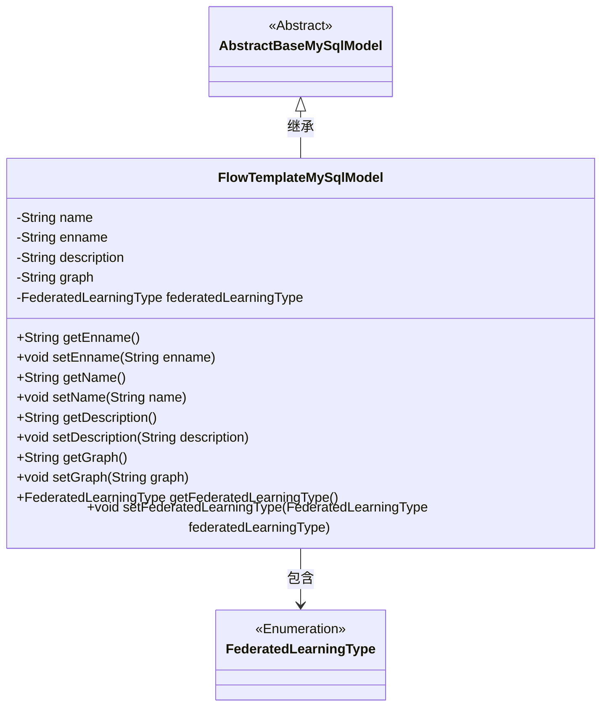

# 基础信息

|      |      |
|------|------|
| 名称 | FlowTemplateMySqlModel |
| 编码语言 | .java |
| 代码路径 | WeFe/board/board-service/src/main/java/com/welab/wefe/board/service/database/entity/flow/FlowTemplateMySqlModel.java |
| 包名 | com.welab.wefe.board.service.database.entity.flow |
| 依赖项 | ['com.welab.wefe.board.service.database.entity.base.AbstractBaseMySqlModel', 'com.welab.wefe.common.wefe.enums.FederatedLearningType', 'javax.persistence.Entity', 'javax.persistence.EnumType', 'javax.persistence.Enumerated'] |
| 概述说明 | FlowTemplateMySqlModel类定义了项目流程模板的数据库实体，包含名称、英文名、描述、流程图和联邦学习类型等字段及其getter/setter方法。 |

# 说明

该内容描述了一个名为FlowTemplateMySqlModel的Java类，它是一个数据库实体类，映射到名为project_flow_template的表。该类继承自AbstractBaseMySqlModel，包含序列化ID字段。主要属性包括模板名称name、模板类型enname、模板描述description、画布编辑图graph以及联邦学习类型federatedLearningType（枚举类型，横向或纵向）。每个属性都有对应的getter和setter方法用于访问和修改。

# 类列表 Class Summary

| 名称   | 类型  | 说明 |
|-------|------|-------------|
| FlowTemplateMySqlModel | class | FlowTemplateMySqlModel是项目流程模板的数据库实体类，包含名称、英文名、描述、流程图和联邦学习类型等字段。 |

## 类 FlowTemplateMySqlModel

|      |      |
|------|------|
| 访问范围 | @Entity(name = "project_flow_template");public |
| 类型 | class |
| 名称 | FlowTemplateMySqlModel |
| 说明 | FlowTemplateMySqlModel是项目流程模板的数据库实体类，包含名称、英文名、描述、流程图和联邦学习类型等字段。 |

### UML类图

这段代码定义了一个名为FlowTemplateMySqlModel的实体类，继承自AbstractBaseMySqlModel抽象类。该类包含模板名称、英文名称、描述、图形数据以及联邦学习类型等属性，并提供了相应的getter和setter方法。其中联邦学习类型是一个枚举类型FederatedLearningType。该类主要用于存储项目流程模板的相关信息，并通过继承获得基础数据库模型的功能。

### 内部方法调用关系图

```mermaid
graph TD
    A["类FlowTemplateMySqlModel"]
    B["继承: AbstractBaseMySqlModel"]
    C["属性: String name"]
    D["属性: String enname"]
    E["属性: String description"]
    F["属性: String graph"]
    G["属性: FederatedLearningType federatedLearningType"]
    H["方法: getEnname()"]
    I["方法: setEnname(String enname)"]
    J["方法: getName()"]
    K["方法: setName(String name)"]
    L["方法: getDescription()"]
    M["方法: setDescription(String description)"]
    N["方法: getGraph()"]
    O["方法: setGraph(String graph)"]
    P["方法: getFederatedLearningType()"]
    Q["方法: setFederatedLearningType(FederatedLearningType)"]

    A --> B
    A --> C
    A --> D
    A --> E
    A --> F
    A --> G
    A --> H
    A --> I
    A --> J
    A --> K
    A --> L
    A --> M
    A --> N
    A --> O
    A --> P
    A --> Q
```

该流程图描述了FlowTemplateMySqlModel类的结构，该类继承自AbstractBaseMySqlModel，包含5个私有属性（name、enname、description、graph和federatedLearningType）以及对应的getter和setter方法。其中federatedLearningType属性使用@Enumerated注解标记为枚举类型。每个属性都有对应的访问和修改方法，形成标准的Java Bean结构，用于数据库实体映射。

### 字段列表 Field List

| 名称  | 类型  | 说明 |
|-------|-------|------|
| enname | String | 定义私有字符串变量enname。 |
| federatedLearningType | FederatedLearningType | 代码定义了一个枚举类型字段federatedLearningType，使用字符串形式存储枚举值。 |
| description | String | 私有字符串类型变量description。 |
| serialVersionUID = -8452977095072329750L | long | 定义序列化版本UID，值为-8452977095072329750L，用于确保类版本兼容性。 |
| name | String | 私有字符串变量name |
| graph | String | 私有字符串变量graph |

### 方法列表

| 名称  | 类型  | 说明 |
|-------|-------|------|
| setEnname | void | 这是一个Java方法，用于设置对象的英文名称属性。方法接收一个字符串参数enname，并将其赋值给对象的enname成员变量。 |
| setGraph | void | 设置图形属性的方法，将输入字符串赋值给类变量graph。 |
| getName | String | 方法返回字符串类型的name变量值。 |
| setDescription | void | 设置描述信息的方法，将输入参数赋值给对象的description属性。 |
| setName | void | 这是一个Java方法，用于设置对象的名称属性。方法接受一个字符串参数name，并将其赋值给当前对象的name成员变量。 |
| getDescription | String | 获取描述信息的字符串方法。 |
| getEnname | String | 这是一个Java方法，返回字符串类型的enname属性值。 |
| getGraph | String | 获取graph字符串的方法。 |
| getFederatedLearningType | FederatedLearningType | 获取联邦学习类型的方法，返回federatedLearningType字段值。 |
| setFederatedLearningType | void | 设置联邦学习类型的方法，将参数值赋给类的成员变量。 |

