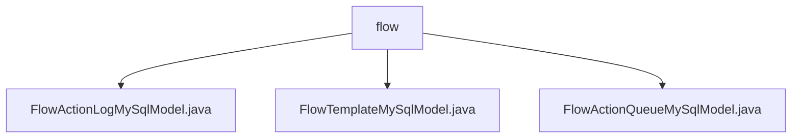

# 基础信息

|      |      |
|------|------|
| 名称 | flow |
| 编码语言 | .java |
| 代码路径 | WeFe/board/board-service/src/main/java/com/welab/wefe/board/service/database/entity/flow |
| 包名 | docs.board.board-service.src.main.java.com.welab.wefe.board.service.database.entity.flow |
| 概述说明 | FlowActionLogMySqlModel记录流程日志，含生产者、优先级、状态等字段。FlowTemplateMySqlModel映射project_flow_template表，含模板名称、类型等属性。FlowActionQueueMySqlModel管理流动作队列，含生产者、优先级等字段。 |

# 说明

## 概述  
该模块核心职责是管理联邦学习流程中的动作日志、模板配置及队列数据，通过MySQL实体类实现持久化存储。接口规范包含三类模型：FlowActionLogMySqlModel记录执行状态和参数，FlowTemplateMySqlModel存储流程模板元数据，FlowActionQueueMySqlModel管理待处理动作队列。关键数据结构涉及生产者类型（枚举board/gateway）、联邦学习类型（横向/纵向枚举）及优先级数值字段。外部依赖仅为MySQL数据库和JPA框架。例如FlowActionLogMySqlModel通过status字段标记动作成功/失败状态。

## 主要业务场景  
模块支撑联邦学习流程全生命周期管理，类似工作流引擎的数据层实现。FlowTemplateMySqlModel定义可复用的流程模板，FlowActionQueueMySqlModel实现优先级队列调度（数值越大优先级越高），FlowActionLogMySqlModel跟踪动作执行轨迹。典型应用包括模板创建（例如graph字段存储画布配置）、动作异步处理（如producer区分消息来源）及执行审计（通过consumerIp记录调用方）。API类型涵盖CRUD操作和状态查询，例如通过federatedLearningType枚举筛选横向或纵向学习模板。

### 包内部结构视图

该流程图展示了WeFe项目中board-service模块下flow目录的层级结构。flow作为父节点包含三个Java实体类文件：FlowActionLogMySqlModel、FlowTemplateMySqlModel和FlowActionQueueMySqlModel，这些文件都属于数据流相关的数据库实体模型。整个结构清晰地反映了数据流实体在项目中的组织方式。

# 文件列表

| 名称   | 类型  | 说明 |
|-------|------|-------------|
| [FlowActionLogMySqlModel.java](FlowActionLogMySqlModel.md) | file | FlowActionLogMySqlModel是MySQL实体类，包含生产者类型、优先级、动作参数、执行状态、备注和消费者IP字段，提供getter/setter方法。 |
| [FlowTemplateMySqlModel.java](FlowTemplateMySqlModel.md) | file | FlowTemplateMySqlModel类定义了项目流程模板的数据库实体，包含名称、英文名、描述、流程图和联邦学习类型等字段及其getter/setter方法。 |
| [FlowActionQueueMySqlModel.java](FlowActionQueueMySqlModel.md) | file | FlowActionQueueMySqlModel是MySQL实体类，包含生产者类型、优先级、动作类型和参数字段，提供getter/setter方法。 |

