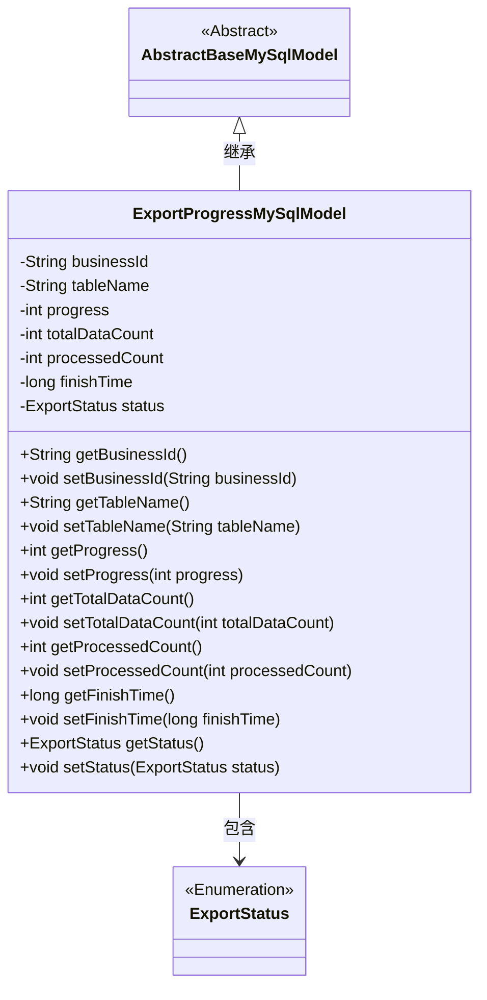

# 基础信息

|      |      |
|------|------|
| 名称 | ExportProgressMySqlModel |
| 编码语言 | .java |
| 代码路径 | WeFe/board/board-service/src/main/java/com/welab/wefe/board/service/database/entity/fusion/ExportProgressMySqlModel.java |
| 包名 | com.welab.wefe.board.service.database.entity.fusion |
| 依赖项 | ['com.welab.wefe.board.service.database.entity.base.AbstractBaseMySqlModel', 'com.welab.wefe.board.service.fusion.enums.ExportStatus', 'javax.persistence.Entity', 'javax.persistence.EnumType', 'javax.persistence.Enumerated'] |
| 概述说明 | ExportProgressMySqlModel类记录融合任务导出进度，包含业务ID、表名、进度百分比、总数、已处理数、完成时间和状态等字段。 |

# 说明

该内容定义了一个名为ExportProgressMySqlModel的Java实体类，用于记录融合任务导出进度。类中包含业务ID、导出表名、进度百分比、总数据量、已处理数量、完成时间和导出状态等字段，并提供了各字段的getter和setter方法。实体映射到数据库表fusion_result_export_progress，继承自AbstractBaseMySqlModel基类。状态字段使用枚举类型ExportStatus存储。

# 类列表 Class Summary

| 名称   | 类型  | 说明 |
|-------|------|-------------|
| ExportProgressMySqlModel | class | ExportProgressMySqlModel类记录导出进度，包含任务ID、表名、进度、总数、已处理数、完成时间和状态。 |

## 类 ExportProgressMySqlModel

|      |      |
|------|------|
| 访问范围 | @Entity(name = "fusion_result_export_progress");public |
| 类型 | class |
| 名称 | ExportProgressMySqlModel |
| 说明 | ExportProgressMySqlModel类记录导出进度，包含任务ID、表名、进度、总数、已处理数、完成时间和状态。 |

### UML类图

这段代码定义了一个名为`ExportProgressMySqlModel`的实体类，用于跟踪导出任务的进度信息。该类继承自`AbstractBaseMySqlModel`，包含业务ID、表名、进度百分比、总数据量、已处理数量、完成时间和状态等字段。其中`ExportStatus`是一个枚举类型，表示导出任务的不同状态。该类提供了所有字段的getter和setter方法，是一个典型的数据模型类，用于与数据库表`fusion_result_export_progress`进行映射。

### 内部方法调用关系图

```mermaid
graph TD
    A["类ExportProgressMySqlModel"]
    B["继承: AbstractBaseMySqlModel"]
    C["属性: String businessId"]
    D["属性: String tableName"]
    E["属性: int progress"]
    F["属性: int totalDataCount"]
    G["属性: int processedCount"]
    H["属性: long finishTime"]
    I["属性: ExportStatus status"]
    J["方法: getBusinessId()"]
    K["方法: setBusinessId(String)"]
    L["方法: getTableName()"]
    M["方法: setTableName(String)"]
    N["方法: getProgress()"]
    O["方法: setProgress(int)"]
    P["方法: getTotalDataCount()"]
    Q["方法: setTotalDataCount(int)"]
    R["方法: getProcessedCount()"]
    S["方法: setProcessedCount(int)"]
    T["方法: getFinishTime()"]
    U["方法: setFinishTime(long)"]
    V["方法: getStatus()"]
    W["方法: setStatus(ExportStatus)"]

    A --> B
    A --> C
    A --> D
    A --> E
    A --> F
    A --> G
    A --> H
    A --> I
    A --> J
    A --> K
    A --> L
    A --> M
    A --> N
    A --> O
    A --> P
    A --> Q
    A --> R
    A --> S
    A --> T
    A --> U
    A --> V
    A --> W
```

这段代码定义了一个名为ExportProgressMySqlModel的JPA实体类，继承自AbstractBaseMySqlModel，用于跟踪数据导出任务的进度状态。类中包含7个核心属性：业务ID、表名、进度百分比、总数据量、已处理数量、完成时间和导出状态，每个属性都有对应的getter和setter方法。该实体映射到数据库表"fusion_result_export_progress"，通过枚举类型ExportStatus记录导出状态，整体结构清晰地反映了导出任务的核心监控指标。

### 字段列表 Field List

| 名称  | 类型  | 说明 |
|-------|-------|------|
| tableName | String | 定义字符串变量tableName。 |
| processedCount | int | 已处理的计数变量。 |
| businessId | String | 业务标识字符串 |
| totalDataCount | int | 总数据计数变量 |
| status | ExportStatus | 使用@Enumerated(EnumType.STRING)将枚举类型ExportStatus以字符串形式存储到数据库。 |
| progress | int | 整型变量progress，用于记录进度。 |
| finishTime | long | 长整型完成时间变量 |

### 方法列表

| 名称  | 类型  | 说明 |
|-------|-------|------|
| getStatus | ExportStatus | 获取当前导出状态的方法，返回ExportStatus对象。 |
| setFinishTime | void | 设置完成时间的方法，参数为长整型finishTime。 |
| getBusinessId | String | 这是一个Java方法，返回字符串类型的businessId变量值。 |
| setProcessedCount | void | 设置已处理数量的方法，将参数processedCount赋值给类的成员变量processedCount。 |
| getTotalDataCount | int | 这是一个返回总数据量的方法，直接返回成员变量totalDataCount的值。 |
| setTableName | void | 设置表名的方法，将输入参数tableName赋值给当前对象的tableName属性。 |
| getFinishTime | long | 获取完成时间的方法，返回finishTime值。 |
| getProcessedCount | int | 获取已处理数量方法，返回processedCount变量值。 |
| setTotalDataCount | void | 这是一个Java方法，用于设置totalDataCount变量的值。方法接受一个整数参数totalDataCount，并将其赋值给类的同名成员变量。 |
| getTableName | String | 获取表名的方法，返回字符串类型的表名变量。 |
| setBusinessId | void | 定义了一个公共方法setBusinessId，用于设置类中的businessId属性值。参数为String类型。 |
| setProgress | void | 设置进度值方法，将输入参数progress赋值给当前对象的progress属性。 |
| getProgress | int | 获取当前进度值的方法，返回整数类型变量progress。 |
| setStatus | void | 设置导出状态的方法，将传入的状态值赋给当前对象的状态属性。 |

