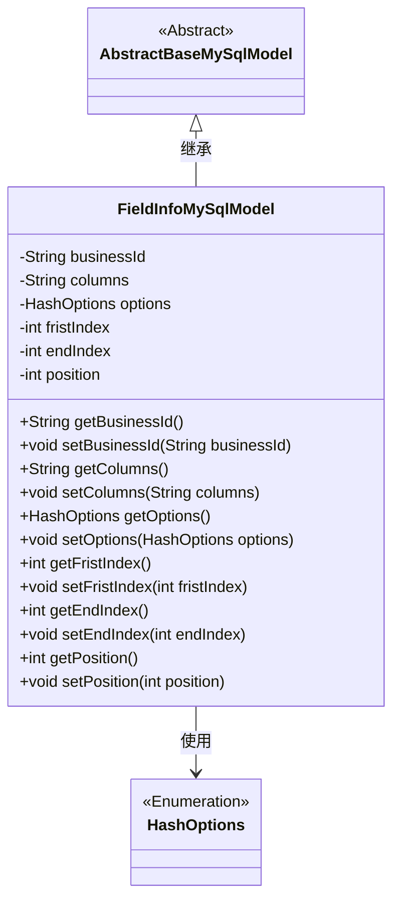
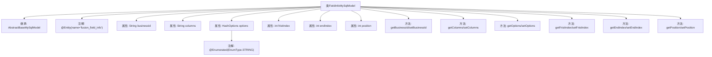

# 基础信息

|      |      |
|------|------|
| 名称 | FieldInfoMySqlModel |
| 编码语言 | .java |
| 代码路径 | WeFe/board/board-service/src/main/java/com/welab/wefe/board/service/database/entity/fusion/FieldInfoMySqlModel.java |
| 包名 | com.welab.wefe.board.service.database.entity.fusion |
| 依赖项 | ['com.welab.wefe.board.service.database.entity.base.AbstractBaseMySqlModel', 'com.welab.wefe.common.wefe.enums.HashOptions', 'javax.persistence.Entity', 'javax.persistence.EnumType', 'javax.persistence.Enumerated'] |
| 概述说明 | FieldInfoMySqlModel类，包含businessId、columns、options枚举、fristIndex、endIndex和position字段及对应getter/setter方法。 |

# 说明

这是一个名为FieldInfoMySqlModel的Java实体类，映射到数据库表fusion_field_info。它继承自AbstractBaseMySqlModel，包含六个属性：businessId（业务ID）、columns（列信息）、options（哈希选项枚举类型）、fristIndex（起始索引）、endIndex（结束索引）和position（位置）。每个属性都有对应的getter和setter方法。其中options属性使用@Enumerated注解指定以字符串形式存储枚举值。

# 类列表 Class Summary

| 名称   | 类型  | 说明 |
|-------|------|-------------|
| FieldInfoMySqlModel | class | FieldInfoMySqlModel类包含业务ID、列名、哈希选项、首尾索引和位置字段，提供对应getter和setter方法。 |

## 类 FieldInfoMySqlModel

|      |      |
|------|------|
| 访问范围 | @Entity(name = "fusion_field_info");public |
| 类型 | class |
| 名称 | FieldInfoMySqlModel |
| 说明 | FieldInfoMySqlModel类包含业务ID、列名、哈希选项、首尾索引和位置字段，提供对应getter和setter方法。 |

### UML类图

该类图展示了FieldInfoMySqlModel继承自抽象类AbstractBaseMySqlModel，并包含多个私有字段及其对应的getter/setter方法。其中HashOptions是一个枚举类型，被FieldInfoMySqlModel作为字段类型使用。类图清晰地反映了实体类之间的继承关系和字段依赖，符合JPA实体建模规范。

### 内部方法调用关系图

这段代码定义了一个名为FieldInfoMySqlModel的JPA实体类，继承自AbstractBaseMySqlModel，用于存储字段信息。类中包含6个属性：businessId、columns、options（带枚举注解）、fristIndex、endIndex和position，每个属性都有对应的getter和setter方法。实体通过@Entity注解映射到数据库表"fusion_field_info"，其中options属性使用@Enumerated指定枚举存储方式为字符串类型。该模型类主要用于ORM框架与数据库表之间的映射操作。

### 字段列表 Field List

| 名称  | 类型  | 说明 |
|-------|-------|------|
| position | int | 私有整型变量position，用于存储位置信息。 |
| options | HashOptions | 枚举类型字段options，使用字符串形式存储。 |
| businessId | String | 私有业务标识符字符串 |
| fristIndex | int | 私有整型变量fristIndex。 |
| endIndex | int | 私有整型变量endIndex，用于标记结束位置。 |
| columns | String | 私有字符串变量columns，用于存储列信息。 |

### 方法列表

| 名称  | 类型  | 说明 |
|-------|-------|------|
| setPosition | void | 设置位置属性的方法，将输入参数赋值给对象的position变量。 |
| setColumns | void | 这是一个Java方法，用于设置类的字符串类型成员变量columns的值。方法名为setColumns，接受一个字符串参数columns，并将其赋值给当前对象的columns属性。 |
| getFristIndex | int | 获取fristIndex值的公共方法。 |
| setFristIndex | void | 设置类成员变量fristIndex的方法，参数为整型fristIndex。 |
| getColumns | String | 方法返回字符串变量columns的值。 |
| setBusinessId | void | 设置业务ID的方法，将传入的字符串参数赋值给类的businessId成员变量。 |
| getBusinessId | String | 获取businessId的公共方法，返回字符串类型的businessId。 |
| getOptions | HashOptions | 方法返回HashOptions对象options。 |
| setOptions | void | 设置哈希选项方法，将输入参数赋值给类成员变量options。 |
| getEndIndex | int | 获取结束索引的整数值。 |
| setEndIndex | void | 设置结束索引的方法，将参数endIndex赋值给类的成员变量endIndex。 |
| getPosition | int | 这是一个Java方法，返回整型变量position的值。 |

