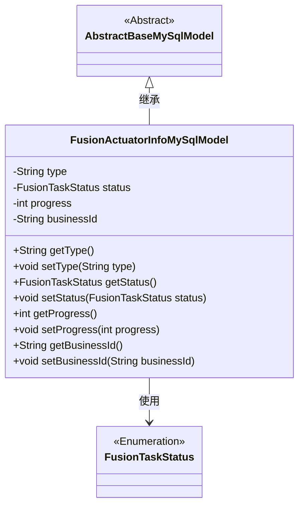
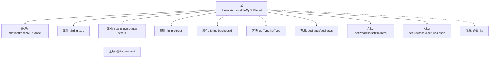

# 基础信息

|      |      |
|------|------|
| 名称 | FusionActuatorInfoMySqlModel |
| 编码语言 | .java |
| 代码路径 | WeFe/board/board-service/src/main/java/com/welab/wefe/board/service/database/entity/fusion/FusionActuatorInfoMySqlModel.java |
| 包名 | com.welab.wefe.board.service.database.entity.fusion |
| 依赖项 | ['com.welab.wefe.board.service.database.entity.base.AbstractBaseMySqlModel', 'com.welab.wefe.fusion.core.enums.FusionTaskStatus', 'javax.persistence.Entity', 'javax.persistence.EnumType', 'javax.persistence.Enumerated'] |
| 概述说明 | Java实体类FusionActuatorInfoMySqlModel，包含类型、状态、进度和业务ID字段及对应getter/setter方法。 |

# 说明

该内容定义了一个名为FusionActuatorInfoMySqlModel的Java实体类，继承自AbstractBaseMySqlModel。实体映射到数据库表fusion_actuator_info。类包含四个字段：type表示类型，status是枚举类型FusionTaskStatus表示任务状态，progress记录进度值，businessId存储业务标识。每个字段都有对应的getter和setter方法用于访问和修改属性值。

# 类列表 Class Summary

| 名称   | 类型  | 说明 |
|-------|------|-------------|
| FusionActuatorInfoMySqlModel | class | 定义了一个名为fusion_actuator_info的JPA实体类，包含类型、状态、进度和业务ID字段及其getter和setter方法。 |

## 类 FusionActuatorInfoMySqlModel

|      |      |
|------|------|
| 访问范围 | @Entity(name = "fusion_actuator_info");public |
| 类型 | class |
| 名称 | FusionActuatorInfoMySqlModel |
| 说明 | 定义了一个名为fusion_actuator_info的JPA实体类，包含类型、状态、进度和业务ID字段及其getter和setter方法。 |

### UML类图

这段类图展示了FusionActuatorInfoMySqlModel继承自AbstractBaseMySqlModel，并包含四个私有字段（type、status、progress、businessId）及其对应的getter/setter方法。其中status字段使用枚举类型FusionTaskStatus，通过@Enumerated注解实现枚举值与字符串的映射。该类作为JPA实体（通过@Entity注解标记），用于持久化执行器信息到MySQL数据库。

### 内部方法调用关系图

该流程图展示了FusionActuatorInfoMySqlModel类的完整结构，包括其继承关系、属性定义、方法组成以及关键注解。类继承自AbstractBaseMySqlModel，包含四个核心属性（type、status、progress、businessId）及其对应的getter/setter方法。特别标注了@Entity实体注解和status字段的@Enumerated枚举类型注解，反映了该JPA实体类与数据库表"fusion_actuator_info"的映射关系，以及枚举字段的特殊处理方式。

### 字段列表 Field List

| 名称  | 类型  | 说明 |
|-------|-------|------|
| businessId | String | 业务标识字符串 |
| status | FusionTaskStatus | 使用字符串形式存储枚举类型FusionTaskStatus的状态值。 |
| progress | int | 整型变量progress，用于记录进度。 |
| type | String | 字符串类型变量声明。 |

### 方法列表

| 名称  | 类型  | 说明 |
|-------|-------|------|
| setStatus | void | 设置任务状态的方法，将输入参数status赋值给当前对象的status属性。 |
| setType | void | 这是一个Java方法，用于设置对象的类型属性。方法名为setType，接收一个String参数type，并将其赋值给当前对象的type成员变量。 |
| setProgress | void | 设置进度值的方法，将输入参数progress赋值给类成员变量progress。 |
| getBusinessId | String | 这是一个Java方法，返回字符串类型的businessId变量值。 |
| setBusinessId | void | 设置业务ID的方法，将输入字符串赋值给类的businessId成员变量。 |
| getStatus | FusionTaskStatus | 获取当前任务状态的方法，返回FusionTaskStatus类型的状态值。 |
| getProgress | int | 这是一个Java方法，返回整型变量progress的当前值。 |
| getType | String | 这是一个Java方法，返回字符串类型的变量type的值。 |

