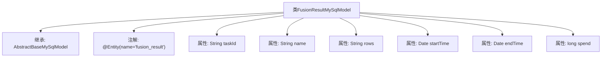

# 基础信息

|      |      |
|------|------|
| 名称 | FusionResultMySqlModel |
| 编码语言 | .java |
| 代码路径 | WeFe/board/board-service/src/main/java/com/welab/wefe/board/service/database/entity/fusion/FusionResultMySqlModel.java |
| 包名 | com.welab.wefe.board.service.database.entity.fusion |
| 依赖项 | ['com.welab.wefe.board.service.database.entity.base.AbstractBaseMySqlModel', 'javax.persistence.Entity', 'java.util.Date'] |
| 概述说明 | FusionResultMySqlModel是MySQL实体类，包含任务ID、名称、行数、开始结束时间及耗时字段。 |

# 说明

这是一个名为FusionResultMySqlModel的Java持久化实体类，映射到数据库表fusion_result。它继承自AbstractBaseMySqlModel基类，包含6个字段：taskId表示任务ID，name存储名称，rows记录行数，startTime和endTime分别表示开始和结束时间，spend存储耗时。所有字段均使用基本数据类型或标准Java类。

# 类列表 Class Summary

| 名称   | 类型  | 说明 |
|-------|------|-------------|
| FusionResultMySqlModel | class | FusionResultMySqlModel是MySQL实体类，包含任务ID、名称、行数、开始结束时间及耗时字段。 |


## 类 FusionResultMySqlModel

|      |      |
|------|------|
| 访问范围 | @Entity(name = "fusion_result");public |
| 类型 | class |
| 名称 | FusionResultMySqlModel |
| 说明 | FusionResultMySqlModel是MySQL实体类，包含任务ID、名称、行数、开始结束时间及耗时字段。 |


### UML类图

```mermaid
classDiagram
    class AbstractBaseMySqlModel {
        <<Abstract>>
        // 基础模型类，包含通用字段和方法
    }

    class FusionResultMySqlModel {
        -String taskId
        -String name
        -String rows
        -Date startTime
        -Date endTime
        -long spend
    }

    AbstractBaseMySqlModel <|-- FusionResultMySqlModel : 继承
    FusionResultMySqlModel ..|> Entity : 实现

    <<Interface>> Entity {
        <<JPA>>
    }
```

这段类图展示了FusionResultMySqlModel继承自AbstractBaseMySqlModel抽象类，并实现了JPA的Entity接口。该类包含6个私有字段：taskId（任务ID）、name（名称）、rows（行数据）、startTime（开始时间）、endTime（结束时间）和spend（耗时），用于存储融合任务的结果数据。通过@Entity注解表明这是一个JPA持久化实体，对应数据库表"fusion_result"。


### 内部方法调用关系图



该流程图描述了FusionResultMySqlModel类的结构，该类继承自AbstractBaseMySqlModel并标注为JPA实体。类包含6个属性：taskId、name、rows三个字符串类型字段，startTime和endTime两个日期类型字段，以及spend长整型字段。所有属性均为默认访问权限，未显式声明getter/setter方法。

### 字段列表 Field List

| 名称  | 类型  | 说明 |
|-------|-------|------|
| startTime | Date | 开始日期时间 |
| endTime | Date | 声明一个名为endTime的日期类型变量。 |
| rows | String | 字符串变量rows的定义。 |
| taskId | String | 任务ID字符串变量 |
| name | String | 声明字符串变量name |
| spend | long | 长时间开销 |

### 方法列表

| 名称  | 类型  | 说明 |
|-------|-------|------|


