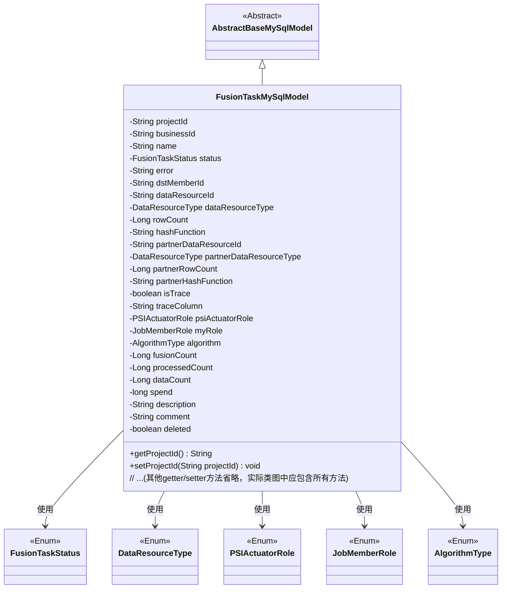
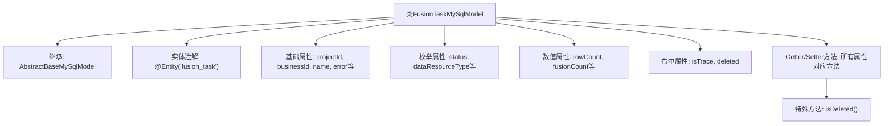

# 基础信息

|      |      |
|------|------|
| 名称 | FusionTaskMySqlModel |
| 编码语言 | .java |
| 代码路径 | WeFe/board/board-service/src/main/java/com/welab/wefe/board/service/database/entity/fusion/FusionTaskMySqlModel.java |
| 包名 | com.welab.wefe.board.service.database.entity.fusion |
| 依赖项 | ['com.welab.wefe.board.service.database.entity.base.AbstractBaseMySqlModel', 'com.welab.wefe.common.wefe.enums.DataResourceType', 'com.welab.wefe.common.wefe.enums.JobMemberRole', 'com.welab.wefe.fusion.core.enums.AlgorithmType', 'com.welab.wefe.fusion.core.enums.FusionTaskStatus', 'com.welab.wefe.fusion.core.enums.PSIActuatorRole', 'javax.persistence.Column', 'javax.persistence.Entity', 'javax.persistence.EnumType', 'javax.persistence.Enumerated'] |
| 概述说明 | FusionTaskMySqlModel类定义了数据融合任务实体，包含项目ID、业务ID、任务状态、数据资源信息、算法类型、角色、行数统计及追踪字段等属性。 |

# 说明

FusionTaskMySqlModel是一个用于表示融合任务的数据库实体类，包含任务基本信息如项目ID、业务ID、名称、状态、错误信息等。它记录了数据资源的相关属性，如资源ID、类型、行数、哈希函数，以及合作伙伴的对应属性。此外，还包含追踪字段、PSI执行角色、算法类型、融合计数、处理计数、数据计数、耗时、描述、注释和删除标志等字段。所有字段均提供了相应的getter和setter方法。

# 类列表 Class Summary

| 名称   | 类型  | 说明 |
|-------|------|-------------|
| FusionTaskMySqlModel | class | FusionTaskMySqlModel类定义了数据融合任务实体，包含项目ID、业务ID、任务状态、数据资源信息、角色类型、算法类型、行数统计、跟踪字段及删除标记等属性。 |

## 类 FusionTaskMySqlModel

|      |      |
|------|------|
| 访问范围 | @Entity(name = "fusion_task");public |
| 类型 | class |
| 名称 | FusionTaskMySqlModel |
| 说明 | FusionTaskMySqlModel类定义了数据融合任务实体，包含项目ID、业务ID、任务状态、数据资源信息、角色类型、算法类型、行数统计、跟踪字段及删除标记等属性。 |

### UML类图

类图描述：
FusionTaskMySqlModel类继承自AbstractBaseMySqlModel，是一个包含多方数据融合任务信息的实体类。它包含34个字段和对应的getter/setter方法，主要记录任务ID、资源信息、状态、算法类型、数据统计等属性。该类与5个枚举类型（FusionTaskStatus、DataResourceType等）存在关联关系，用于表示状态、角色和算法等分类信息。实体标注表明这是一个JPA持久化对象。

### 内部方法调用关系图

这段代码定义了一个名为FusionTaskMySqlModel的JPA实体类，继承自AbstractBaseMySqlModel，用于表示数据融合任务的数据模型。类中包含多种类型的属性：基础字符串类型（如projectId）、枚举类型（如status）、数值类型（如rowCount）以及布尔标志（如isTrace）。所有属性都配有对应的getter和setter方法，其中isDeleted()方法用于检查删除状态。该类通过@Entity注解映射到数据库表"fusion_task"，并通过@Enumerated和@Column等注解配置枚举字段的存储方式。

### 字段列表 Field List

| 名称  | 类型  | 说明 |
|-------|-------|------|
| spend | long | 变量spend，长整型，表示支出金额。 |
| dataResourceId | String | 字符串类型的数据资源标识符。 |
| dataCount = 0L | Long | 定义长整型变量dataCount，初始值为0。 |
| traceColumn | String | 声明一个公共字符串变量traceColumn。 |
| partnerRowCount | Long | 长整型变量，记录合作伙伴行数。 |
| partnerHashFunction | String | 字符串类型的合作伙伴哈希函数变量。 |
| businessId | String | 业务标识字符串 |
| name | String | 声明字符串变量name |
| processedCount = 0L | Long | 已处理的记录数，初始值为0。 |
| psiActuatorRole | PSIActuatorRole | 使用@Enumerated注解将枚举类型PSIActuatorRole以字符串形式存入数据库列psi_actuator_role。 |
| rowCount | Long | 声明一个长整型变量rowCount。 |
| algorithm | AlgorithmType | 实体类字段注解：使用字符串存储枚举类型AlgorithmType，对应数据库列名algorithm。 |
| status | FusionTaskStatus | 使用@Enumerated注解将枚举类型FusionTaskStatus以字符串形式存储到数据库。 |
| description | String | 公共字符串变量description，用于存储描述信息。 |
| comment | String | 公共字符串变量comment，用于存储评论内容。 |
| isTrace | boolean | 布尔变量isTrace用于追踪状态。 |
| dstMemberId | String | 定义字符串类型变量dstMemberId。 |
| fusionCount = 0L | Long | 定义了一个名为fusionCount的长整型变量，初始值为0。 |
| partnerDataResourceId | String | 声明字符串变量partnerDataResourceId，用于存储合作伙伴数据资源ID。 |
| myRole | JobMemberRole | 使用@Enumerated注解将枚举类型JobMemberRole以字符串形式存储到数据库表my_role字段中。 |
| partnerDataResourceType | DataResourceType | 使用@Enumerated注解将枚举类型DataResourceType以字符串形式存储到数据库表的partner_data_resource_type列中。 |
| error | String | 字符串类型错误变量。 |
| dataResourceType | DataResourceType | 实体类字段使用@Enumerated注解将枚举类型以字符串形式存储到数据库，对应列名为data_resource_type。 |
| deleted = false | boolean | 布尔变量deleted初始值为false，表示未删除状态。 |
| hashFunction | String | 字符串哈希函数 |
| projectId | String | 项目ID字符串变量声明。 |

### 方法列表

| 名称  | 类型  | 说明 |
|-------|-------|------|
| setDataCount | void | 这是一个Java方法，用于设置类的dataCount属性值。方法接收一个Long类型参数，并将其赋值给类的成员变量dataCount。 |
| getPartnerDataResourceId | String | 这是一个Java方法，返回名为partnerDataResourceId的字符串变量值。 |
| getDescription | String | 获取描述信息的字符串方法。 |
| setHashFunction | void | 这是一个Java方法，用于设置对象的hashFunction属性值。方法接受一个字符串参数hashFunction，并将其赋值给当前对象的同名属性。 |
| getHashFunction | String | 获取哈希函数名称的方法。 |
| setDataResourceId | void | 设置数据资源ID的方法，将参数值赋给类的成员变量dataResourceId。 |
| getBusinessId | String | 这是一个Java方法，返回字符串类型的businessId字段值。 |
| getPartnerDataResourceType | DataResourceType | 获取合作伙伴数据资源类型的方法，返回partnerDataResourceType。 |
| getPartnerRowCount | Long | 获取合作伙伴行数的方法，返回长整型数值partnerRowCount。 |
| getError | String | 获取错误信息的字符串方法。 |
| getRowCount | Long | 获取行数的方法，返回长整型数值rowCount。 |
| getMyRole | JobMemberRole | 获取当前用户的角色信息。 |
| setPartnerDataResourceType | void | 设置合作伙伴数据资源类型的方法，将输入参数赋值给成员变量partnerDataResourceType。 |
| setBusinessId | void | 设置业务ID的方法，将输入字符串赋值给类的businessId成员变量。 |
| setProcessedCount | void | 设置已处理数量的方法，参数为长整型processedCount。 |
| getTraceColumn | String | 获取traceColumn值的公共方法。 |
| setPartnerDataResourceId | void | 设置合作伙伴数据资源ID的方法，将输入参数赋值给类的成员变量partnerDataResourceId。 |
| getPartnerHashFunction | String | 获取合作伙伴哈希函数的方法，返回值为partnerHashFunction。 |
| getDataResourceId | String | 获取数据资源ID的方法，返回字符串类型的dataResourceId。 |
| setDataResourceType | void | 该方法用于设置数据资源类型，参数为DataResourceType类型，将其赋值给类的成员变量dataResourceType。 |
| setStatus | void | 设置任务状态的方法，将传入的状态参数赋值给当前对象的状态属性。 |
| getSpend | long | 获取spend值的公开方法，返回long类型数据。 |
| setMyRole | void | Java方法：设置当前对象的角色属性，参数为JobMemberRole类型。 |
| setTrace | void | 该方法用于设置布尔值trace，将其赋值给成员变量isTrace。 |
| setSpend | void | 这是一个Java方法，用于设置类成员变量spend的值，参数类型为long。 |
| getProcessedCount | Long | 获取已处理数量的方法，返回长整型数值processedCount。 |
| setTraceColumn | void | 设置跟踪列的方法，将输入字符串赋值给类的traceColumn成员变量。 |
| setError | void | 设置错误信息的方法，将传入的字符串赋值给类的error变量。 |
| setComment | void | 设置对象评论属性的方法，参数为字符串comment。 |
| isTrace | boolean | 这是一个Java方法，返回布尔值isTrace的状态。 |
| getDataResourceType | DataResourceType | 获取数据资源类型的方法，返回dataResourceType。 |
| getComment | String | 方法返回字符串类型的comment变量值。 |
| getStatus | FusionTaskStatus | 获取当前任务状态的方法，返回FusionTaskStatus类型的状态值。 |
| setPartnerRowCount | void | 设置合作伙伴行数的方法，参数为长整型。 |
| setPsiActuatorRole | void | 设置PSI执行器角色方法，将输入参数赋值给类成员变量psiActuatorRole。 |
| isDeleted | boolean | 这是一个Java方法，返回布尔值deleted，表示对象是否被删除。 |
| setProjectId | void | 设置项目ID的方法，将参数projectId赋值给当前对象的projectId属性。 |
| setFusionCount | void | Java方法：设置fusionCount属性值。 |
| setDescription | void | 设置描述内容的方法，将输入参数赋值给对象的description属性。 |
| getDataCount | Long | 获取数据数量的方法，返回长整型值dataCount。 |
| getName | String | 获取名称的方法，返回字符串类型的name变量值。 |
| setAlgorithm | void | 设置算法类型的方法，将输入参数赋值给类成员变量algorithm。 |
| setDstMemberId | void | 设置目标成员ID的方法，将参数值赋给类的成员变量dstMemberId。 |
| setPartnerHashFunction | void | 设置合作伙伴哈希函数的方法，将输入参数赋值给成员变量partnerHashFunction。 |
| setDeleted | void | 设置对象删除状态的公共方法，参数为布尔值deleted。 |
| getProjectId | String | 方法返回项目ID字符串。 |
| setRowCount | void | 设置行数的方法，将输入参数rowCount赋值给类成员变量rowCount。 |
| setName | void | 这是一个Java方法，用于设置对象的name属性，接受一个String参数name并将其赋值给当前对象的name字段。 |
| getPsiActuatorRole | PSIActuatorRole | 获取PSI执行器角色对象的方法。 |
| getFusionCount | Long | 获取融合计数值的方法，返回类型为Long。 |
| getDstMemberId | String | 获取目标成员ID的方法，返回dstMemberId字符串。 |
| getAlgorithm | AlgorithmType | 获取当前算法类型的方法，返回值为AlgorithmType类型。 |

