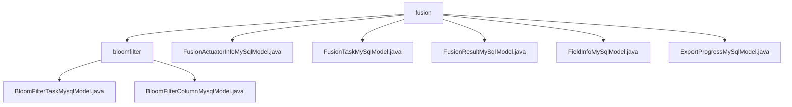

# 基础信息

|      |      |
|------|------|
| 名称 | fusion |
| 编码语言 | .java |
| 代码路径 | WeFe/board/board-service/src/main/java/com/welab/wefe/board/service/database/entity/fusion |
| 包名 | docs.board.board-service.src.main.java.com.welab.wefe.board.service.database.entity.fusion |
| 概述说明 | 该模块管理布隆过滤器任务及字段元数据，包含任务进度、字段特征等模型，支持CRUD和统计分析。涉及多个MySQL实体类，如任务状态、融合任务、结果、字段信息和导出进度等，均继承基础模型并映射到数据库表。 |

# 说明

## 概述  
该模块核心职责是管理数据融合任务全生命周期，包括任务执行监控、字段元数据分析和结果导出。接口规范包含五类模型：FusionTaskMySqlModel记录任务基础信息（例如项目ID、状态），FusionActuatorInfoMySqlModel跟踪执行进度（例如进度百分比），FieldInfoMySqlModel存储字段级配置（例如哈希选项），FusionResultMySqlModel保存结果统计（例如行数耗时），ExportProgressMySqlModel管理导出状态。关键数据结构包括业务ID关联的主从模型、枚举类型状态字段和耗时统计字段。外部依赖涉及JPA注解、MySQL数据库和枚举序列化库。例如FieldInfoMySqlModel使用@Enumerated实现枚举持久化。

## 主要业务场景  
模块实现类似数据流水线的融合任务管理，涵盖任务调度、执行监控和结果分析。主模型FusionTaskMySqlModel维护任务元数据（例如通过status字段跟踪任务阶段），从模型FusionActuatorInfoMySqlModel实时更新执行进度（例如progress字段）。典型应用模式包括：任务初始化时创建主模型，执行过程中通过FieldInfoMySqlModel配置字段映射规则，最终结果由FusionResultMySqlModel记录统计指标。API类型覆盖任务CRUD、进度查询和导出控制，例如ExportProgressMySqlModel支持导出状态管理。

### 包内部结构视图

该流程图展示了fusion目录下的层级结构，包含1个子目录bloomfilter和5个Java文件。bloomfilter子目录下又包含2个Java模型文件。整个结构清晰地呈现了数据库实体类的组织方式，总节点数与原路径数量完全一致。

# 文件列表

| 名称   | 类型  | 说明 |
|-------|------|-------------|
| [bloomfilter](bloomfilter/_module.md) | package | BloomFilterTaskMysqlModel类存储布隆过滤器任务信息，包含名称、ID、进度等字段，继承AbstractBaseMySqlModel。BloomFilterColumnMysqlModel类映射到数据库表，包含过滤器ID、字段序号、名称等，支持JSON存储，继承AbstractBaseMySqlModel。 |
| [FusionActuatorInfoMySqlModel.java](FusionActuatorInfoMySqlModel.md) | file | Java实体类FusionActuatorInfoMySqlModel，包含类型、状态、进度和业务ID字段及对应getter/setter方法。 |
| [FusionTaskMySqlModel.java](FusionTaskMySqlModel.md) | file | FusionTaskMySqlModel类定义了数据融合任务实体，包含项目ID、业务ID、任务状态、数据资源信息、算法类型、角色、行数统计及追踪字段等属性。 |
| [FusionResultMySqlModel.java](FusionResultMySqlModel.md) | file | FusionResultMySqlModel是MySQL实体类，包含任务ID、名称、行数、开始结束时间及耗时字段。 |
| [FieldInfoMySqlModel.java](FieldInfoMySqlModel.md) | file | FieldInfoMySqlModel类，包含businessId、columns、options枚举、fristIndex、endIndex和position字段及对应getter/setter方法。 |
| [ExportProgressMySqlModel.java](ExportProgressMySqlModel.md) | file | ExportProgressMySqlModel类记录融合任务导出进度，包含业务ID、表名、进度百分比、总数、已处理数、完成时间和状态等字段。 |

