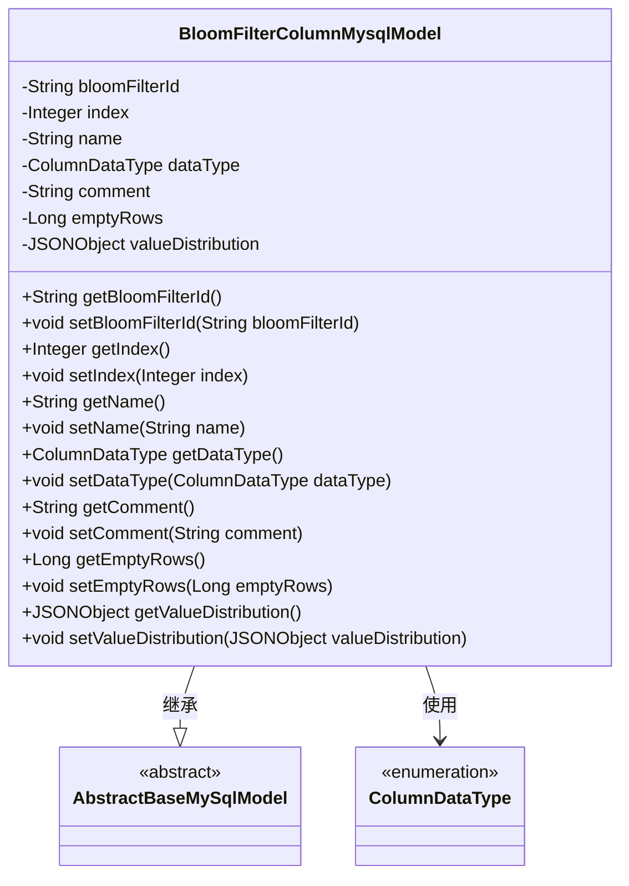

# 基础信息

|      |      |
|------|------|
| 名称 | BloomFilterColumnMysqlModel |
| 编码语言 | .java |
| 代码路径 | WeFe/board/board-service/src/main/java/com/welab/wefe/board/service/database/entity/fusion/bloomfilter/BloomFilterColumnMysqlModel.java |
| 包名 | com.welab.wefe.board.service.database.entity.fusion.bloomfilter |
| 依赖项 | ['com.alibaba.fastjson.JSONObject', 'com.vladmihalcea.hibernate.type.json.JsonStringType', 'com.welab.wefe.board.service.database.entity.base.AbstractBaseMySqlModel', 'com.welab.wefe.common.wefe.enums.ColumnDataType', 'org.hibernate.annotations.Type', 'org.hibernate.annotations.TypeDef', 'javax.persistence.Column', 'javax.persistence.Entity', 'javax.persistence.EnumType', 'javax.persistence.Enumerated'] |
| 概述说明 | BloomFilterColumnMysqlModel实体类，包含过滤器ID、字段序号、名称、数据类型、注释、空值行数和JSON格式的数值分布等属性。 |

# 说明

该代码定义了一个名为BloomFilterColumnMysqlModel的实体类，映射到数据库表bloom_filter_column。类继承自AbstractBaseMySqlModel，包含多个字段：bloomFilterId表示过滤器ID，index表示字段序号，name表示字段名称，dataType为枚举类型表示数据类型，comment存储注释信息，emptyRows记录空值数据行数，valueDistribution以JSON格式存储数值分布。所有字段均配有对应的getter和setter方法。实体类使用了JPA注解进行ORM映射，包括@Entity、@TypeDef等，并支持JSON类型字段存储。

# 类列表 Class Summary

| 名称   | 类型  | 说明 |
|-------|------|-------------|
| BloomFilterColumnMysqlModel | class | BloomFilterColumnMysqlModel是MySQL实体类，包含过滤器ID、字段序号、名称、数据类型、注释、空值行数和JSON格式的数值分布等属性。 |

## 类 BloomFilterColumnMysqlModel

|      |      |
|------|------|
| 访问范围 | @Entity(name = "bloom_filter_column");@TypeDef(name = "json", typeClass = JsonStringType.class);public |
| 类型 | class |
| 名称 | BloomFilterColumnMysqlModel |
| 说明 | BloomFilterColumnMysqlModel是MySQL实体类，包含过滤器ID、字段序号、名称、数据类型、注释、空值行数和JSON格式的数值分布等属性。 |

### UML类图

该代码定义了一个名为`BloomFilterColumnMysqlModel`的实体类，继承自抽象基类`AbstractBaseMySqlModel`，用于表示MySQL数据库中的布隆过滤器列信息。类中包含多个私有字段（如过滤器ID、字段序号、名称、数据类型等）及其对应的getter/setter方法。其中`dataType`字段使用枚举类型`ColumnDataType`，`valueDistribution`字段使用JSON格式存储数值分布数据。类通过JPA注解标记为实体，并指定了表名和JSON类型映射。

### 内部方法调用关系图

```mermaid
graph TD
    A["类BloomFilterColumnMysqlModel"]
    B["注解: @Entity('bloom_filter_column')"]
    C["注解: @TypeDef(name='json', typeClass=JsonStringType.class)"]
    D["继承: AbstractBaseMySqlModel"]
    E["属性: String bloomFilterId"]
    F["属性: @Column Integer index"]
    G["属性: String name"]
    H["属性: @Enumerated ColumnDataType dataType"]
    I["属性: String comment"]
    J["属性: Long emptyRows"]
    K["属性: @Type @Column JSONObject valueDistribution"]
    L["方法: getter/setter bloomFilterId"]
    M["方法: getter/setter index"]
    N["方法: getter/setter name"]
    O["方法: getter/setter dataType"]
    P["方法: getter/setter comment"]
    Q["方法: getter/setter emptyRows"]
    R["方法: getter/setter valueDistribution"]

    A --> B
    A --> C
    A --> D
    A --> E
    A --> F
    A --> G
    A --> H
    A --> I
    A --> J
    A --> K
    A --> L
    A --> M
    A --> N
    A --> O
    A --> P
    A --> Q
    A --> R
```

该流程图展示了BloomFilterColumnMysqlModel类的结构，包括类注解、继承关系、属性和方法。类使用了@Entity和@TypeDef注解，继承自AbstractBaseMySqlModel，包含多个属性如bloomFilterId、index等，每个属性都有对应的getter和setter方法。属性中使用了多种JPA注解如@Column、@Enumerated等来定义数据库映射规则。

### 字段列表 Field List

| 名称  | 类型  | 说明 |
|-------|-------|------|
| name | String | 声明一个私有字符串变量name。 |
| index | Integer | 数据库字段映射：私有整型变量index对应表中列名`index`。 |
| comment | String | 私有字符串类型变量comment。 |
| dataType | ColumnDataType | 定义枚举类型字段dataType，使用字符串形式存储枚举值。 |
| bloomFilterId | String | 私有字符串变量，存储布隆过滤器ID。 |
| emptyRows | Long | 私有长整型变量emptyRows，用于记录空行数量。 |
| valueDistribution | JSONObject | 字段valueDistribution使用JSON类型存储，数据库列定义为json格式。 |

### 方法列表

| 名称  | 类型  | 说明 |
|-------|-------|------|
| getEmptyRows | Long | 方法返回空行数。 |
| setComment | void | 设置对象评论内容的方法，将输入字符串赋值给成员变量comment。 |
| getIndex | Integer | 获取index值的公共方法，返回Integer类型。 |
| setBloomFilterId | void | 设置布隆过滤器ID的方法，将输入参数赋值给类成员变量bloomFilterId。 |
| setEmptyRows | void | 设置空行数量的方法，参数为emptyRows。 |
| getDataType | ColumnDataType | 获取列数据类型的公共方法，返回dataType字段值。 |
| getBloomFilterId | String | 获取布隆过滤器ID的方法，直接返回成员变量bloomFilterId的值。 |
| getValueDistribution | JSONObject | 获取valueDistribution的JSON对象。 |
| setName | void | 设置对象名称的方法，将参数name赋值给对象的name属性。 |
| setIndex | void | 这是一个Java方法，用于设置类成员变量index的值。方法接收一个Integer参数，并将其赋值给当前对象的index属性。 |
| setDataType | void | 方法setDataType用于设置列数据类型，参数为ColumnDataType类型，赋值给成员变量dataType。 |
| getComment | String | 获取comment字符串的方法。 |
| setValueDistribution | void | 方法setValueDistribution用于设置对象的valueDistribution属性，参数为JSONObject类型的valueDistribution。 |
| getName | String | 方法返回字符串类型的name变量值。 |

