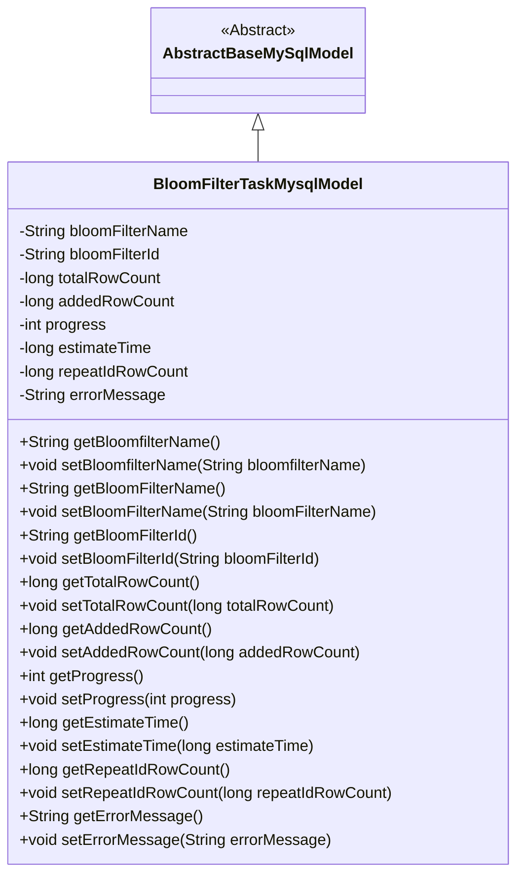

# 基础信息

|      |      |
|------|------|
| 名称 | BloomFilterTaskMysqlModel |
| 编码语言 | .java |
| 代码路径 | WeFe/board/board-service/src/main/java/com/welab/wefe/board/service/database/entity/fusion/bloomfilter/BloomFilterTaskMysqlModel.java |
| 包名 | com.welab.wefe.board.service.database.entity.fusion.bloomfilter |
| 依赖项 | ['com.welab.wefe.board.service.database.entity.base.AbstractBaseMySqlModel', 'javax.persistence.Entity'] |
| 概述说明 | BloomFilterTaskMysqlModel类用于布隆过滤器任务管理，包含名称、ID、数据行数、进度、剩余耗时、重复ID数和错误信息等字段。 |

# 说明

该代码定义了一个名为BloomFilterTaskMysqlModel的实体类，用于存储布隆过滤器任务的相关信息。类中包含过滤器名称、ID、总数据行数、已写入行数、任务进度百分比、预计剩余耗时、主键重复条数和错误消息等字段。所有字段均提供了对应的getter和setter方法，用于获取和设置属性值。该类继承自AbstractBaseMySqlModel，表明其作为MySQL数据库的模型类使用。

# 类列表 Class Summary

| 名称   | 类型  | 说明 |
|-------|------|-------------|
| BloomFilterTaskMysqlModel | class | BloomFilterTaskMysqlModel类用于记录布隆过滤器任务信息，包含名称、ID、数据行数、进度、剩余耗时、重复主键数和错误消息等字段。 |

## 类 BloomFilterTaskMysqlModel

|      |      |
|------|------|
| 访问范围 | @Entity(name = "bloom_filter_task");public |
| 类型 | class |
| 名称 | BloomFilterTaskMysqlModel |
| 说明 | BloomFilterTaskMysqlModel类用于记录布隆过滤器任务信息，包含名称、ID、数据行数、进度、剩余耗时、重复主键数和错误消息等字段。 |

### UML类图

该类图展示了BloomFilterTaskMysqlModel继承自抽象类AbstractBaseMySqlModel的结构。BloomFilterTaskMysqlModel是一个实体类，用于存储布隆过滤器任务的相关数据，包括过滤器名称、ID、任务进度统计信息（总行数、已写入行数、进度百分比）、时间预估以及错误处理等字段。类中提供了完整的getter/setter方法对私有字段进行访问控制，体现了标准的Java Bean设计模式。通过继承关系，该类复用抽象基类的数据库操作能力，适合作为ORM框架的实体映射类。

### 内部方法调用关系图

```mermaid
graph TD
    A["类BloomFilterTaskMysqlModel"]
    B["继承: AbstractBaseMySqlModel"]
    C["注解: @Entity('bloom_filter_task')"]
    D["属性: String bloomFilterName"]
    E["属性: String bloomFilterId"]
    F["属性: long totalRowCount"]
    G["属性: long addedRowCount"]
    H["属性: int progress"]
    I["属性: long estimateTime"]
    J["属性: long repeatIdRowCount"]
    K["属性: String errorMessage"]
    L["方法: getBloomfilterName/setBloomfilterName"]
    M["方法: getBloomFilterName/setBloomFilterName"]
    N["方法: getBloomFilterId/setBloomFilterId"]
    O["方法: getTotalRowCount/setTotalRowCount"]
    P["方法: getAddedRowCount/setAddedRowCount"]
    Q["方法: getProgress/setProgress"]
    R["方法: getEstimateTime/setEstimateTime"]
    S["方法: getRepeatIdRowCount/setRepeatIdRowCount"]
    T["方法: getErrorMessage/setErrorMessage"]

    A --> B
    A --> C
    A --> D
    A --> E
    A --> F
    A --> G
    A --> H
    A --> I
    A --> J
    A --> K
    A --> L
    A --> M
    A --> N
    A --> O
    A --> P
    A --> Q
    A --> R
    A --> S
    A --> T
```

该流程图展示了BloomFilterTaskMysqlModel类的结构，该类继承自AbstractBaseMySqlModel并使用@Entity注解标记。类包含多个属性如bloomFilterName、bloomFilterId等，以及对应的getter和setter方法。流程图清晰地呈现了类的继承关系、属性定义和方法组成，便于理解该实体类的完整结构。

### 字段列表 Field List

| 名称  | 类型  | 说明 |
|-------|-------|------|
| bloomFilterName | String | 私有字符串变量，用于存储布隆过滤器名称。 |
| totalRowCount = 0 | long | 私有长整型变量totalRowCount初始化为0，用于记录总行数。 |
| addedRowCount = 0 | long | 私有长整型变量，记录新增行数，初始值为0。 |
| repeatIdRowCount | long | 私有长整型变量，记录重复ID的行数。 |
| estimateTime | long | 私有长整型变量，用于存储估算时间。 |
| progress | int | 私有整型变量progress，用于记录进度。 |
| bloomFilterId | String | 私有字符串变量，存储布隆过滤器ID。 |
| errorMessage | String | 私有字符串变量，用于存储错误信息。 |

### 方法列表

| 名称  | 类型  | 说明 |
|-------|-------|------|
| setBloomFilterId | void | 设置布隆过滤器ID的方法，将输入参数赋值给类的成员变量bloomFilterId。 |
| setBloomfilterName | void | 设置布隆过滤器名称的方法，将输入参数赋值给类的成员变量bloomFilterName。 |
| getTotalRowCount | long | 获取总行数的方法，返回totalRowCount的值。 |
| setAddedRowCount | void | 设置新增行数的方法，将参数值赋给类的成员变量addedRowCount。 |
| getProgress | int | 这是一个Java方法，返回整型变量progress的值。 |
| getBloomFilterId | String | 获取布隆过滤器ID的方法，返回字符串类型的bloomFilterId。 |
| setBloomFilterName | void | 设置布隆过滤器名称的方法，将输入参数赋值给类的成员变量。 |
| getBloomfilterName | String | 该方法返回布隆过滤器的名称字符串。 |
| setTotalRowCount | void | 设置总行数的方法，将参数totalRowCount赋值给类的同名成员变量。 |
| getAddedRowCount | long | 获取新增行数的方法，返回长整型变量addedRowCount的值。 |
| getBloomFilterName | String | 获取布隆过滤器名称的方法，返回字符串类型变量bloomFilterName。 |
| setProgress | void | 设置进度值的方法，将输入参数progress赋值给类成员变量progress。 |
| getEstimateTime | long | 获取预估时间的公共方法，返回长整型数值estimateTime。 |
| setEstimateTime | void | 设置预估时间的方法，将参数estimateTime赋值给类的同名成员变量。 |
| getRepeatIdRowCount | long | 获取重复ID行数的方法，返回值为长整型。 |
| setRepeatIdRowCount | void | 设置重复ID的行数。 |
| getErrorMessage | String | 获取错误信息的方法，返回字符串类型的errorMessage。 |
| setErrorMessage | void | 定义了一个公共方法setErrorMessage，用于设置错误信息字符串。 |

