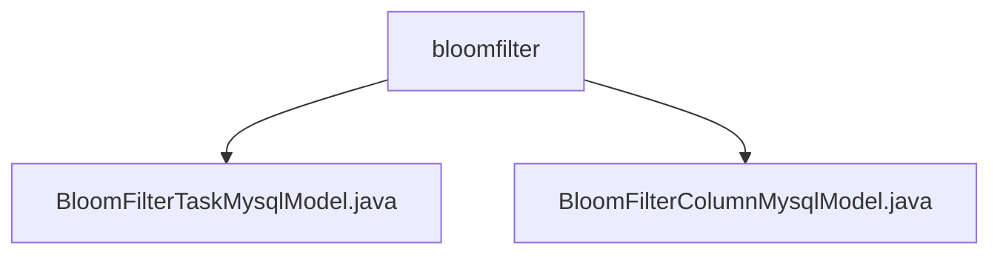

# 基础信息

|      |      |
|------|------|
| 名称 | bloomfilter |
| 编码语言 | .java |
| 代码路径 | WeFe/board/board-service/src/main/java/com/welab/wefe/board/service/database/entity/fusion/bloomfilter |
| 包名 | docs.board.board-service.src.main.java.com.welab.wefe.board.service.database.entity.fusion.bloomfilter |
| 概述说明 | BloomFilterTaskMysqlModel类存储布隆过滤器任务信息，包含名称、ID、进度等字段，继承AbstractBaseMySqlModel。BloomFilterColumnMysqlModel类映射到数据库表，包含过滤器ID、字段序号、名称等，支持JSON存储，继承AbstractBaseMySqlModel。 |

# 说明

## 概述  
该模块核心职责是管理布隆过滤器任务及其字段元数据，通过MySQL实体类实现数据持久化。接口规范包含两类模型：BloomFilterTaskMysqlModel记录任务进度和统计信息（例如总行数、错误消息），BloomFilterColumnMysqlModel存储字段级元数据（例如数据类型、空值统计）。关键数据结构包括任务ID关联的主从模型、JSON格式的数值分布字段。外部依赖涉及JPA注解、MySQL数据库和JSON类型处理库。例如BloomFilterColumnMysqlModel使用@TypeDef支持JSON字段映射。

## 主要业务场景  
模块支撑布隆过滤器全生命周期管理，类似ETL监控系统。主模型BloomFilterTaskMysqlModel跟踪任务执行状态（例如进度百分比、剩余耗时），从模型BloomFilterColumnMysqlModel分析字段特征（例如通过emptyRows统计空值率）。典型应用模式包括：任务创建时初始化主模型，数据扫描阶段更新从模型的valueDistribution。API类型涵盖CRUD操作和统计分析，例如通过bloomFilterId关联主从数据查询。

### 包内部结构视图

该流程图展示了bloomfilter目录下的两个Java文件结构关系。bloomfilter作为父节点，包含BloomFilterTaskMysqlModel和BloomFilterColumnMysqlModel两个模型类文件，这两个文件都位于fusion模块的数据库实体层中，用于处理布隆过滤器相关的数据持久化操作。

# 文件列表

| 名称   | 类型  | 说明 |
|-------|------|-------------|
| [BloomFilterTaskMysqlModel.java](BloomFilterTaskMysqlModel.md) | file | BloomFilterTaskMysqlModel类用于布隆过滤器任务管理，包含名称、ID、数据行数、进度、剩余耗时、重复ID数和错误信息等字段。 |
| [BloomFilterColumnMysqlModel.java](BloomFilterColumnMysqlModel.md) | file | BloomFilterColumnMysqlModel实体类，包含过滤器ID、字段序号、名称、数据类型、注释、空值行数和JSON格式的数值分布等属性。 |

